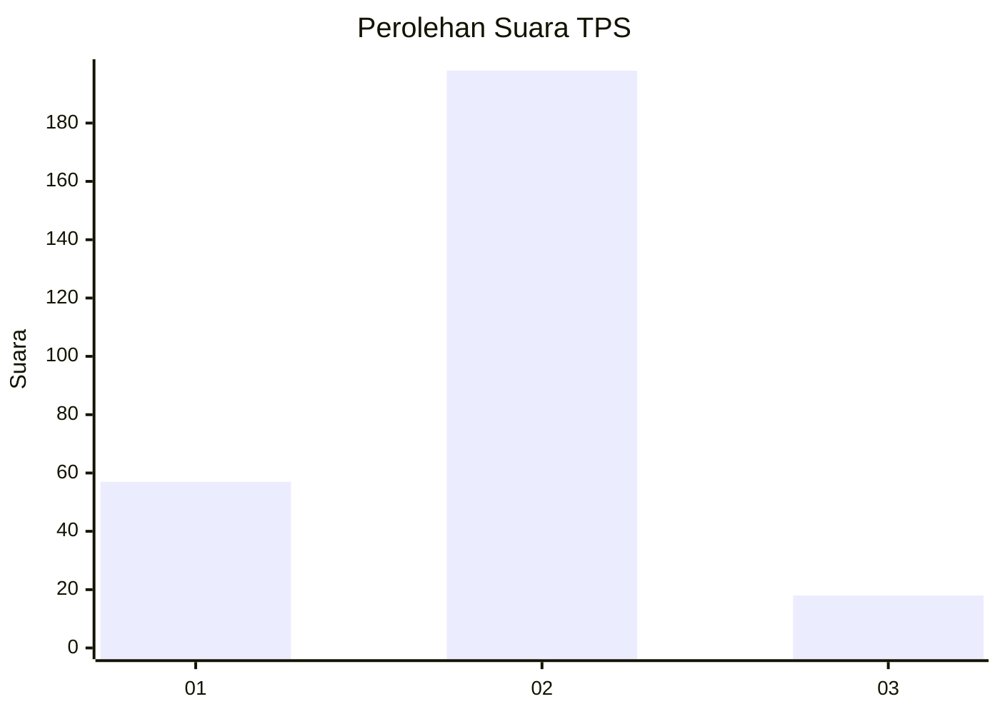

# Hasil

## Grafik

## Tabel

| No. | Nama Paslon    | Suara | Suara (raw) | Persentase |
|:--- |:-------------- | -----:| -----------:| ----------:|
| 1   | ANIES MUHAIMIN | 57    | [57][p-1]   | 20,88      |
| 2   | PRABOWO GIBRAN | 198   | [198][p-2]  | 72,53      |
| 3   | GANJAR MAHFUD  | 18    | [18][p-3]   | 6,59       |

[p-1]: https://github.com/gigit-pemilu/pemilu-2024/blob/main/pilpres/hitung-suara/sub/35-jawa-timur/sub/26-bangkalan/sub/07-klampis/sub/2021-larangan-glintong/sub/005-tps/sub/paslon-1.txt
[p-2]: https://github.com/gigit-pemilu/pemilu-2024/blob/main/pilpres/hitung-suara/sub/35-jawa-timur/sub/26-bangkalan/sub/07-klampis/sub/2021-larangan-glintong/sub/005-tps/sub/paslon-2.txt
[p-3]: https://github.com/gigit-pemilu/pemilu-2024/blob/main/pilpres/hitung-suara/sub/35-jawa-timur/sub/26-bangkalan/sub/07-klampis/sub/2021-larangan-glintong/sub/005-tps/sub/paslon-3.txt

## Foto C Plano

https://sirekap-obj-formc.kpu.go.id/1cc7/pemilu/ppwp/35/26/07/20/21/3526072021005-20240215-033153--eb9147fe-50e7-4d8b-88d4-583098436145.jpg

https://sirekap-obj-formc.kpu.go.id/1cc7/pemilu/ppwp/35/26/07/20/21/3526072021005-20240215-033254--d72205f6-1ed2-4f0f-97df-bb3acc0c2281.jpg

https://sirekap-obj-formc.kpu.go.id/1cc7/pemilu/ppwp/35/26/07/20/21/3526072021005-20240215-033355--27033d5c-cd36-43c0-92b8-9b415e2f16ed.jpg

## Metadata

| Key        | Value               |
| ---------- | ------------------- |
| Time Stamp | 2024-02-25 16:00:00 |

