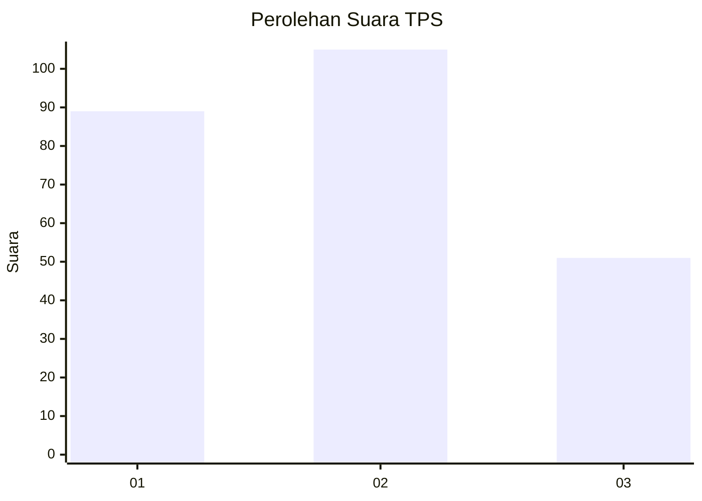
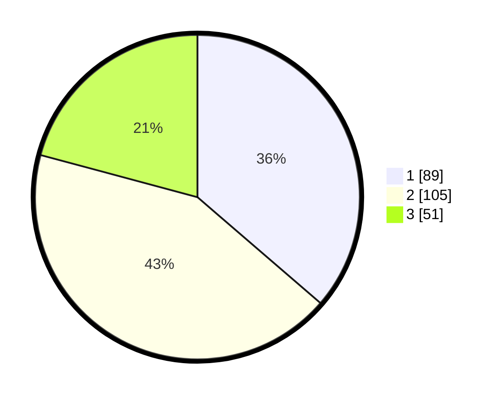

# Hasil

## Grafik

## Tabel

| No. | Nama Paslon    | Suara | Suara (raw) | Persentase |
|:--- |:-------------- | -----:| -----------:| ----------:|
| 1   | ANIES MUHAIMIN | 89    | [89][p-1]   | 36,33      |
| 2   | PRABOWO GIBRAN | 105   | [105][p-2]  | 42,86      |
| 3   | GANJAR MAHFUD  | 51    | [51][p-3]   | 20,82      |

[p-1]: https://github.com/gigit-pemilu/pemilu-2024/blob/main/pilpres/hitung-suara/sub/35-jawa-timur/sub/26-bangkalan/sub/07-klampis/sub/2021-larangan-glintong/sub/006-tps/sub/paslon-1.txt
[p-2]: https://github.com/gigit-pemilu/pemilu-2024/blob/main/pilpres/hitung-suara/sub/35-jawa-timur/sub/26-bangkalan/sub/07-klampis/sub/2021-larangan-glintong/sub/006-tps/sub/paslon-2.txt
[p-3]: https://github.com/gigit-pemilu/pemilu-2024/blob/main/pilpres/hitung-suara/sub/35-jawa-timur/sub/26-bangkalan/sub/07-klampis/sub/2021-larangan-glintong/sub/006-tps/sub/paslon-3.txt

## Foto C Plano

https://sirekap-obj-formc.kpu.go.id/0184/pemilu/ppwp/35/26/07/20/21/3526072021006-20240214-204707--95192663-396d-4dee-b71c-b6bbe2b25199.jpg

https://sirekap-obj-formc.kpu.go.id/0184/pemilu/ppwp/35/26/07/20/21/3526072021006-20240214-204416--3915eb10-2b92-4825-866c-23874c638a77.jpg

https://sirekap-obj-formc.kpu.go.id/0184/pemilu/ppwp/35/26/07/20/21/3526072021006-20240214-204819--ba4a15de-2a84-40d2-892f-4b5cdb5bd89e.jpg

## Metadata

| Key        | Value               |
| ---------- | ------------------- |
| Time Stamp | 2024-02-19 06:16:00 |

