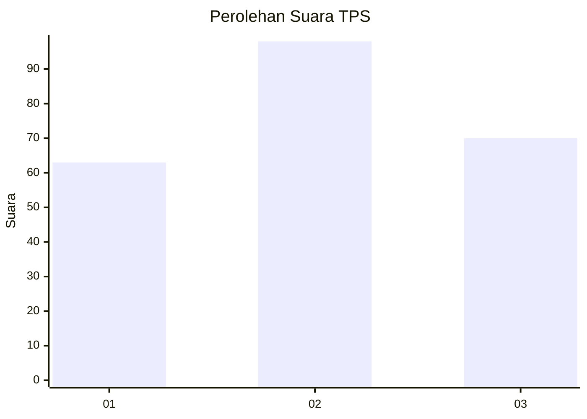
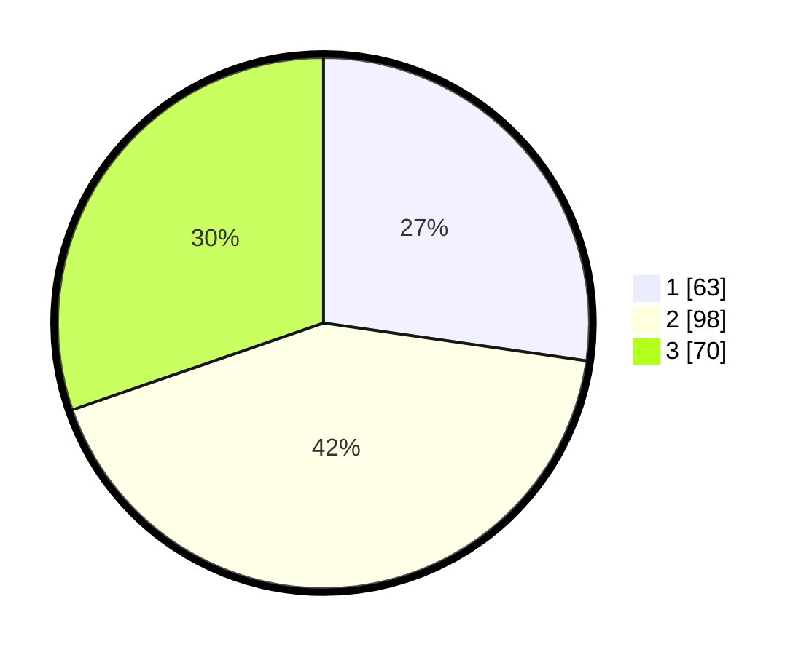

# Hasil

## Grafik

## Tabel

| No. | Nama Paslon    | Suara | Suara (raw) | Persentase |
|:--- |:-------------- | -----:| -----------:| ----------:|
| 1   | ANIES MUHAIMIN | 63    | [63][p-1]   | 27,27      |
| 2   | PRABOWO GIBRAN | 98    | [98][p-2]   | 42,42      |
| 3   | GANJAR MAHFUD  | 70    | [70][p-3]   | 30,30      |

[p-1]: https://github.com/gigit-pemilu/pemilu-2024/blob/main/pilpres/hitung-suara/sub/35-jawa-timur/sub/26-bangkalan/sub/07-klampis/sub/2021-larangan-glintong/sub/007-tps/sub/paslon-1.txt
[p-2]: https://github.com/gigit-pemilu/pemilu-2024/blob/main/pilpres/hitung-suara/sub/35-jawa-timur/sub/26-bangkalan/sub/07-klampis/sub/2021-larangan-glintong/sub/007-tps/sub/paslon-2.txt
[p-3]: https://github.com/gigit-pemilu/pemilu-2024/blob/main/pilpres/hitung-suara/sub/35-jawa-timur/sub/26-bangkalan/sub/07-klampis/sub/2021-larangan-glintong/sub/007-tps/sub/paslon-3.txt

## Foto C Plano

https://sirekap-obj-formc.kpu.go.id/4aa0/pemilu/ppwp/35/26/07/20/21/3526072021007-20240214-205855--2048faf5-cb36-4511-a05c-5ee45e44ef7f.jpg

https://sirekap-obj-formc.kpu.go.id/4aa0/pemilu/ppwp/35/26/07/20/21/3526072021007-20240214-210238--bcbdd36c-f11f-4ce1-b3cb-8ba4b7d3a896.jpg

https://sirekap-obj-formc.kpu.go.id/4aa0/pemilu/ppwp/35/26/07/20/21/3526072021007-20240214-210412--0f996444-d668-43e4-9c0e-47683fd42cc8.jpg

## Metadata

| Key        | Value               |
| ---------- | ------------------- |
| Time Stamp | 2024-02-19 06:16:00 |

