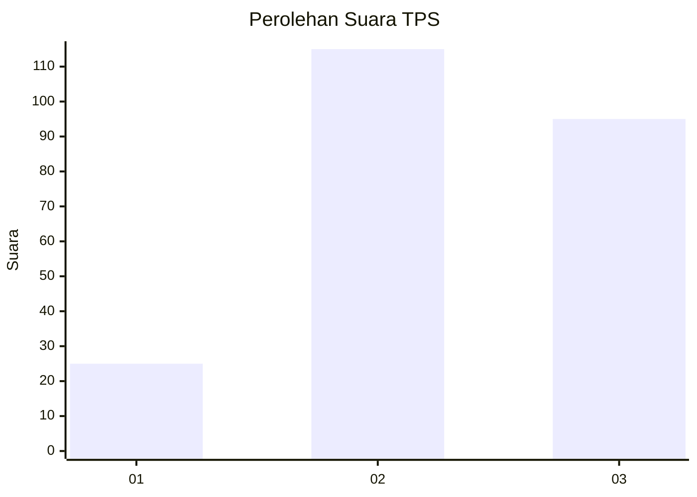
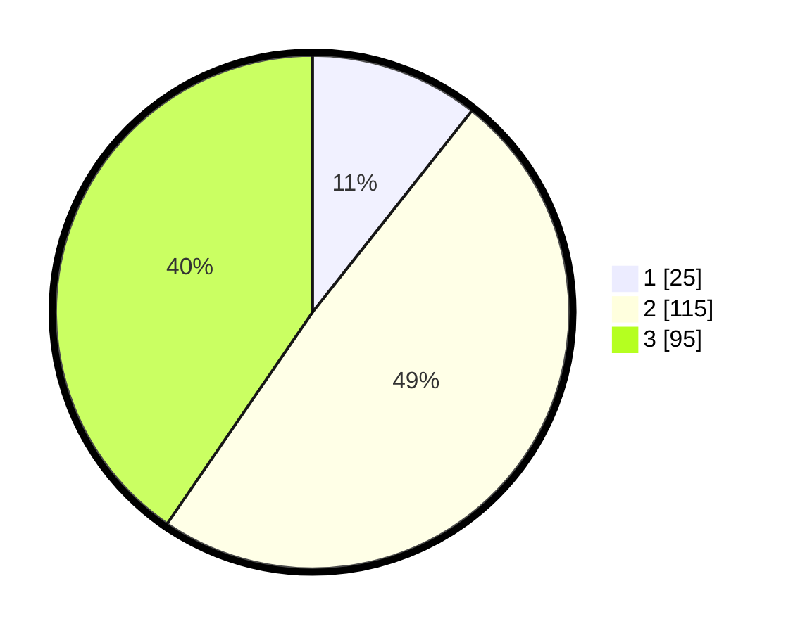

# Hasil

## Grafik

## Tabel

| No. | Nama Paslon    | Suara | Suara (raw) | Persentase |
|:--- |:-------------- | -----:| -----------:| ----------:|
| 1   | ANIES MUHAIMIN | 25    | [25][p-1]   | 10,64      |
| 2   | PRABOWO GIBRAN | 115   | [115][p-2]  | 48,94      |
| 3   | GANJAR MAHFUD  | 95    | [95][p-3]   | 40,43      |

[p-1]: https://github.com/gigit-pemilu/pemilu-2024/blob/main/pilpres/hitung-suara/sub/35-jawa-timur/sub/26-bangkalan/sub/07-klampis/sub/2021-larangan-glintong/sub/008-tps/sub/paslon-1.txt
[p-2]: https://github.com/gigit-pemilu/pemilu-2024/blob/main/pilpres/hitung-suara/sub/35-jawa-timur/sub/26-bangkalan/sub/07-klampis/sub/2021-larangan-glintong/sub/008-tps/sub/paslon-2.txt
[p-3]: https://github.com/gigit-pemilu/pemilu-2024/blob/main/pilpres/hitung-suara/sub/35-jawa-timur/sub/26-bangkalan/sub/07-klampis/sub/2021-larangan-glintong/sub/008-tps/sub/paslon-3.txt

## Foto C Plano

https://sirekap-obj-formc.kpu.go.id/36a8/pemilu/ppwp/35/26/07/20/21/3526072021008-20240214-233543--fe7d725c-02e9-498f-8ce0-47df3167549c.jpg

https://sirekap-obj-formc.kpu.go.id/36a8/pemilu/ppwp/35/26/07/20/21/3526072021008-20240214-210301--4b5d0e84-a912-45a7-971b-13b46be8c488.jpg

https://sirekap-obj-formc.kpu.go.id/36a8/pemilu/ppwp/35/26/07/20/21/3526072021008-20240214-233506--95c1fd27-ff7f-4b48-83a8-cb9446021fcb.jpg

## Metadata

| Key        | Value               |
| ---------- | ------------------- |
| Time Stamp | 2024-02-25 13:00:00 |

