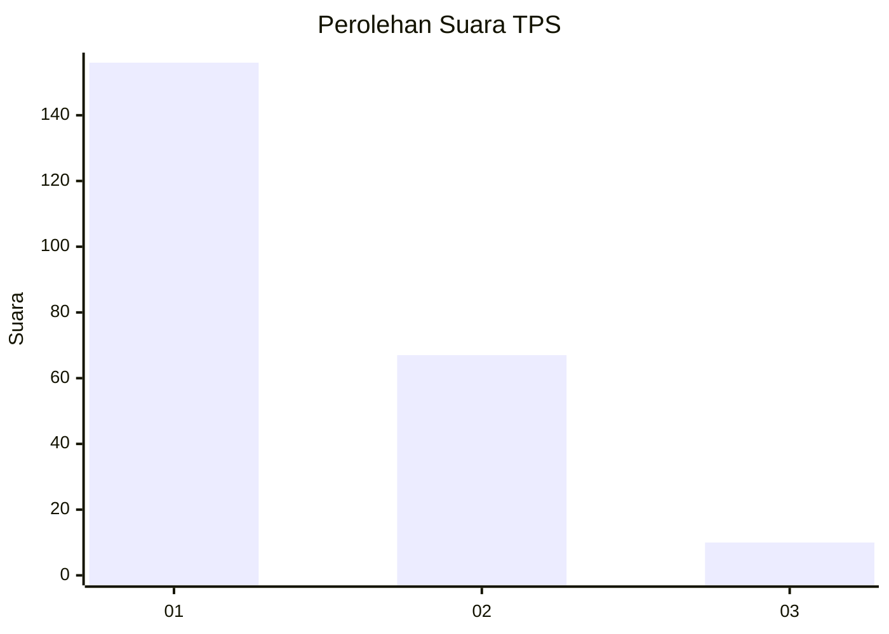
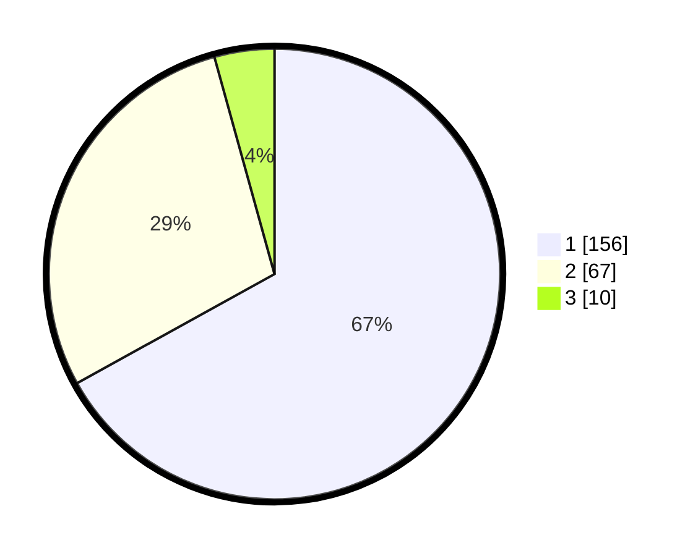

# Hasil

## Grafik

## Tabel

| No. | Nama Paslon    | Suara | Suara (raw) | Persentase |
|:--- |:-------------- | -----:| -----------:| ----------:|
| 1   | ANIES MUHAIMIN | 156   | [156][p-1]  | 66,95      |
| 2   | PRABOWO GIBRAN | 67    | [67][p-2]   | 28,76      |
| 3   | GANJAR MAHFUD  | 10    | [10][p-3]   | 4,29       |

[p-1]: https://github.com/gigit-pemilu/pemilu-2024/blob/main/pilpres/hitung-suara/sub/35-jawa-timur/sub/26-bangkalan/sub/07-klampis/sub/2022-ko'ol/sub/002-tps/sub/paslon-1.txt
[p-2]: https://github.com/gigit-pemilu/pemilu-2024/blob/main/pilpres/hitung-suara/sub/35-jawa-timur/sub/26-bangkalan/sub/07-klampis/sub/2022-ko'ol/sub/002-tps/sub/paslon-2.txt
[p-3]: https://github.com/gigit-pemilu/pemilu-2024/blob/main/pilpres/hitung-suara/sub/35-jawa-timur/sub/26-bangkalan/sub/07-klampis/sub/2022-ko'ol/sub/002-tps/sub/paslon-3.txt

## Foto C Plano

https://sirekap-obj-formc.kpu.go.id/a1ca/pemilu/ppwp/35/26/07/20/22/3526072022002-20240215-063650--0b85a428-d969-42f3-934c-d4b522bafb1b.jpg

https://sirekap-obj-formc.kpu.go.id/a1ca/pemilu/ppwp/35/26/07/20/22/3526072022002-20240215-063754--8aaa823d-9833-4dae-a31a-39fdcf7e155d.jpg

https://sirekap-obj-formc.kpu.go.id/a1ca/pemilu/ppwp/35/26/07/20/22/3526072022002-20240214-231752--bf76d2e7-1eee-421e-8817-cae59668cd7b.jpg

## Metadata

| Key        | Value               |
| ---------- | ------------------- |
| Time Stamp | 2024-02-25 13:00:00 |

