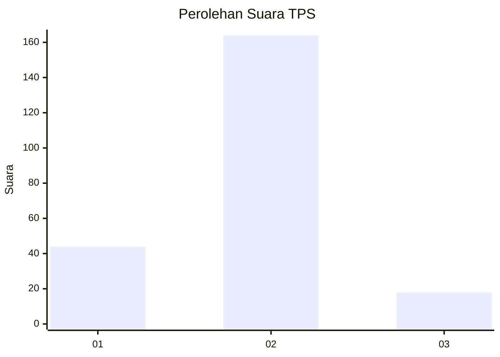
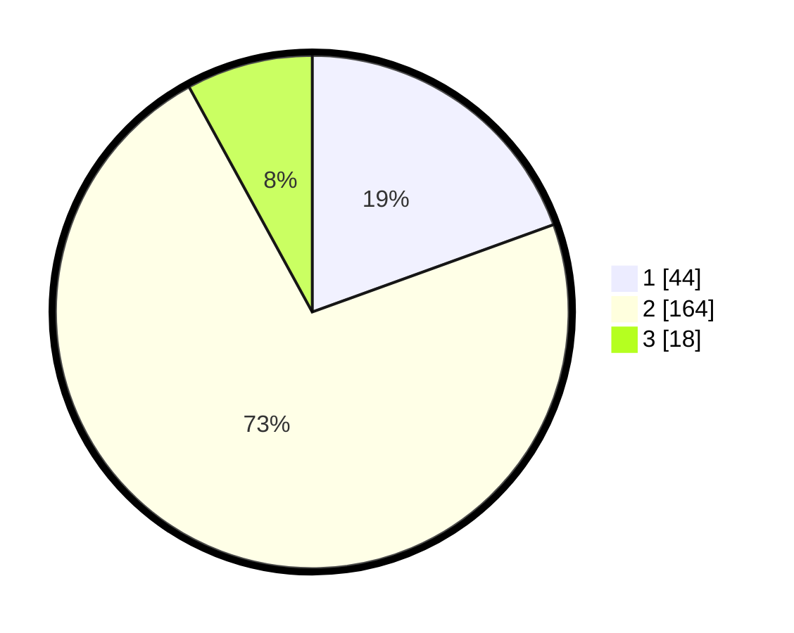

# Hasil

## Grafik

## Tabel

| No. | Nama Paslon    | Suara | Suara (raw) | Persentase |
|:--- |:-------------- | -----:| -----------:| ----------:|
| 1   | ANIES MUHAIMIN | 44    | [44][p-1]   | 19,47      |
| 2   | PRABOWO GIBRAN | 164   | [164][p-2]  | 72,57      |
| 3   | GANJAR MAHFUD  | 18    | [18][p-3]   | 7,96       |

[p-1]: https://github.com/gigit-pemilu/pemilu-2024-35-jawa-timur/blob/main/pilpres/hitung-suara/sub/35-jawa-timur/sub/26-bangkalan/sub/08-sepulu/sub/2001-sepulu/sub/014-tps/sub/paslon-1.txt
[p-2]: https://github.com/gigit-pemilu/pemilu-2024-35-jawa-timur/blob/main/pilpres/hitung-suara/sub/35-jawa-timur/sub/26-bangkalan/sub/08-sepulu/sub/2001-sepulu/sub/014-tps/sub/paslon-2.txt
[p-3]: https://github.com/gigit-pemilu/pemilu-2024-35-jawa-timur/blob/main/pilpres/hitung-suara/sub/35-jawa-timur/sub/26-bangkalan/sub/08-sepulu/sub/2001-sepulu/sub/014-tps/sub/paslon-3.txt

## Foto C Plano

https://sirekap-obj-formc.kpu.go.id/5f46/pemilu/ppwp/35/26/08/20/01/3526082001014-20240215-201502--09c7fb65-be3d-4e3e-883d-fcd9992d0438.jpg

https://sirekap-obj-formc.kpu.go.id/5f46/pemilu/ppwp/35/26/08/20/01/3526082001014-20240223-203526--7fc08b60-380b-4f66-8aca-7d1fc2587dfe.jpg

https://sirekap-obj-formc.kpu.go.id/5f46/pemilu/ppwp/35/26/08/20/01/3526082001014-20240223-204113--5c1a7b29-6834-4609-b630-68f31e18b219.jpg

## Metadata

| Key        | Value               |
| ---------- | ------------------- |
| Time Stamp | 2024-02-24 22:31:28 |

