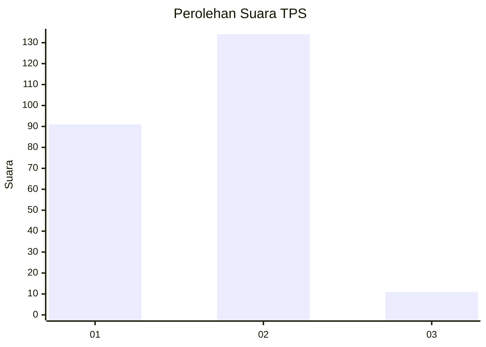
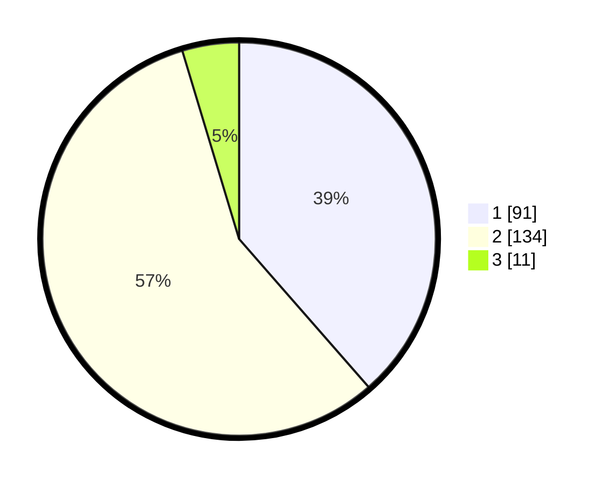

# Hasil

## Grafik

## Tabel

| No. | Nama Paslon    | Suara | Suara (raw) | Persentase |
|:--- |:-------------- | -----:| -----------:| ----------:|
| 1   | ANIES MUHAIMIN | 91    | [91][p-1]   | 38,56      |
| 2   | PRABOWO GIBRAN | 134   | [134][p-2]  | 56,78      |
| 3   | GANJAR MAHFUD  | 11    | [11][p-3]   | 4,66       |

[p-1]: https://github.com/gigit-pemilu/pemilu-2024/blob/main/pilpres/hitung-suara/sub/35-jawa-timur/sub/26-bangkalan/sub/08-sepulu/sub/2002-maneron/sub/002-tps/sub/paslon-1.txt
[p-2]: https://github.com/gigit-pemilu/pemilu-2024/blob/main/pilpres/hitung-suara/sub/35-jawa-timur/sub/26-bangkalan/sub/08-sepulu/sub/2002-maneron/sub/002-tps/sub/paslon-2.txt
[p-3]: https://github.com/gigit-pemilu/pemilu-2024/blob/main/pilpres/hitung-suara/sub/35-jawa-timur/sub/26-bangkalan/sub/08-sepulu/sub/2002-maneron/sub/002-tps/sub/paslon-3.txt

## Foto C Plano

https://sirekap-obj-formc.kpu.go.id/ca2c/pemilu/ppwp/35/26/08/20/02/3526082002002-20240214-213326--6f63c7d2-ef3e-4c1a-8f3d-355c9f3a086f.jpg

https://sirekap-obj-formc.kpu.go.id/ca2c/pemilu/ppwp/35/26/08/20/02/3526082002002-20240214-213442--586e543e-e752-4dd1-9c9e-514e26f6eb50.jpg

https://sirekap-obj-formc.kpu.go.id/ca2c/pemilu/ppwp/35/26/08/20/02/3526082002002-20240214-213625--d1e0db79-0dda-4590-98a6-bc772048d11b.jpg

## Metadata

| Key        | Value               |
| ---------- | ------------------- |
| Time Stamp | 2024-02-19 06:16:00 |

