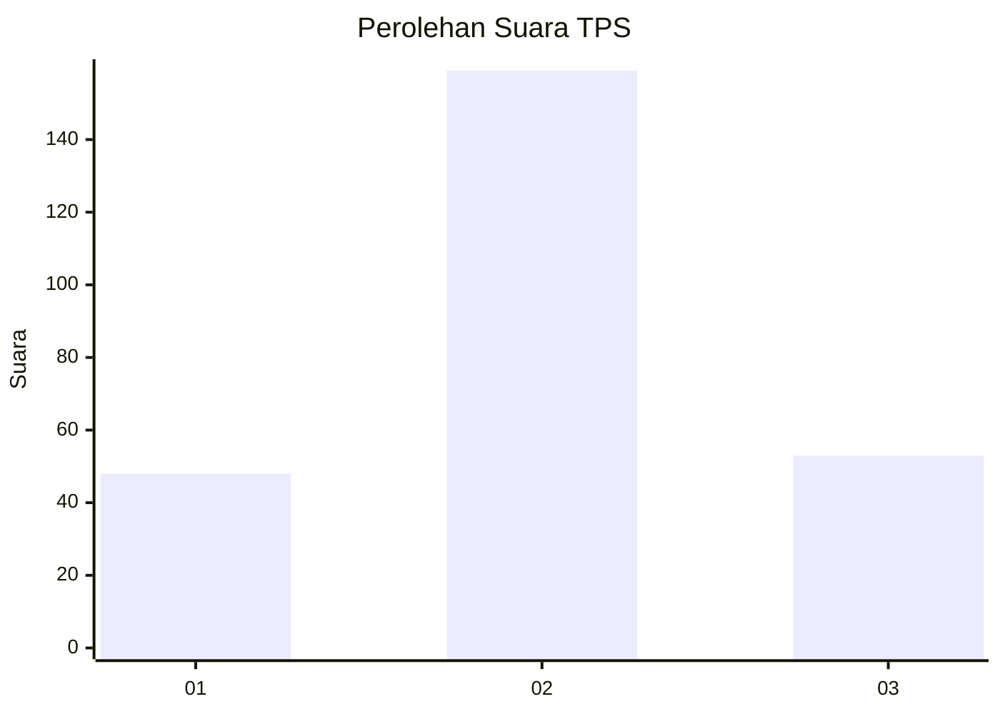
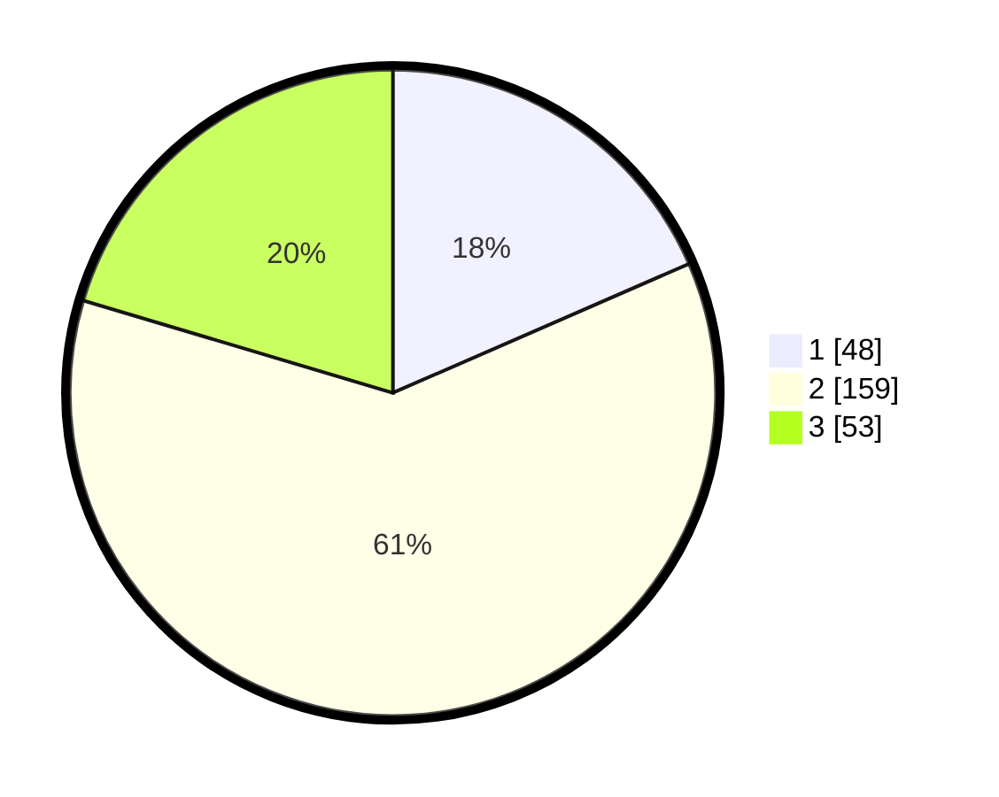

# Hasil

## Grafik

## Tabel

| No. | Nama Paslon    | Suara | Suara (raw) | Persentase |
|:--- |:-------------- | -----:| -----------:| ----------:|
| 1   | ANIES MUHAIMIN | 48    | [48][p-1]   | 18,46      |
| 2   | PRABOWO GIBRAN | 159   | [159][p-2]  | 61,15      |
| 3   | GANJAR MAHFUD  | 53    | [53][p-3]   | 20,38      |

[p-1]: https://github.com/gigit-pemilu/pemilu-2024-35-jawa-timur/blob/main/pilpres/hitung-suara/sub/35-jawa-timur/sub/26-bangkalan/sub/08-sepulu/sub/2002-maneron/sub/008-tps/sub/paslon-1.txt
[p-2]: https://github.com/gigit-pemilu/pemilu-2024-35-jawa-timur/blob/main/pilpres/hitung-suara/sub/35-jawa-timur/sub/26-bangkalan/sub/08-sepulu/sub/2002-maneron/sub/008-tps/sub/paslon-2.txt
[p-3]: https://github.com/gigit-pemilu/pemilu-2024-35-jawa-timur/blob/main/pilpres/hitung-suara/sub/35-jawa-timur/sub/26-bangkalan/sub/08-sepulu/sub/2002-maneron/sub/008-tps/sub/paslon-3.txt

## Foto C Plano

https://sirekap-obj-formc.kpu.go.id/b4fe/pemilu/ppwp/35/26/08/20/02/3526082002008-20240214-214727--e002b25a-f24e-4fd5-a66e-5ee6df2d2eb2.jpg

https://sirekap-obj-formc.kpu.go.id/b4fe/pemilu/ppwp/35/26/08/20/02/3526082002008-20240214-214852--a6302c55-c2e1-4388-8973-49f965e8db33.jpg

https://sirekap-obj-formc.kpu.go.id/b4fe/pemilu/ppwp/35/26/08/20/02/3526082002008-20240214-215802--2599eb27-1ff6-4768-84aa-cc8aeea7711f.jpg

## Metadata

| Key        | Value               |
| ---------- | ------------------- |
| Time Stamp | 2024-02-19 06:16:00 |

