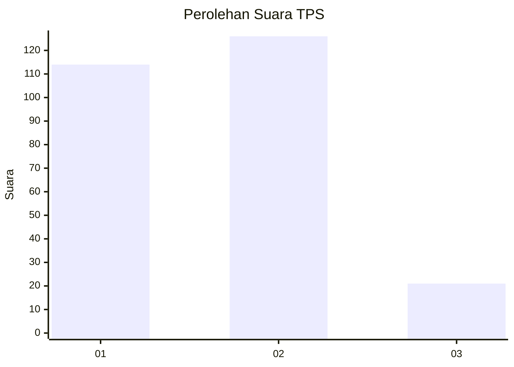
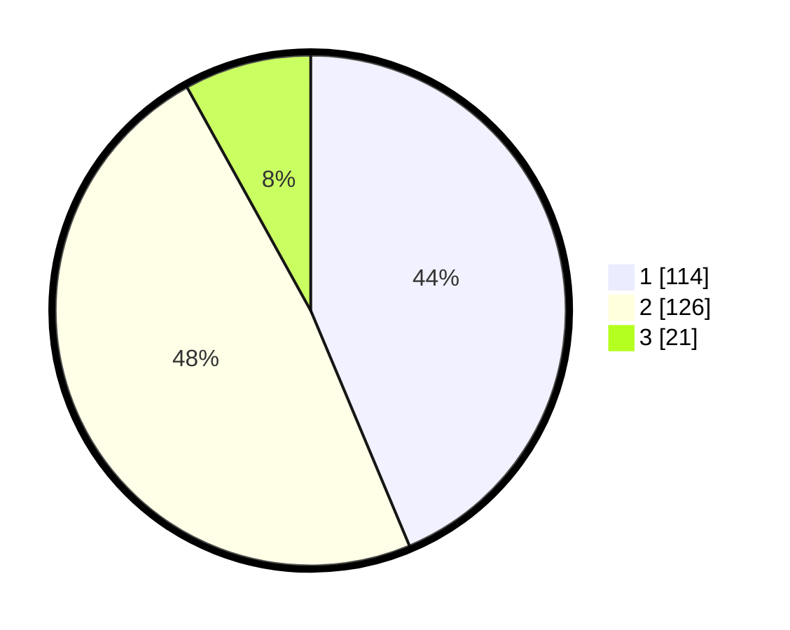

# Hasil

## Grafik

## Tabel

| No. | Nama Paslon    | Suara | Suara (raw) | Persentase |
|:--- |:-------------- | -----:| -----------:| ----------:|
| 1   | ANIES MUHAIMIN | 114   | [114][p-1]  | 43,68      |
| 2   | PRABOWO GIBRAN | 126   | [126][p-2]  | 48,28      |
| 3   | GANJAR MAHFUD  | 21    | [21][p-3]   | 8,05       |

[p-1]: https://github.com/gigit-pemilu/pemilu-2024/blob/main/pilpres/hitung-suara/sub/35-jawa-timur/sub/26-bangkalan/sub/08-sepulu/sub/2002-maneron/sub/010-tps/sub/paslon-1.txt
[p-2]: https://github.com/gigit-pemilu/pemilu-2024/blob/main/pilpres/hitung-suara/sub/35-jawa-timur/sub/26-bangkalan/sub/08-sepulu/sub/2002-maneron/sub/010-tps/sub/paslon-2.txt
[p-3]: https://github.com/gigit-pemilu/pemilu-2024/blob/main/pilpres/hitung-suara/sub/35-jawa-timur/sub/26-bangkalan/sub/08-sepulu/sub/2002-maneron/sub/010-tps/sub/paslon-3.txt

## Foto C Plano

https://sirekap-obj-formc.kpu.go.id/5091/pemilu/ppwp/35/26/08/20/02/3526082002010-20240214-235450--06a932dd-e554-4120-bd5f-31ef11661bad.jpg

https://sirekap-obj-formc.kpu.go.id/5091/pemilu/ppwp/35/26/08/20/02/3526082002010-20240214-235942--7408565c-298b-465b-9f5b-3c79c583aa33.jpg

https://sirekap-obj-formc.kpu.go.id/5091/pemilu/ppwp/35/26/08/20/02/3526082002010-20240214-235807--4567241e-2465-4681-a4d7-651fe9b240aa.jpg

## Metadata

| Key        | Value               |
| ---------- | ------------------- |
| Time Stamp | 2024-02-19 06:16:00 |

