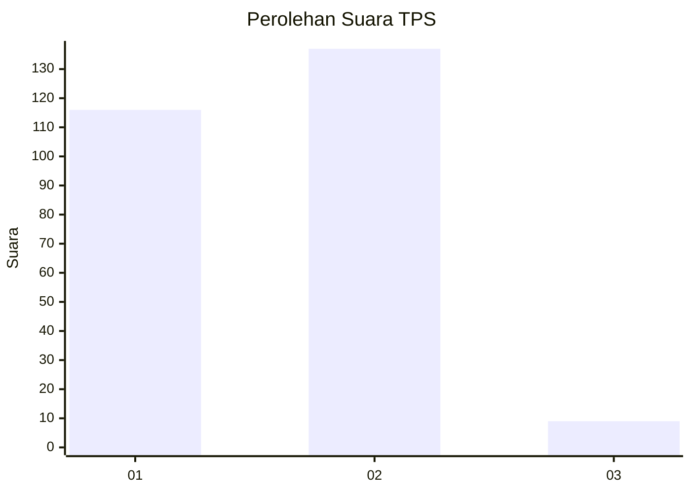
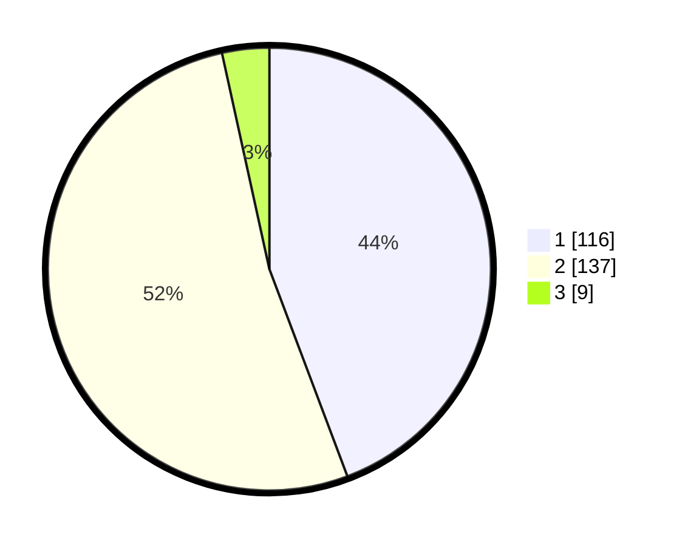

# Hasil

## Grafik

## Tabel

| No. | Nama Paslon    | Suara | Suara (raw) | Persentase |
|:--- |:-------------- | -----:| -----------:| ----------:|
| 1   | ANIES MUHAIMIN | 116   | [116][p-1]  | 44,27      |
| 2   | PRABOWO GIBRAN | 137   | [137][p-2]  | 52,29      |
| 3   | GANJAR MAHFUD  | 9     | [9][p-3]    | 3,44       |

[p-1]: https://github.com/gigit-pemilu/pemilu-2024/blob/main/pilpres/hitung-suara/sub/35-jawa-timur/sub/26-bangkalan/sub/08-sepulu/sub/2004-klapayan/sub/011-tps/sub/paslon-1.txt
[p-2]: https://github.com/gigit-pemilu/pemilu-2024/blob/main/pilpres/hitung-suara/sub/35-jawa-timur/sub/26-bangkalan/sub/08-sepulu/sub/2004-klapayan/sub/011-tps/sub/paslon-2.txt
[p-3]: https://github.com/gigit-pemilu/pemilu-2024/blob/main/pilpres/hitung-suara/sub/35-jawa-timur/sub/26-bangkalan/sub/08-sepulu/sub/2004-klapayan/sub/011-tps/sub/paslon-3.txt

## Foto C Plano

https://sirekap-obj-formc.kpu.go.id/7e63/pemilu/ppwp/35/26/08/20/04/3526082004011-20240214-195815--8b1693ad-e156-4f4d-aa9a-56be61d3b289.jpg

https://sirekap-obj-formc.kpu.go.id/7e63/pemilu/ppwp/35/26/08/20/04/3526082004011-20240214-195820--833cadb9-6a08-49c5-9f36-38b2d9388ff8.jpg

https://sirekap-obj-formc.kpu.go.id/7e63/pemilu/ppwp/35/26/08/20/04/3526082004011-20240214-195824--388435ac-9d24-481a-b3d1-316280c612ef.jpg

## Metadata

| Key        | Value               |
| ---------- | ------------------- |
| Time Stamp | 2024-02-21 20:00:00 |

