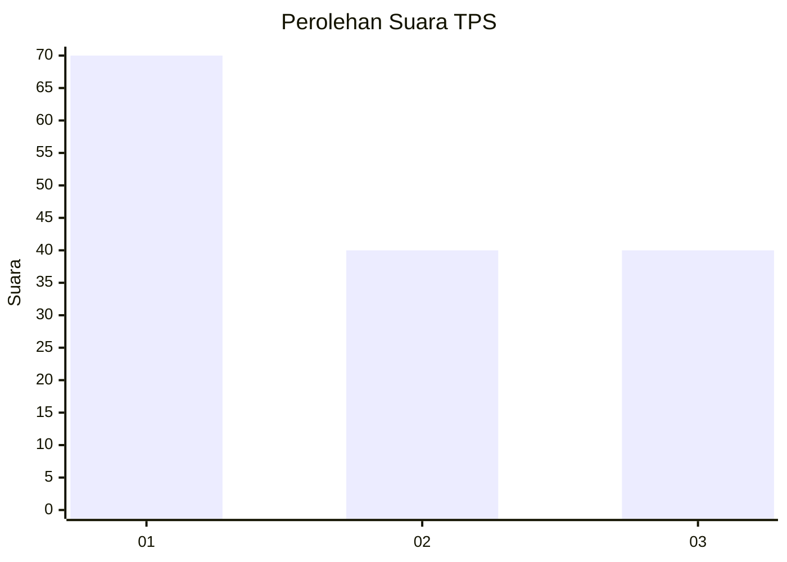
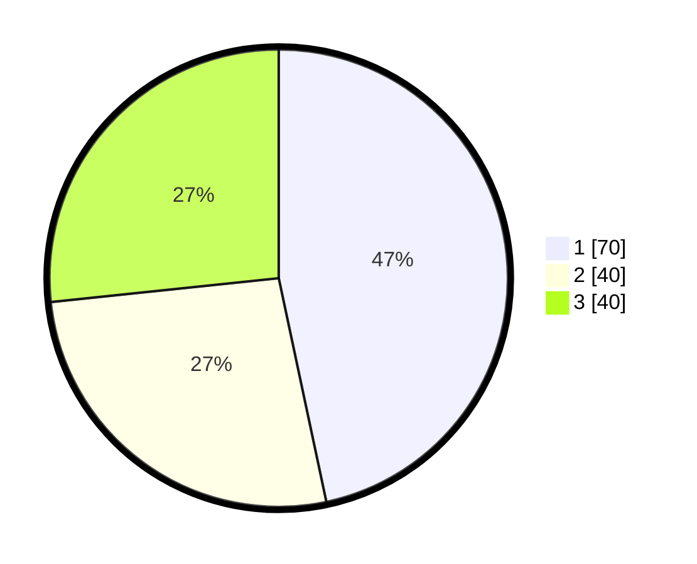

# Hasil

## Grafik

## Tabel

| No. | Nama Paslon    | Suara | Suara (raw) | Persentase |
|:--- |:-------------- | -----:| -----------:| ----------:|
| 1   | ANIES MUHAIMIN | 70    | [70][p-1]   | 46,67      |
| 2   | PRABOWO GIBRAN | 40    | [40][p-2]   | 26,67      |
| 3   | GANJAR MAHFUD  | 40    | [40][p-3]   | 26,67      |

[p-1]: https://github.com/gigit-pemilu/pemilu-2024/blob/main/pilpres/hitung-suara/sub/35-jawa-timur/sub/26-bangkalan/sub/08-sepulu/sub/2007-saplasah/sub/004-tps/sub/paslon-1.txt
[p-2]: https://github.com/gigit-pemilu/pemilu-2024/blob/main/pilpres/hitung-suara/sub/35-jawa-timur/sub/26-bangkalan/sub/08-sepulu/sub/2007-saplasah/sub/004-tps/sub/paslon-2.txt
[p-3]: https://github.com/gigit-pemilu/pemilu-2024/blob/main/pilpres/hitung-suara/sub/35-jawa-timur/sub/26-bangkalan/sub/08-sepulu/sub/2007-saplasah/sub/004-tps/sub/paslon-3.txt

## Foto C Plano

https://sirekap-obj-formc.kpu.go.id/5214/pemilu/ppwp/35/26/08/20/07/3526082007004-20240215-205039--cc2a55b7-ca9d-4132-bb40-8a155a2deca7.jpg

https://sirekap-obj-formc.kpu.go.id/5214/pemilu/ppwp/35/26/08/20/07/3526082007004-20240215-205119--0cd02c33-4c85-46c0-816c-922fe0dac26c.jpg

https://sirekap-obj-formc.kpu.go.id/5214/pemilu/ppwp/35/26/08/20/07/3526082007004-20240215-234456--79ee63df-5cbd-45bb-9fcc-e2401bcb97dc.jpg

## Metadata

| Key        | Value               |
| ---------- | ------------------- |
| Time Stamp | 2024-02-16 00:00:26 |

