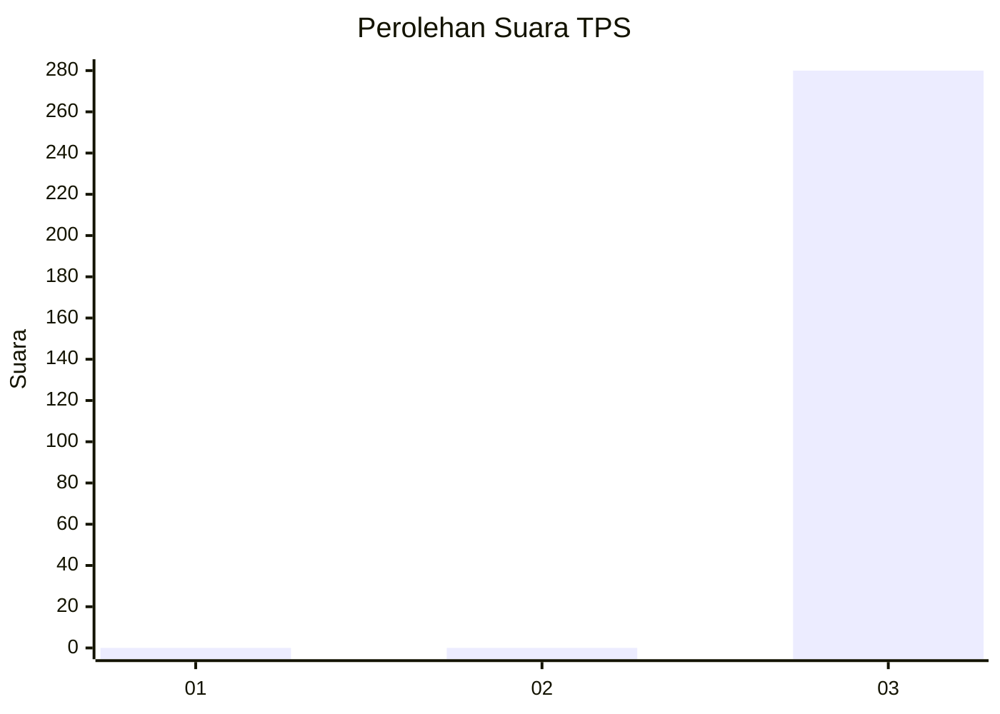
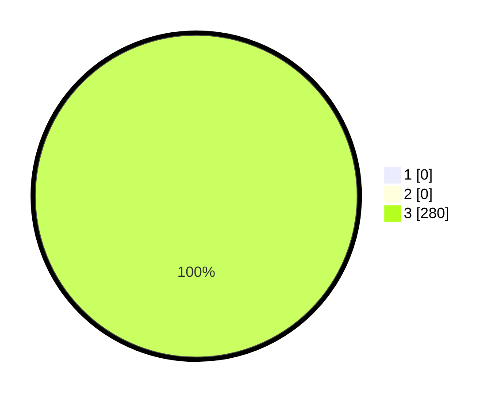

# Hasil

## Grafik

## Tabel

| No. | Nama Paslon    | Suara | Suara (raw) | Persentase |
|:--- |:-------------- | -----:| -----------:| ----------:|
| 1   | ANIES MUHAIMIN | 0     | [0][p-1]    | 0,00       |
| 2   | PRABOWO GIBRAN | 0     | [0][p-2]    | 0,00       |
| 3   | GANJAR MAHFUD  | 280   | [280][p-3]  | 100,00     |

[p-1]: https://github.com/gigit-pemilu/pemilu-2024/blob/main/pilpres/hitung-suara/sub/35-jawa-timur/sub/26-bangkalan/sub/08-sepulu/sub/2008-genelap/sub/001-tps/sub/paslon-1.txt
[p-2]: https://github.com/gigit-pemilu/pemilu-2024/blob/main/pilpres/hitung-suara/sub/35-jawa-timur/sub/26-bangkalan/sub/08-sepulu/sub/2008-genelap/sub/001-tps/sub/paslon-2.txt
[p-3]: https://github.com/gigit-pemilu/pemilu-2024/blob/main/pilpres/hitung-suara/sub/35-jawa-timur/sub/26-bangkalan/sub/08-sepulu/sub/2008-genelap/sub/001-tps/sub/paslon-3.txt

## Foto C Plano

https://sirekap-obj-formc.kpu.go.id/bacf/pemilu/ppwp/35/26/08/20/08/3526082008001-20240215-072732--64109714-4ba1-4d89-beef-22d64a42aa7b.jpg

https://sirekap-obj-formc.kpu.go.id/bacf/pemilu/ppwp/35/26/08/20/08/3526082008001-20240215-072901--9b12563d-cdee-4fbe-b0fa-e0e02423bca5.jpg

https://sirekap-obj-formc.kpu.go.id/bacf/pemilu/ppwp/35/26/08/20/08/3526082008001-20240215-073234--2f288ee4-5af1-4629-a9a6-0a489b063575.jpg

## Metadata

| Key        | Value               |
| ---------- | ------------------- |
| Time Stamp | 2024-02-21 20:00:00 |

