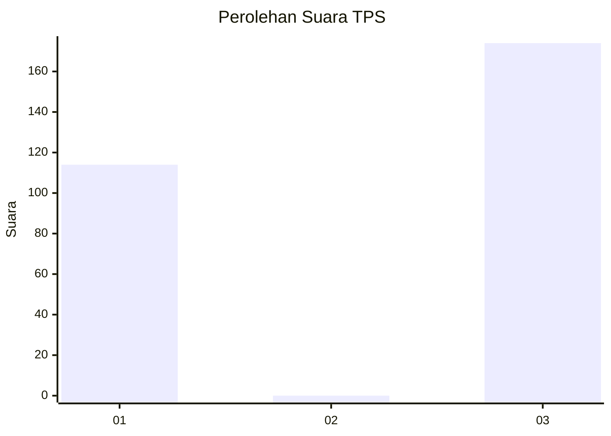
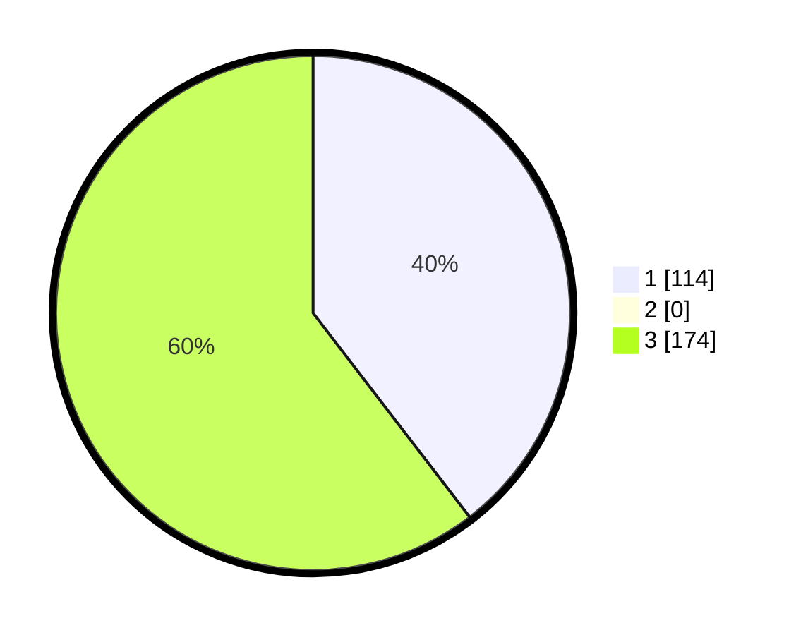

# Hasil

## Grafik

## Tabel

| No. | Nama Paslon    | Suara | Suara (raw) | Persentase |
|:--- |:-------------- | -----:| -----------:| ----------:|
| 1   | ANIES MUHAIMIN | 114   | [114][p-1]  | 39,58      |
| 2   | PRABOWO GIBRAN | 0     | [0][p-2]    | 0,00       |
| 3   | GANJAR MAHFUD  | 174   | [174][p-3]  | 60,42      |

[p-1]: https://github.com/gigit-pemilu/pemilu-2024-35-jawa-timur/blob/main/pilpres/hitung-suara/sub/35-jawa-timur/sub/26-bangkalan/sub/08-sepulu/sub/2008-genelap/sub/005-tps/sub/paslon-1.txt
[p-2]: https://github.com/gigit-pemilu/pemilu-2024-35-jawa-timur/blob/main/pilpres/hitung-suara/sub/35-jawa-timur/sub/26-bangkalan/sub/08-sepulu/sub/2008-genelap/sub/005-tps/sub/paslon-2.txt
[p-3]: https://github.com/gigit-pemilu/pemilu-2024-35-jawa-timur/blob/main/pilpres/hitung-suara/sub/35-jawa-timur/sub/26-bangkalan/sub/08-sepulu/sub/2008-genelap/sub/005-tps/sub/paslon-3.txt

## Foto C Plano

https://sirekap-obj-formc.kpu.go.id/a6ab/pemilu/ppwp/35/26/08/20/08/3526082008005-20240214-192228--da71e86d-4b6e-43b3-985e-65e25a5ed0c0.jpg

https://sirekap-obj-formc.kpu.go.id/a6ab/pemilu/ppwp/35/26/08/20/08/3526082008005-20240214-192248--1894065b-7e30-4e78-8131-e5e40237b02d.jpg

https://sirekap-obj-formc.kpu.go.id/a6ab/pemilu/ppwp/35/26/08/20/08/3526082008005-20240214-192250--11b522df-8891-4895-80db-ed1882da83ac.jpg

## Metadata

| Key        | Value               |
| ---------- | ------------------- |
| Time Stamp | 2024-02-19 06:16:00 |

