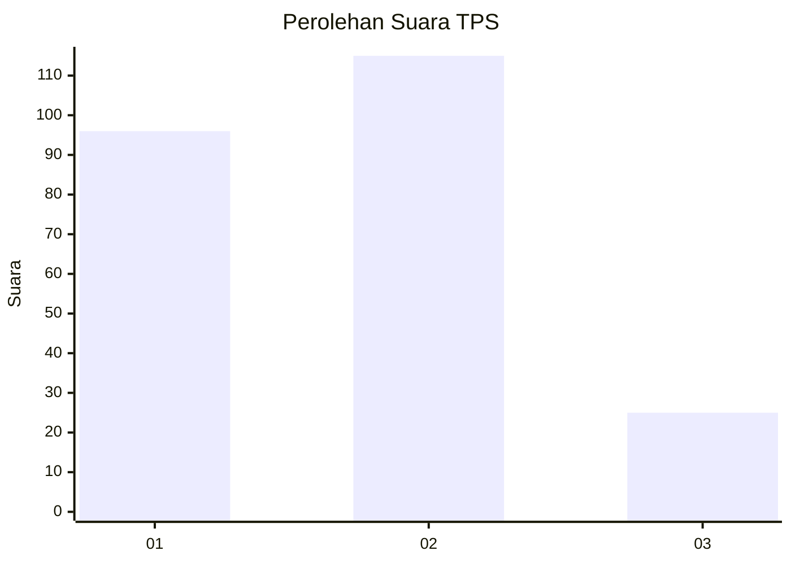
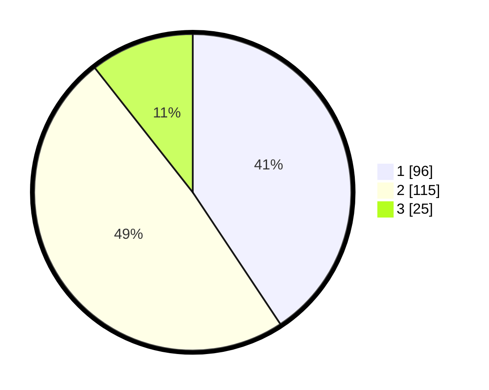

# Hasil

## Grafik

## Tabel

| No. | Nama Paslon    | Suara | Suara (raw) | Persentase |
|:--- |:-------------- | -----:| -----------:| ----------:|
| 1   | ANIES MUHAIMIN | 96    | [96][p-1]   | 40,68      |
| 2   | PRABOWO GIBRAN | 115   | [115][p-2]  | 48,73      |
| 3   | GANJAR MAHFUD  | 25    | [25][p-3]   | 10,59      |

[p-1]: https://github.com/gigit-pemilu/pemilu-2024/blob/main/pilpres/hitung-suara/sub/35-jawa-timur/sub/26-bangkalan/sub/08-sepulu/sub/2009-klabetan/sub/007-tps/sub/paslon-1.txt
[p-2]: https://github.com/gigit-pemilu/pemilu-2024/blob/main/pilpres/hitung-suara/sub/35-jawa-timur/sub/26-bangkalan/sub/08-sepulu/sub/2009-klabetan/sub/007-tps/sub/paslon-2.txt
[p-3]: https://github.com/gigit-pemilu/pemilu-2024/blob/main/pilpres/hitung-suara/sub/35-jawa-timur/sub/26-bangkalan/sub/08-sepulu/sub/2009-klabetan/sub/007-tps/sub/paslon-3.txt

## Foto C Plano

https://sirekap-obj-formc.kpu.go.id/7e16/pemilu/ppwp/35/26/08/20/09/3526082009007-20240214-204906--f16def93-22c1-4f38-a211-e8d6f08d72d8.jpg

https://sirekap-obj-formc.kpu.go.id/7e16/pemilu/ppwp/35/26/08/20/09/3526082009007-20240214-221339--63ee25b2-0ae7-4788-b56f-f1fe756bb6ff.jpg

https://sirekap-obj-formc.kpu.go.id/7e16/pemilu/ppwp/35/26/08/20/09/3526082009007-20240214-221447--c74b2d68-9a7f-45f6-809d-01ca888a429c.jpg

## Metadata

| Key        | Value               |
| ---------- | ------------------- |
| Time Stamp | 2024-02-21 20:00:00 |

