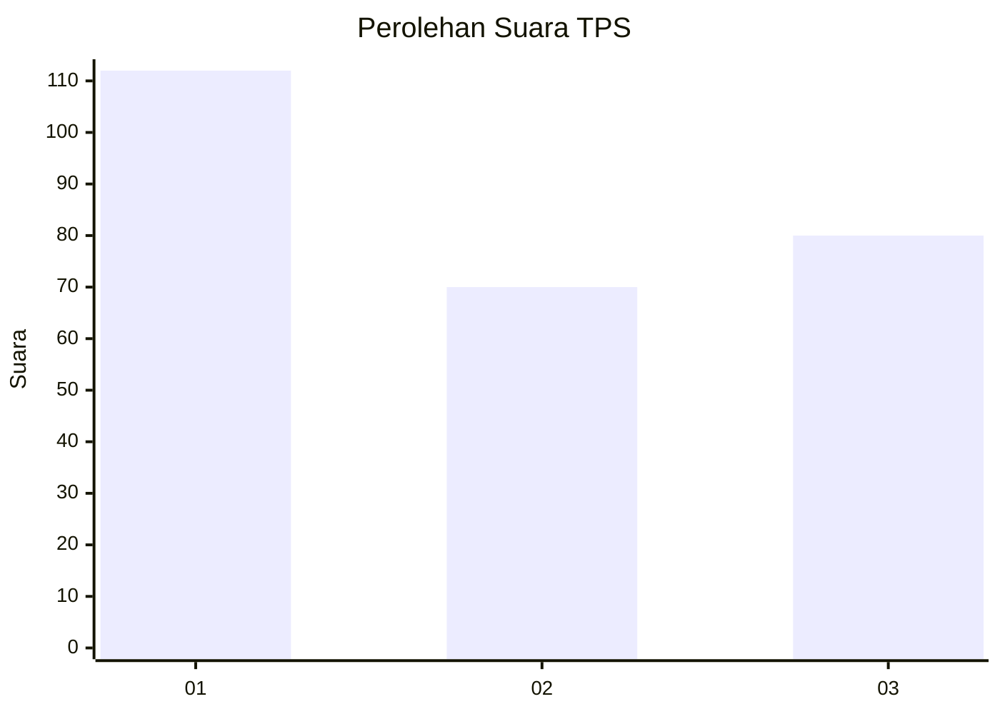
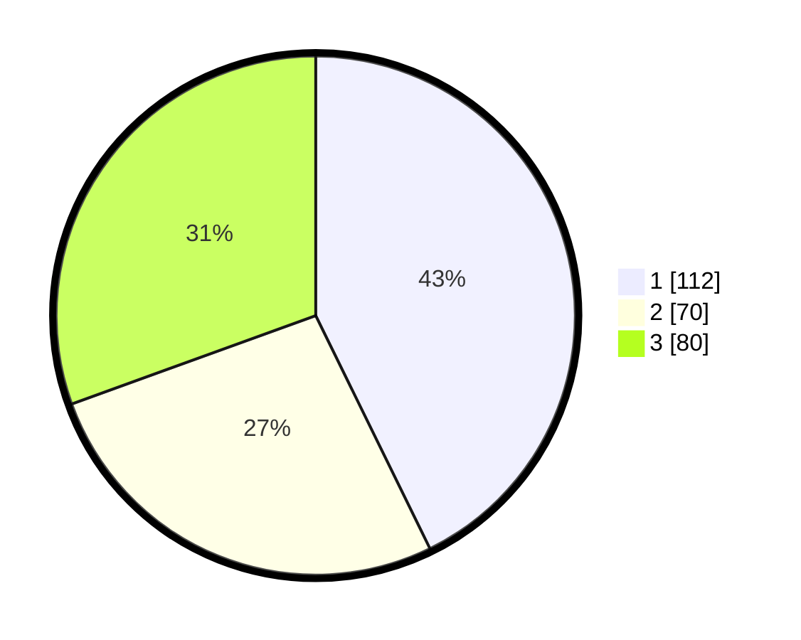

# Hasil

## Grafik

## Tabel

| No. | Nama Paslon    | Suara | Suara (raw) | Persentase |
|:--- |:-------------- | -----:| -----------:| ----------:|
| 1   | ANIES MUHAIMIN | 112   | [112][p-1]  | 42,75      |
| 2   | PRABOWO GIBRAN | 70    | [70][p-2]   | 26,72      |
| 3   | GANJAR MAHFUD  | 80    | [80][p-3]   | 30,53      |

[p-1]: https://github.com/gigit-pemilu/pemilu-2024-35-jawa-timur/blob/main/pilpres/hitung-suara/sub/35-jawa-timur/sub/26-bangkalan/sub/08-sepulu/sub/2010-banyior/sub/004-tps/sub/paslon-1.txt
[p-2]: https://github.com/gigit-pemilu/pemilu-2024-35-jawa-timur/blob/main/pilpres/hitung-suara/sub/35-jawa-timur/sub/26-bangkalan/sub/08-sepulu/sub/2010-banyior/sub/004-tps/sub/paslon-2.txt
[p-3]: https://github.com/gigit-pemilu/pemilu-2024-35-jawa-timur/blob/main/pilpres/hitung-suara/sub/35-jawa-timur/sub/26-bangkalan/sub/08-sepulu/sub/2010-banyior/sub/004-tps/sub/paslon-3.txt

## Foto C Plano

https://sirekap-obj-formc.kpu.go.id/d0a2/pemilu/ppwp/35/26/08/20/10/3526082010004-20240214-191530--a5923e23-92cf-4e4d-ae2f-d419c775e745.jpg

https://sirekap-obj-formc.kpu.go.id/d0a2/pemilu/ppwp/35/26/08/20/10/3526082010004-20240214-191636--af44d7db-2568-4314-9d3a-e6ba8484915e.jpg

https://sirekap-obj-formc.kpu.go.id/d0a2/pemilu/ppwp/35/26/08/20/10/3526082010004-20240214-191712--ee9509a9-a356-4fde-b5ff-54669ce80b30.jpg

## Metadata

| Key        | Value               |
| ---------- | ------------------- |
| Time Stamp | 2024-02-19 06:16:00 |

