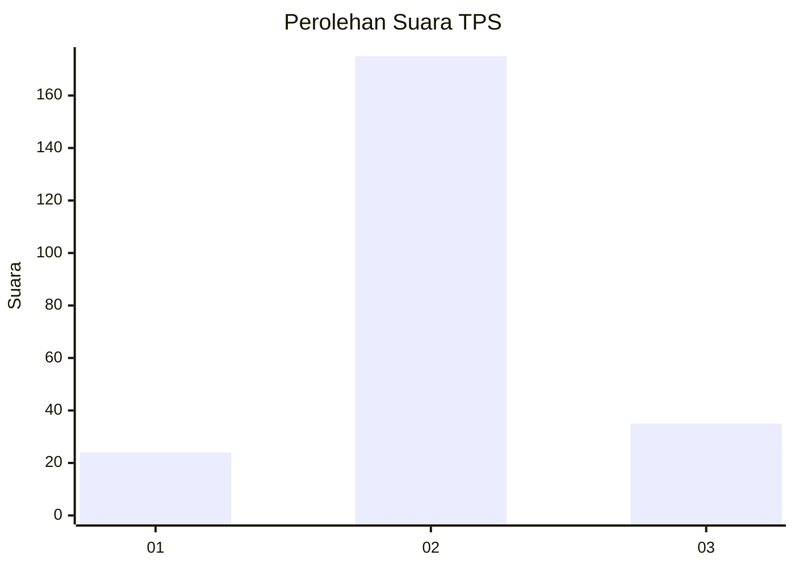

# Hasil

## Grafik

## Tabel

| No. | Nama Paslon    | Suara | Suara (raw) | Persentase |
|:--- |:-------------- | -----:| -----------:| ----------:|
| 1   | ANIES MUHAIMIN | 24    | [24][p-1]   | 10,26      |
| 2   | PRABOWO GIBRAN | 175   | [175][p-2]  | 74,79      |
| 3   | GANJAR MAHFUD  | 35    | [35][p-3]   | 14,96      |

[p-1]: https://github.com/gigit-pemilu/pemilu-2024/blob/main/pilpres/hitung-suara/sub/35-jawa-timur/sub/26-bangkalan/sub/09-tanjung-bumi/sub/2002-bumi-anyar/sub/002-tps/sub/paslon-1.txt
[p-2]: https://github.com/gigit-pemilu/pemilu-2024/blob/main/pilpres/hitung-suara/sub/35-jawa-timur/sub/26-bangkalan/sub/09-tanjung-bumi/sub/2002-bumi-anyar/sub/002-tps/sub/paslon-2.txt
[p-3]: https://github.com/gigit-pemilu/pemilu-2024/blob/main/pilpres/hitung-suara/sub/35-jawa-timur/sub/26-bangkalan/sub/09-tanjung-bumi/sub/2002-bumi-anyar/sub/002-tps/sub/paslon-3.txt

## Foto C Plano

https://sirekap-obj-formc.kpu.go.id/0e04/pemilu/ppwp/35/26/09/20/02/3526092002002-20240215-043512--70e655ef-249f-4e8b-9e06-c80dd885d9ac.jpg

https://sirekap-obj-formc.kpu.go.id/0e04/pemilu/ppwp/35/26/09/20/02/3526092002002-20240215-043947--d9566cb2-d70c-4741-a9f3-dbd14170db19.jpg

https://sirekap-obj-formc.kpu.go.id/0e04/pemilu/ppwp/35/26/09/20/02/3526092002002-20240215-043709--379c182f-71da-4d80-9483-62cb0ed5bade.jpg

## Metadata

| Key        | Value               |
| ---------- | ------------------- |
| Time Stamp | 2024-02-24 22:31:28 |

