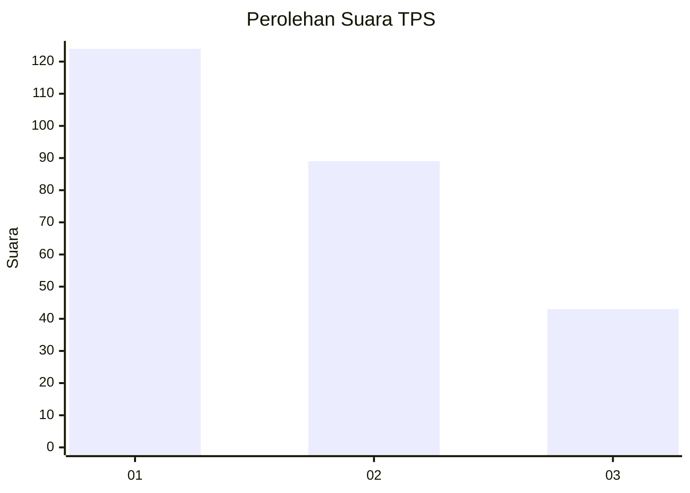
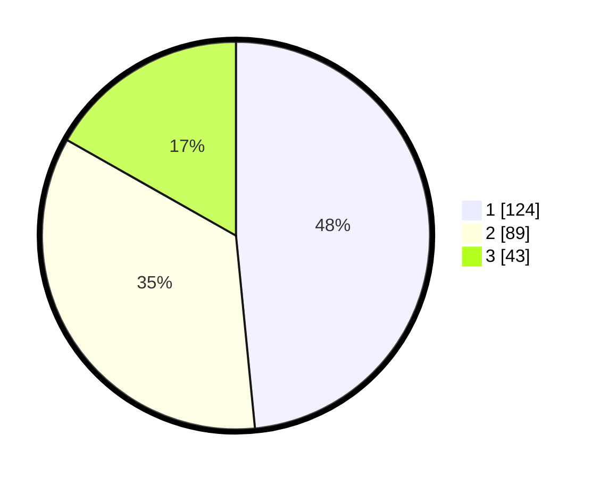

# Hasil

## Grafik

## Tabel

| No. | Nama Paslon    | Suara | Suara (raw) | Persentase |
|:--- |:-------------- | -----:| -----------:| ----------:|
| 1   | ANIES MUHAIMIN | 124   | [124][p-1]  | 48,44      |
| 2   | PRABOWO GIBRAN | 89    | [89][p-2]   | 34,77      |
| 3   | GANJAR MAHFUD  | 43    | [43][p-3]   | 16,80      |

[p-1]: https://github.com/gigit-pemilu/pemilu-2024-35-jawa-timur/blob/main/pilpres/hitung-suara/sub/35-jawa-timur/sub/26-bangkalan/sub/09-tanjung-bumi/sub/2003-tambak-pocok/sub/003-tps/sub/paslon-1.txt
[p-2]: https://github.com/gigit-pemilu/pemilu-2024-35-jawa-timur/blob/main/pilpres/hitung-suara/sub/35-jawa-timur/sub/26-bangkalan/sub/09-tanjung-bumi/sub/2003-tambak-pocok/sub/003-tps/sub/paslon-2.txt
[p-3]: https://github.com/gigit-pemilu/pemilu-2024-35-jawa-timur/blob/main/pilpres/hitung-suara/sub/35-jawa-timur/sub/26-bangkalan/sub/09-tanjung-bumi/sub/2003-tambak-pocok/sub/003-tps/sub/paslon-3.txt

## Foto C Plano

https://sirekap-obj-formc.kpu.go.id/7f81/pemilu/ppwp/35/26/09/20/03/3526092003003-20240215-181027--6e62056b-aea0-402c-967a-3fb77debeb99.jpg

https://sirekap-obj-formc.kpu.go.id/7f81/pemilu/ppwp/35/26/09/20/03/3526092003003-20240215-181150--7dc4e33c-0a81-4d52-9d45-ba539e591812.jpg

https://sirekap-obj-formc.kpu.go.id/7f81/pemilu/ppwp/35/26/09/20/03/3526092003003-20240215-181112--d6daa763-f54b-4c71-9f39-36ed7b20f4a2.jpg

## Metadata

| Key        | Value               |
| ---------- | ------------------- |
| Time Stamp | 2024-02-21 20:00:00 |

