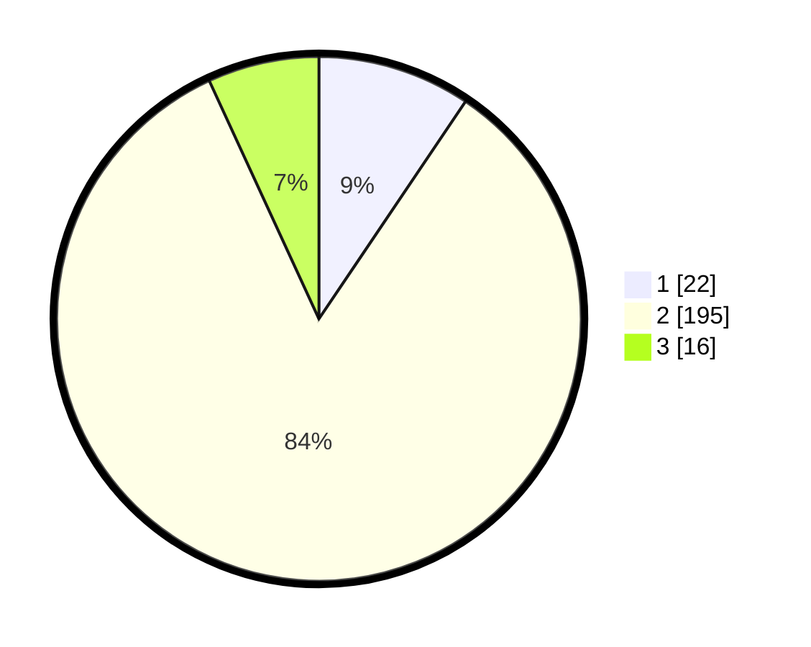

# Hasil

## Grafik

## Tabel

| No. | Nama Paslon    | Suara | Suara (raw) | Persentase |
|:--- |:-------------- | -----:| -----------:| ----------:|
| 1   | ANIES MUHAIMIN | 22    | [22][p-1]   | 9,44       |
| 2   | PRABOWO GIBRAN | 195   | [195][p-2]  | 83,69      |
| 3   | GANJAR MAHFUD  | 16    | [16][p-3]   | 6,87       |

[p-1]: https://github.com/gigit-pemilu/pemilu-2024-35-jawa-timur/blob/main/pilpres/hitung-suara/sub/35-jawa-timur/sub/26-bangkalan/sub/09-tanjung-bumi/sub/2006-bandang-dajah/sub/001-tps/sub/paslon-1.txt
[p-2]: https://github.com/gigit-pemilu/pemilu-2024-35-jawa-timur/blob/main/pilpres/hitung-suara/sub/35-jawa-timur/sub/26-bangkalan/sub/09-tanjung-bumi/sub/2006-bandang-dajah/sub/001-tps/sub/paslon-2.txt
[p-3]: https://github.com/gigit-pemilu/pemilu-2024-35-jawa-timur/blob/main/pilpres/hitung-suara/sub/35-jawa-timur/sub/26-bangkalan/sub/09-tanjung-bumi/sub/2006-bandang-dajah/sub/001-tps/sub/paslon-3.txt

## Foto C Plano

https://sirekap-obj-formc.kpu.go.id/799c/pemilu/ppwp/35/26/09/20/06/3526092006001-20240215-002324--94d97811-dd51-4cf7-9d64-4171374ec32e.jpg

https://sirekap-obj-formc.kpu.go.id/799c/pemilu/ppwp/35/26/09/20/06/3526092006001-20240215-002352--77d40b22-c461-4041-8318-dd50c048f750.jpg

https://sirekap-obj-formc.kpu.go.id/799c/pemilu/ppwp/35/26/09/20/06/3526092006001-20240215-002454--01ed1c6a-b54f-4164-a720-3845a54a495b.jpg

## Metadata

| Key        | Value               |
| ---------- | ------------------- |
| Time Stamp | 2024-02-24 22:31:28 |

