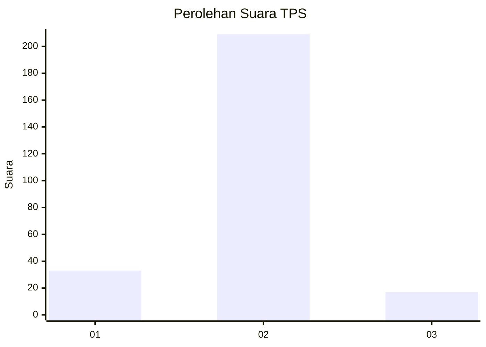
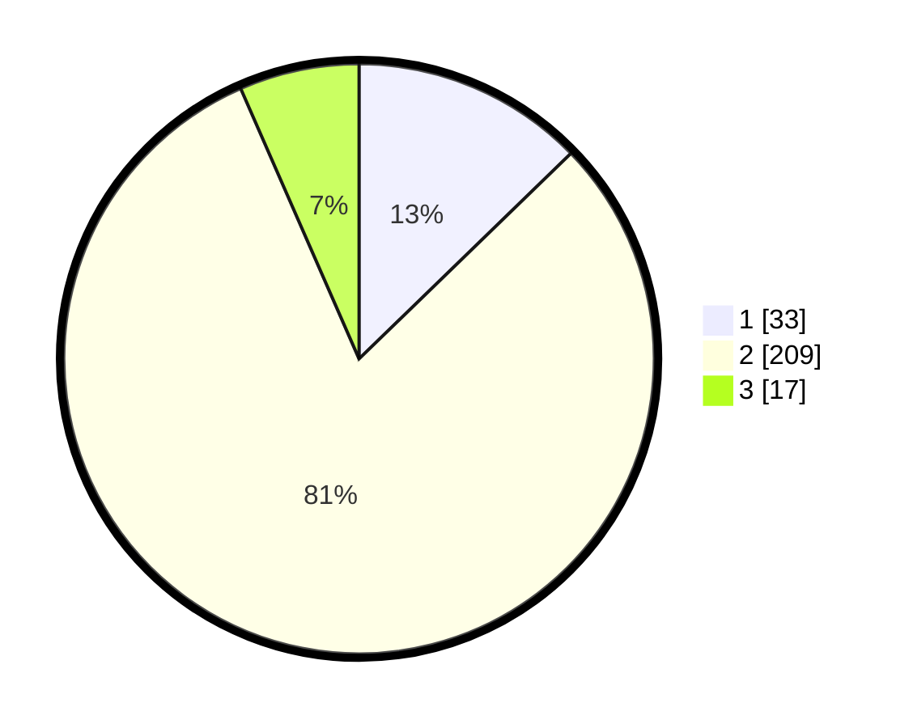

# Hasil

## Grafik

## Tabel

| No. | Nama Paslon    | Suara | Suara (raw) | Persentase |
|:--- |:-------------- | -----:| -----------:| ----------:|
| 1   | ANIES MUHAIMIN | 33    | [33][p-1]   | 12,74      |
| 2   | PRABOWO GIBRAN | 209   | [209][p-2]  | 80,69      |
| 3   | GANJAR MAHFUD  | 17    | [17][p-3]   | 6,56       |

[p-1]: https://github.com/gigit-pemilu/pemilu-2024-35-jawa-timur/blob/main/pilpres/hitung-suara/sub/35-jawa-timur/sub/26-bangkalan/sub/09-tanjung-bumi/sub/2007-tagungguh/sub/004-tps/sub/paslon-1.txt
[p-2]: https://github.com/gigit-pemilu/pemilu-2024-35-jawa-timur/blob/main/pilpres/hitung-suara/sub/35-jawa-timur/sub/26-bangkalan/sub/09-tanjung-bumi/sub/2007-tagungguh/sub/004-tps/sub/paslon-2.txt
[p-3]: https://github.com/gigit-pemilu/pemilu-2024-35-jawa-timur/blob/main/pilpres/hitung-suara/sub/35-jawa-timur/sub/26-bangkalan/sub/09-tanjung-bumi/sub/2007-tagungguh/sub/004-tps/sub/paslon-3.txt

## Foto C Plano

https://sirekap-obj-formc.kpu.go.id/0129/pemilu/ppwp/35/26/09/20/07/3526092007004-20240214-211653--49775d73-9106-46c2-ae20-3c25119483de.jpg

https://sirekap-obj-formc.kpu.go.id/0129/pemilu/ppwp/35/26/09/20/07/3526092007004-20240214-211923--3a98432f-a2ba-469d-8a69-1b3492d759de.jpg

https://sirekap-obj-formc.kpu.go.id/0129/pemilu/ppwp/35/26/09/20/07/3526092007004-20240214-212037--ea206482-db80-409f-8091-a59889bdd7ed.jpg

## Metadata

| Key        | Value               |
| ---------- | ------------------- |
| Time Stamp | 2024-02-19 06:16:00 |

