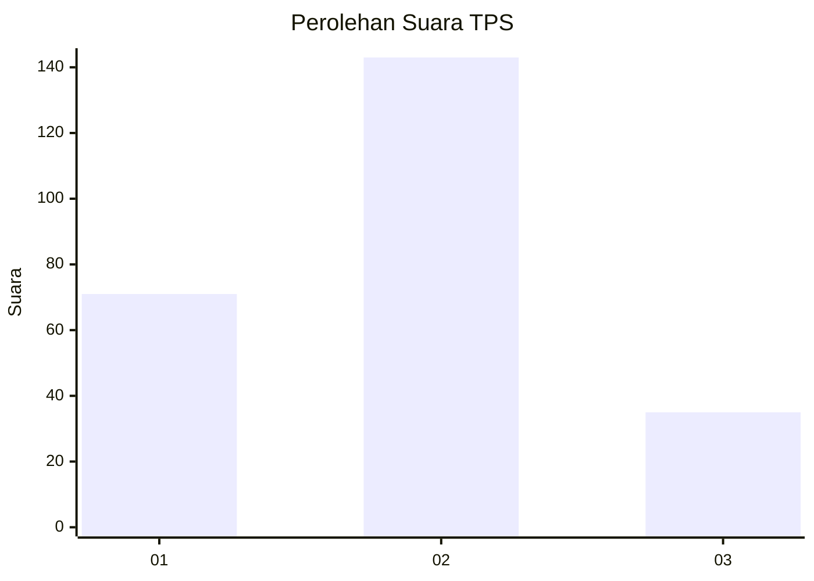
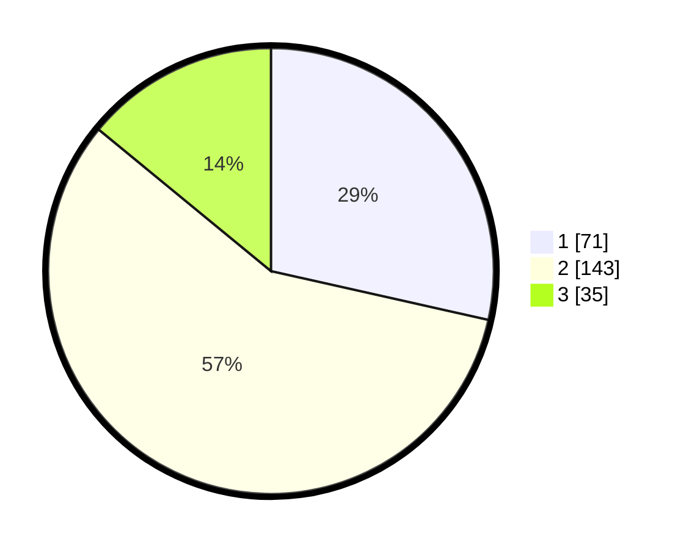

# Hasil

## Grafik

## Tabel

| No. | Nama Paslon    | Suara | Suara (raw) | Persentase |
|:--- |:-------------- | -----:| -----------:| ----------:|
| 1   | ANIES MUHAIMIN | 71    | [71][p-1]   | 28,51      |
| 2   | PRABOWO GIBRAN | 143   | [143][p-2]  | 57,43      |
| 3   | GANJAR MAHFUD  | 35    | [35][p-3]   | 14,06      |

[p-1]: https://github.com/gigit-pemilu/pemilu-2024/blob/main/pilpres/hitung-suara/sub/35-jawa-timur/sub/26-bangkalan/sub/09-tanjung-bumi/sub/2012-macajah/sub/011-tps/sub/paslon-1.txt
[p-2]: https://github.com/gigit-pemilu/pemilu-2024/blob/main/pilpres/hitung-suara/sub/35-jawa-timur/sub/26-bangkalan/sub/09-tanjung-bumi/sub/2012-macajah/sub/011-tps/sub/paslon-2.txt
[p-3]: https://github.com/gigit-pemilu/pemilu-2024/blob/main/pilpres/hitung-suara/sub/35-jawa-timur/sub/26-bangkalan/sub/09-tanjung-bumi/sub/2012-macajah/sub/011-tps/sub/paslon-3.txt

## Foto C Plano

https://sirekap-obj-formc.kpu.go.id/ca1d/pemilu/ppwp/35/26/09/20/12/3526092012011-20240215-001922--14976902-28b6-43f6-9756-8aaec12dd924.jpg

https://sirekap-obj-formc.kpu.go.id/ca1d/pemilu/ppwp/35/26/09/20/12/3526092012011-20240215-001933--78719ad5-6be2-447b-aaa3-1e0a642fdb4b.jpg

https://sirekap-obj-formc.kpu.go.id/ca1d/pemilu/ppwp/35/26/09/20/12/3526092012011-20240215-001949--106a865b-25fd-457b-9061-4efb10f7bdb1.jpg

## Metadata

| Key        | Value               |
| ---------- | ------------------- |
| Time Stamp | 2024-02-21 20:00:00 |

