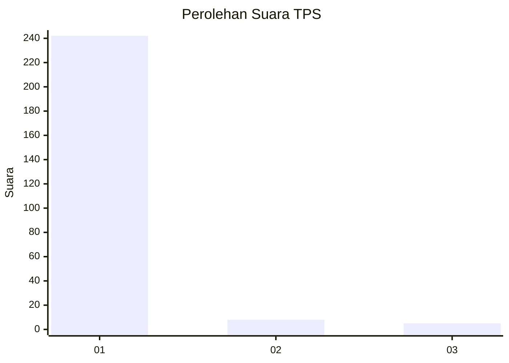
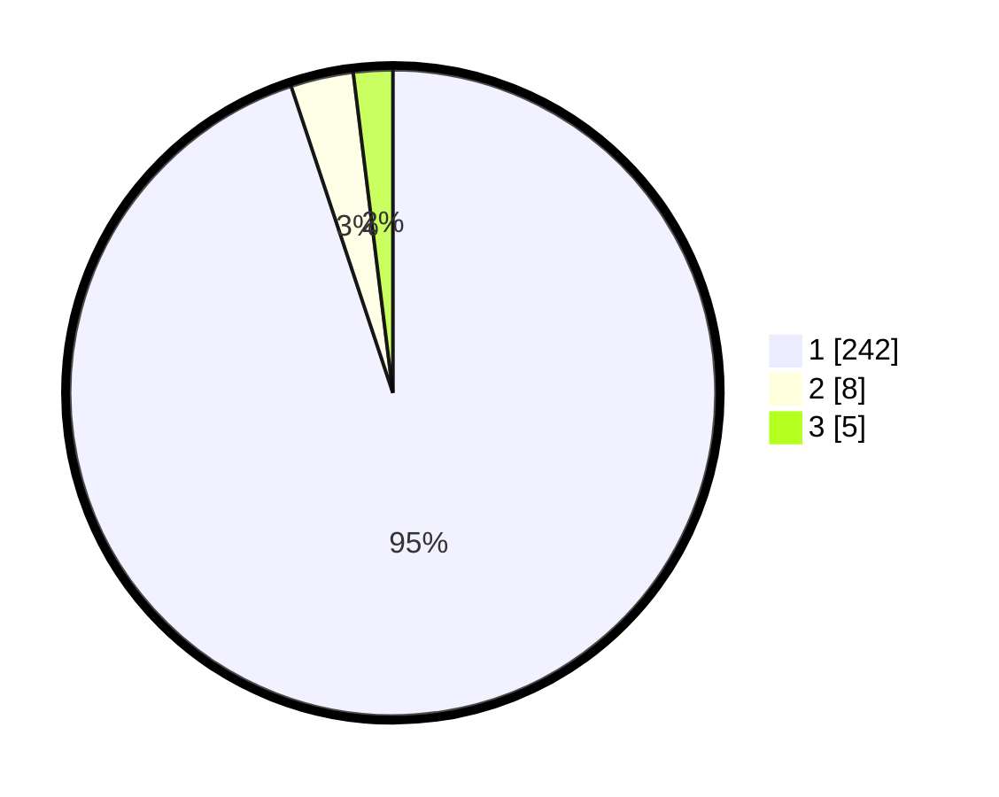

# Hasil

## Grafik

## Tabel

| No. | Nama Paslon    | Suara | Suara (raw) | Persentase |
|:--- |:-------------- | -----:| -----------:| ----------:|
| 1   | ANIES MUHAIMIN | 242   | [242][p-1]  | 94,90      |
| 2   | PRABOWO GIBRAN | 8     | [8][p-2]    | 3,14       |
| 3   | GANJAR MAHFUD  | 5     | [5][p-3]    | 1,96       |

[p-1]: https://github.com/gigit-pemilu/pemilu-2024-35-jawa-timur/blob/main/pilpres/hitung-suara/sub/35-jawa-timur/sub/26-bangkalan/sub/10-kokop/sub/2008-kokop/sub/007-tps/sub/paslon-1.txt
[p-2]: https://github.com/gigit-pemilu/pemilu-2024-35-jawa-timur/blob/main/pilpres/hitung-suara/sub/35-jawa-timur/sub/26-bangkalan/sub/10-kokop/sub/2008-kokop/sub/007-tps/sub/paslon-2.txt
[p-3]: https://github.com/gigit-pemilu/pemilu-2024-35-jawa-timur/blob/main/pilpres/hitung-suara/sub/35-jawa-timur/sub/26-bangkalan/sub/10-kokop/sub/2008-kokop/sub/007-tps/sub/paslon-3.txt

## Foto C Plano

https://sirekap-obj-formc.kpu.go.id/71d0/pemilu/ppwp/35/26/10/20/08/3526102008007-20240214-231745--661fe3fc-66c2-4556-85cd-ecfa5fa6ee8e.jpg

https://sirekap-obj-formc.kpu.go.id/71d0/pemilu/ppwp/35/26/10/20/08/3526102008007-20240214-231457--06b4b2be-32ba-4864-8338-71f4821f2c96.jpg

https://sirekap-obj-formc.kpu.go.id/71d0/pemilu/ppwp/35/26/10/20/08/3526102008007-20240214-231848--8d7ae0b7-606f-44c5-b6bd-ee937a6bfffe.jpg

## Metadata

| Key        | Value               |
| ---------- | ------------------- |
| Time Stamp | 2024-02-19 11:00:00 |

