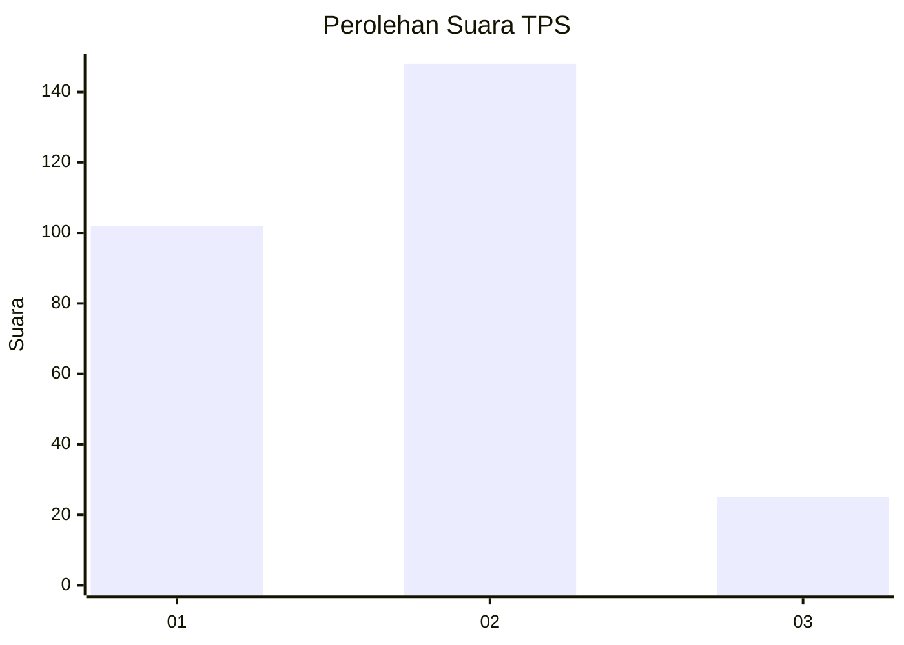

# Hasil

## Grafik

## Tabel

| No. | Nama Paslon    | Suara | Suara (raw) | Persentase |
|:--- |:-------------- | -----:| -----------:| ----------:|
| 1   | ANIES MUHAIMIN | 102   | [102][p-1]  | 37,09      |
| 2   | PRABOWO GIBRAN | 148   | [148][p-2]  | 53,82      |
| 3   | GANJAR MAHFUD  | 25    | [25][p-3]   | 9,09       |

[p-1]: https://github.com/gigit-pemilu/pemilu-2024/blob/main/pilpres/hitung-suara/sub/35-jawa-timur/sub/26-bangkalan/sub/11-kwanyar/sub/2001-pesanggrahan/sub/011-tps/sub/paslon-1.txt
[p-2]: https://github.com/gigit-pemilu/pemilu-2024/blob/main/pilpres/hitung-suara/sub/35-jawa-timur/sub/26-bangkalan/sub/11-kwanyar/sub/2001-pesanggrahan/sub/011-tps/sub/paslon-2.txt
[p-3]: https://github.com/gigit-pemilu/pemilu-2024/blob/main/pilpres/hitung-suara/sub/35-jawa-timur/sub/26-bangkalan/sub/11-kwanyar/sub/2001-pesanggrahan/sub/011-tps/sub/paslon-3.txt

## Foto C Plano

https://sirekap-obj-formc.kpu.go.id/7fa2/pemilu/ppwp/35/26/11/20/01/3526112001011-20240214-225046--ced01ef6-b45e-4dc9-ac5d-e6aa078625b8.jpg

https://sirekap-obj-formc.kpu.go.id/7fa2/pemilu/ppwp/35/26/11/20/01/3526112001011-20240214-225128--4feda6ef-c84b-4f9b-b6a6-cb2148fb53c4.jpg

https://sirekap-obj-formc.kpu.go.id/7fa2/pemilu/ppwp/35/26/11/20/01/3526112001011-20240214-225242--cd27792f-28cf-4058-b6d4-7834fdae2b81.jpg

## Metadata

| Key        | Value               |
| ---------- | ------------------- |
| Time Stamp | 2024-02-15 12:00:28 |

