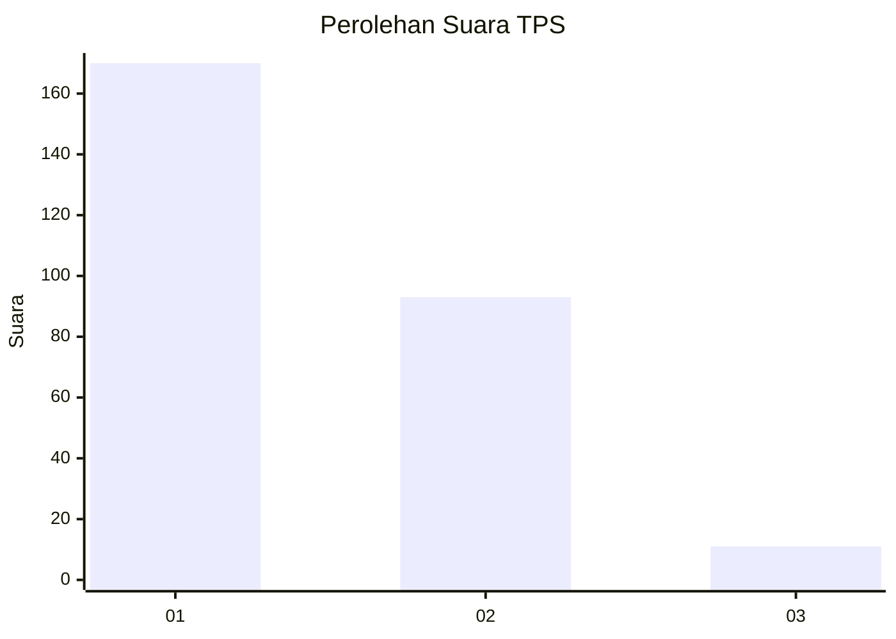
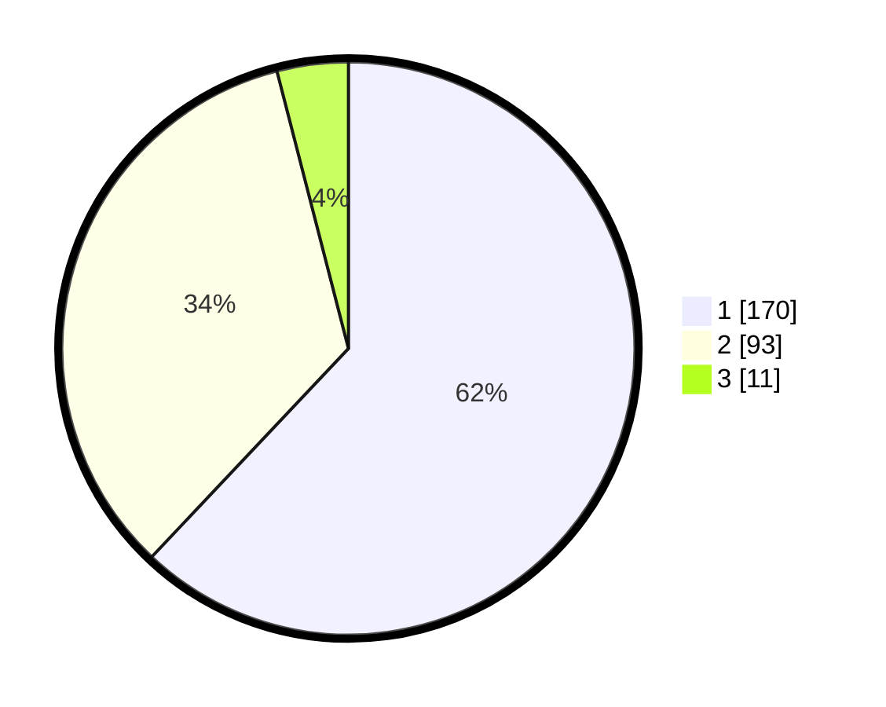

# Hasil

## Grafik

## Tabel

| No. | Nama Paslon    | Suara | Suara (raw) | Persentase |
|:--- |:-------------- | -----:| -----------:| ----------:|
| 1   | ANIES MUHAIMIN | 170   | [170][p-1]  | 62,04      |
| 2   | PRABOWO GIBRAN | 93    | [93][p-2]   | 33,94      |
| 3   | GANJAR MAHFUD  | 11    | [11][p-3]   | 4,01       |

[p-1]: https://github.com/gigit-pemilu/pemilu-2024/blob/main/pilpres/hitung-suara/sub/35-jawa-timur/sub/26-bangkalan/sub/11-kwanyar/sub/2001-pesanggrahan/sub/014-tps/sub/paslon-1.txt
[p-2]: https://github.com/gigit-pemilu/pemilu-2024/blob/main/pilpres/hitung-suara/sub/35-jawa-timur/sub/26-bangkalan/sub/11-kwanyar/sub/2001-pesanggrahan/sub/014-tps/sub/paslon-2.txt
[p-3]: https://github.com/gigit-pemilu/pemilu-2024/blob/main/pilpres/hitung-suara/sub/35-jawa-timur/sub/26-bangkalan/sub/11-kwanyar/sub/2001-pesanggrahan/sub/014-tps/sub/paslon-3.txt

## Foto C Plano

https://sirekap-obj-formc.kpu.go.id/5680/pemilu/ppwp/35/26/11/20/01/3526112001014-20240214-213806--dc98700a-9f77-4b06-be8c-44d51ae32d5d.jpg

https://sirekap-obj-formc.kpu.go.id/5680/pemilu/ppwp/35/26/11/20/01/3526112001014-20240214-214151--1f748530-dd3c-4cc6-b34d-cdd4fbd60160.jpg

https://sirekap-obj-formc.kpu.go.id/5680/pemilu/ppwp/35/26/11/20/01/3526112001014-20240214-214500--67a3a0a2-1110-4fb4-9258-df4540c8824d.jpg

## Metadata

| Key        | Value               |
| ---------- | ------------------- |
| Time Stamp | 2024-02-19 06:16:00 |

