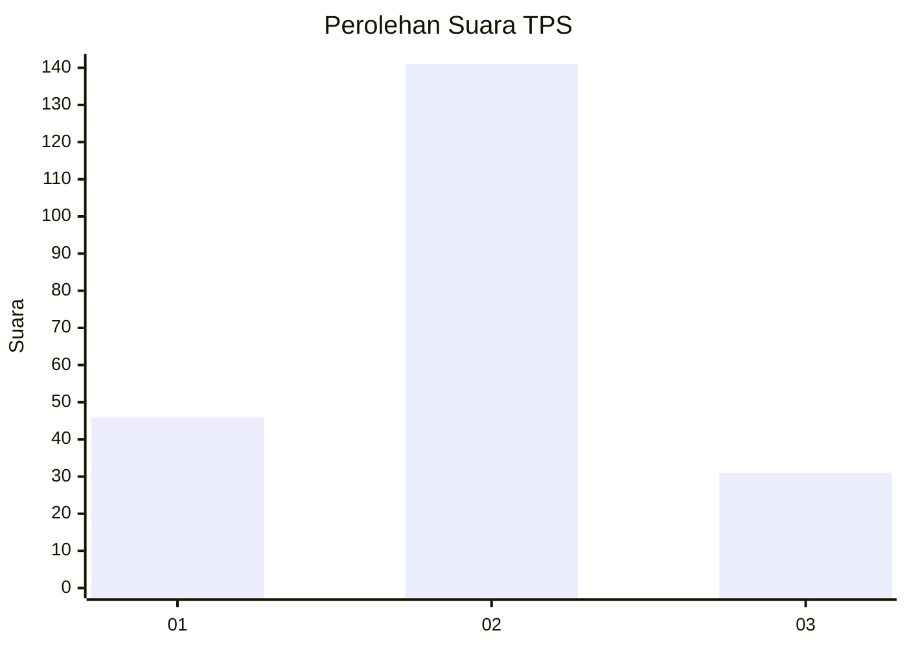
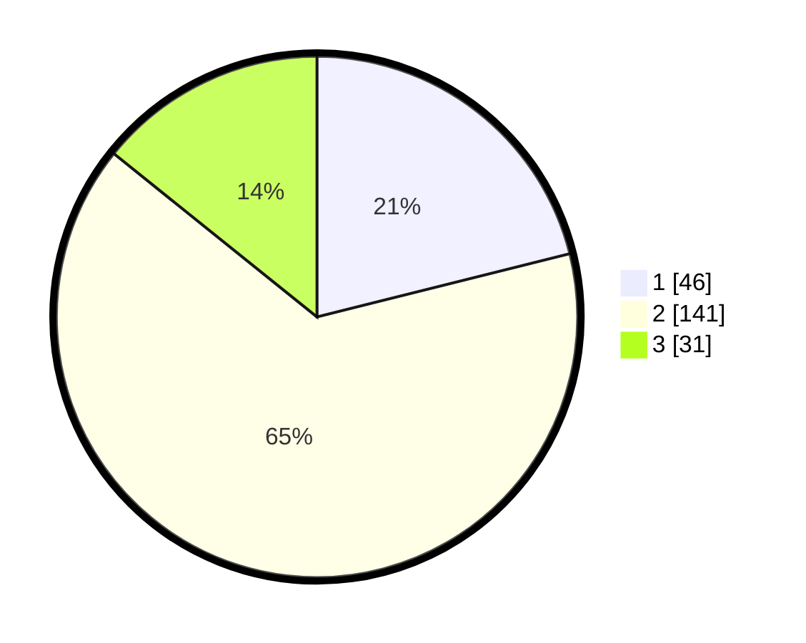

# Hasil

## Grafik

## Tabel

| No. | Nama Paslon    | Suara | Suara (raw) | Persentase |
|:--- |:-------------- | -----:| -----------:| ----------:|
| 1   | ANIES MUHAIMIN | 46    | [46][p-1]   | 21,10      |
| 2   | PRABOWO GIBRAN | 141   | [141][p-2]  | 64,68      |
| 3   | GANJAR MAHFUD  | 31    | [31][p-3]   | 14,22      |

[p-1]: https://github.com/gigit-pemilu/pemilu-2024/blob/main/pilpres/hitung-suara/sub/35-jawa-timur/sub/26-bangkalan/sub/11-kwanyar/sub/2002-kwanyar-barat/sub/003-tps/sub/paslon-1.txt
[p-2]: https://github.com/gigit-pemilu/pemilu-2024/blob/main/pilpres/hitung-suara/sub/35-jawa-timur/sub/26-bangkalan/sub/11-kwanyar/sub/2002-kwanyar-barat/sub/003-tps/sub/paslon-2.txt
[p-3]: https://github.com/gigit-pemilu/pemilu-2024/blob/main/pilpres/hitung-suara/sub/35-jawa-timur/sub/26-bangkalan/sub/11-kwanyar/sub/2002-kwanyar-barat/sub/003-tps/sub/paslon-3.txt

## Foto C Plano

https://sirekap-obj-formc.kpu.go.id/5395/pemilu/ppwp/35/26/11/20/02/3526112002003-20240215-175739--b5a331db-ea82-4ae0-a3db-0c2148924dfd.jpg

https://sirekap-obj-formc.kpu.go.id/5395/pemilu/ppwp/35/26/11/20/02/3526112002003-20240215-175931--d8fac631-7546-43df-aa29-ad2e26bc60fc.jpg

https://sirekap-obj-formc.kpu.go.id/5395/pemilu/ppwp/35/26/11/20/02/3526112002003-20240215-180112--b5ae3cb6-9eec-4453-89f8-54b41bebfc90.jpg

## Metadata

| Key        | Value               |
| ---------- | ------------------- |
| Time Stamp | 2024-02-24 22:31:28 |

