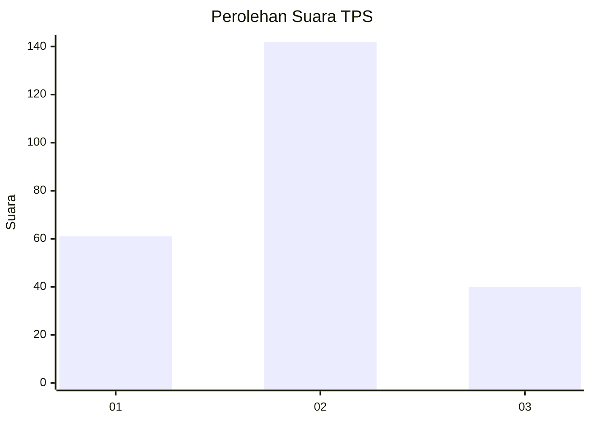

# Hasil

## Grafik

## Tabel

| No. | Nama Paslon    | Suara | Suara (raw) | Persentase |
|:--- |:-------------- | -----:| -----------:| ----------:|
| 1   | ANIES MUHAIMIN | 61    | [61][p-1]   | 25,10      |
| 2   | PRABOWO GIBRAN | 142   | [142][p-2]  | 58,44      |
| 3   | GANJAR MAHFUD  | 40    | [40][p-3]   | 16,46      |

[p-1]: https://github.com/gigit-pemilu/pemilu-2024-35-jawa-timur/blob/main/pilpres/hitung-suara/sub/35-jawa-timur/sub/26-bangkalan/sub/11-kwanyar/sub/2002-kwanyar-barat/sub/005-tps/sub/paslon-1.txt
[p-2]: https://github.com/gigit-pemilu/pemilu-2024-35-jawa-timur/blob/main/pilpres/hitung-suara/sub/35-jawa-timur/sub/26-bangkalan/sub/11-kwanyar/sub/2002-kwanyar-barat/sub/005-tps/sub/paslon-2.txt
[p-3]: https://github.com/gigit-pemilu/pemilu-2024-35-jawa-timur/blob/main/pilpres/hitung-suara/sub/35-jawa-timur/sub/26-bangkalan/sub/11-kwanyar/sub/2002-kwanyar-barat/sub/005-tps/sub/paslon-3.txt

## Foto C Plano

https://sirekap-obj-formc.kpu.go.id/ec49/pemilu/ppwp/35/26/11/20/02/3526112002005-20240214-234138--d143a17c-b120-437c-bb55-b17d4a3856bc.jpg

https://sirekap-obj-formc.kpu.go.id/ec49/pemilu/ppwp/35/26/11/20/02/3526112002005-20240214-233639--9cdb476f-c79c-484d-8e20-cc0ebdb7b308.jpg

https://sirekap-obj-formc.kpu.go.id/ec49/pemilu/ppwp/35/26/11/20/02/3526112002005-20240214-234240--0a83c98c-12c2-4d9c-933e-286eedea4e79.jpg

## Metadata

| Key        | Value               |
| ---------- | ------------------- |
| Time Stamp | 2024-02-24 22:31:28 |

