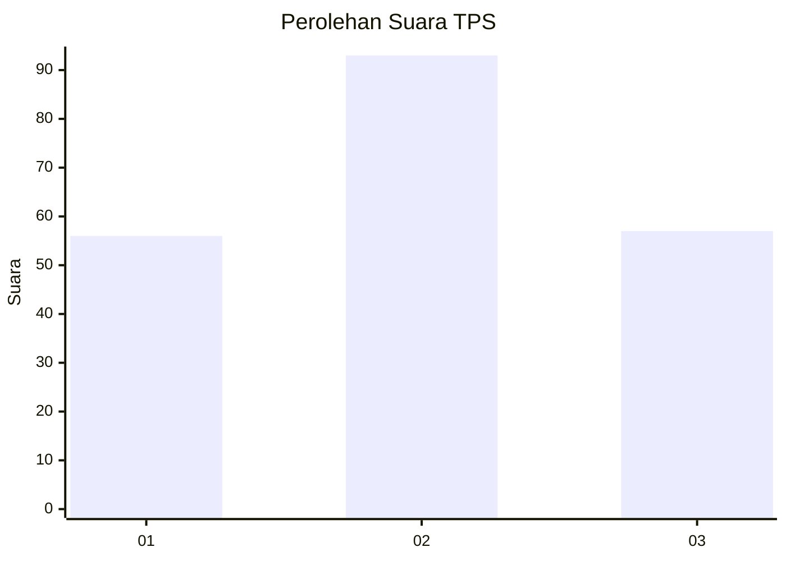
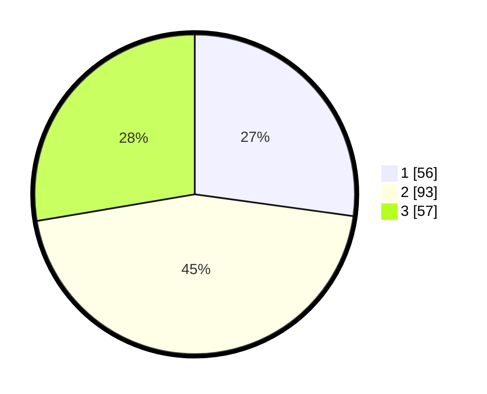

# Hasil

## Grafik

## Tabel

| No. | Nama Paslon    | Suara | Suara (raw) | Persentase |
|:--- |:-------------- | -----:| -----------:| ----------:|
| 1   | ANIES MUHAIMIN | 56    | [56][p-1]   | 27,18      |
| 2   | PRABOWO GIBRAN | 93    | [93][p-2]   | 45,15      |
| 3   | GANJAR MAHFUD  | 57    | [57][p-3]   | 27,67      |

[p-1]: https://github.com/gigit-pemilu/pemilu-2024/blob/main/pilpres/hitung-suara/sub/35-jawa-timur/sub/26-bangkalan/sub/11-kwanyar/sub/2002-kwanyar-barat/sub/008-tps/sub/paslon-1.txt
[p-2]: https://github.com/gigit-pemilu/pemilu-2024/blob/main/pilpres/hitung-suara/sub/35-jawa-timur/sub/26-bangkalan/sub/11-kwanyar/sub/2002-kwanyar-barat/sub/008-tps/sub/paslon-2.txt
[p-3]: https://github.com/gigit-pemilu/pemilu-2024/blob/main/pilpres/hitung-suara/sub/35-jawa-timur/sub/26-bangkalan/sub/11-kwanyar/sub/2002-kwanyar-barat/sub/008-tps/sub/paslon-3.txt

## Foto C Plano

https://sirekap-obj-formc.kpu.go.id/f9a7/pemilu/ppwp/35/26/11/20/02/3526112002008-20240215-035648--4944e038-1c61-4461-a3ad-63b1aea88a30.jpg

https://sirekap-obj-formc.kpu.go.id/f9a7/pemilu/ppwp/35/26/11/20/02/3526112002008-20240215-035735--a9ac54d0-4d47-4bd7-98bc-013ea9119604.jpg

## Metadata

| Key        | Value               |
| ---------- | ------------------- |
| Time Stamp | 2024-02-24 22:31:28 |

