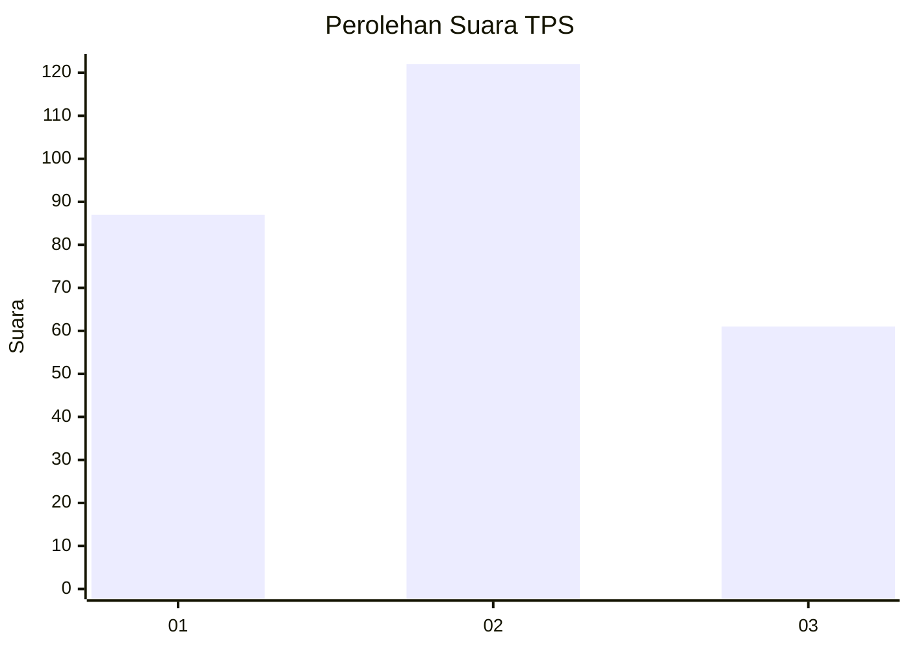
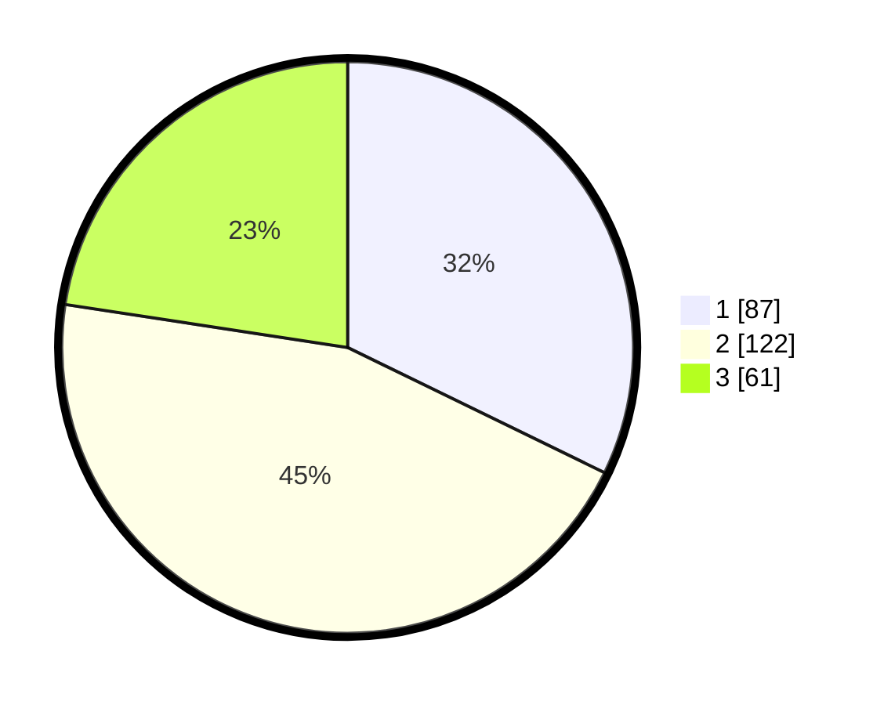

# Hasil

## Grafik

## Tabel

| No. | Nama Paslon    | Suara | Suara (raw) | Persentase |
|:--- |:-------------- | -----:| -----------:| ----------:|
| 1   | ANIES MUHAIMIN | 87    | [87][p-1]   | 32,22      |
| 2   | PRABOWO GIBRAN | 122   | [122][p-2]  | 45,19      |
| 3   | GANJAR MAHFUD  | 61    | [61][p-3]   | 22,59      |

[p-1]: https://github.com/gigit-pemilu/pemilu-2024/blob/main/pilpres/hitung-suara/sub/35-jawa-timur/sub/26-bangkalan/sub/11-kwanyar/sub/2013-batah-timur/sub/004-tps/sub/paslon-1.txt
[p-2]: https://github.com/gigit-pemilu/pemilu-2024/blob/main/pilpres/hitung-suara/sub/35-jawa-timur/sub/26-bangkalan/sub/11-kwanyar/sub/2013-batah-timur/sub/004-tps/sub/paslon-2.txt
[p-3]: https://github.com/gigit-pemilu/pemilu-2024/blob/main/pilpres/hitung-suara/sub/35-jawa-timur/sub/26-bangkalan/sub/11-kwanyar/sub/2013-batah-timur/sub/004-tps/sub/paslon-3.txt

## Foto C Plano

https://sirekap-obj-formc.kpu.go.id/09bc/pemilu/ppwp/35/26/11/20/13/3526112013004-20240214-201257--13dbaa16-f2eb-49f0-81e0-54c3c73f59a5.jpg

https://sirekap-obj-formc.kpu.go.id/09bc/pemilu/ppwp/35/26/11/20/13/3526112013004-20240214-201320--53f659af-ecc8-438e-9655-f082a496709d.jpg

https://sirekap-obj-formc.kpu.go.id/09bc/pemilu/ppwp/35/26/11/20/13/3526112013004-20240214-193733--59fb6a5b-52af-42aa-bb4e-5ef83b17ce1b.jpg

## Metadata

| Key        | Value               |
| ---------- | ------------------- |
| Time Stamp | 2024-02-24 22:31:28 |

