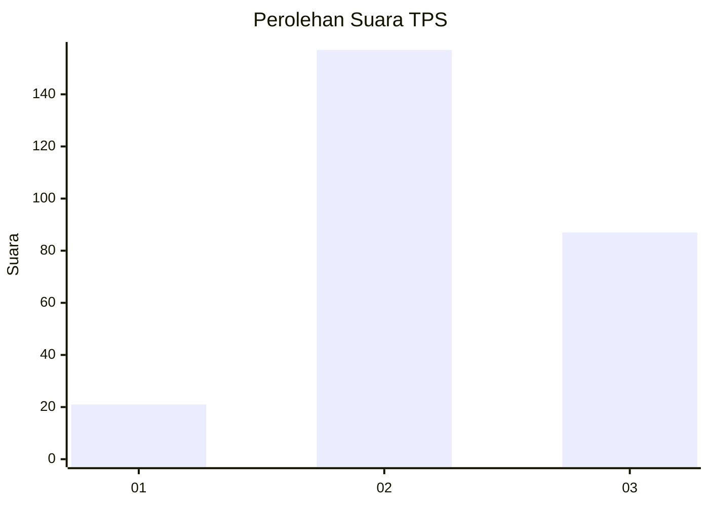
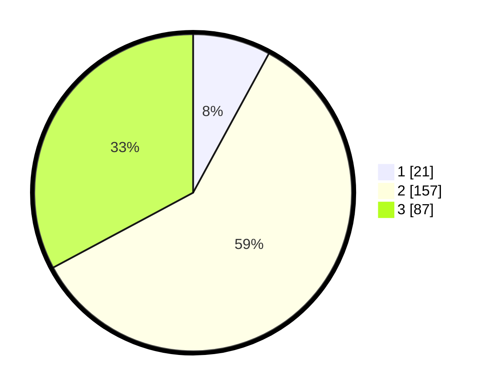

# Hasil

## Grafik

## Tabel

| No. | Nama Paslon    | Suara | Suara (raw) | Persentase |
|:--- |:-------------- | -----:| -----------:| ----------:|
| 1   | ANIES MUHAIMIN | 21    | [21][p-1]   | 7,92       |
| 2   | PRABOWO GIBRAN | 157   | [157][p-2]  | 59,25      |
| 3   | GANJAR MAHFUD  | 87    | [87][p-3]   | 32,83      |

[p-1]: https://github.com/gigit-pemilu/pemilu-2024/blob/main/pilpres/hitung-suara/sub/35-jawa-timur/sub/26-bangkalan/sub/12-labang/sub/2001-kesek/sub/009-tps/sub/paslon-1.txt
[p-2]: https://github.com/gigit-pemilu/pemilu-2024/blob/main/pilpres/hitung-suara/sub/35-jawa-timur/sub/26-bangkalan/sub/12-labang/sub/2001-kesek/sub/009-tps/sub/paslon-2.txt
[p-3]: https://github.com/gigit-pemilu/pemilu-2024/blob/main/pilpres/hitung-suara/sub/35-jawa-timur/sub/26-bangkalan/sub/12-labang/sub/2001-kesek/sub/009-tps/sub/paslon-3.txt

## Foto C Plano

https://sirekap-obj-formc.kpu.go.id/db10/pemilu/ppwp/35/26/12/20/01/3526122001009-20240215-071242--42e45123-d443-4d8b-a235-1670534dd3bf.jpg

https://sirekap-obj-formc.kpu.go.id/db10/pemilu/ppwp/35/26/12/20/01/3526122001009-20240215-071258--9c21d92c-4be4-4b0a-ae59-7a027b9e6d35.jpg

https://sirekap-obj-formc.kpu.go.id/db10/pemilu/ppwp/35/26/12/20/01/3526122001009-20240215-071356--45825a2f-a1c3-49c8-95e7-7c854072c4b9.jpg

## Metadata

| Key        | Value               |
| ---------- | ------------------- |
| Time Stamp | 2024-02-17 14:45:18 |

