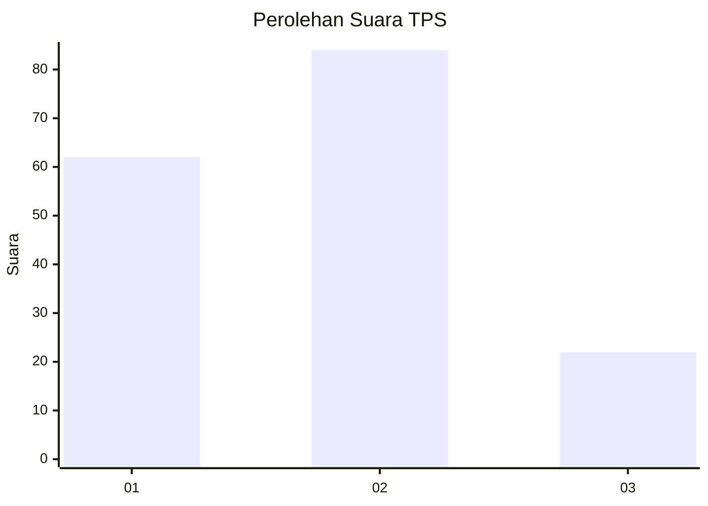
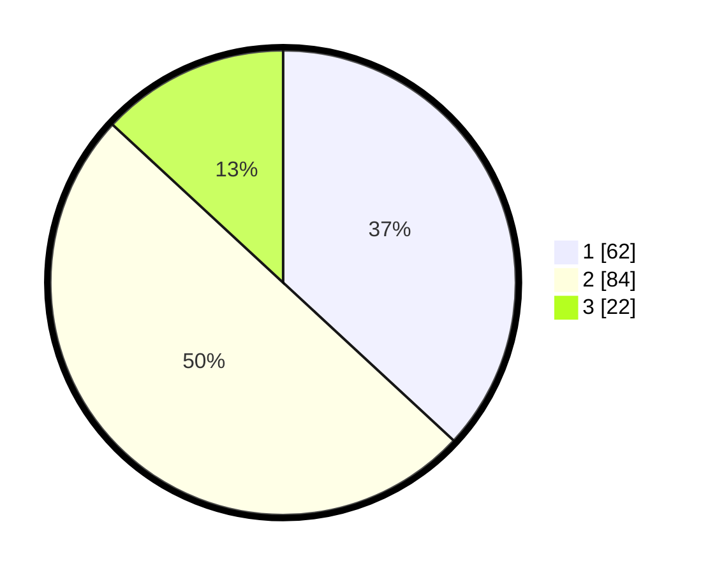

# Hasil

## Grafik

## Tabel

| No. | Nama Paslon    | Suara | Suara (raw) | Persentase |
|:--- |:-------------- | -----:| -----------:| ----------:|
| 1   | ANIES MUHAIMIN | 62    | [62][p-1]   | 36,90      |
| 2   | PRABOWO GIBRAN | 84    | [84][p-2]   | 50,00      |
| 3   | GANJAR MAHFUD  | 22    | [22][p-3]   | 13,10      |

[p-1]: https://github.com/gigit-pemilu/pemilu-2024-35-jawa-timur/blob/main/pilpres/hitung-suara/sub/35-jawa-timur/sub/26-bangkalan/sub/12-labang/sub/2002-labang/sub/006-tps/sub/paslon-1.txt
[p-2]: https://github.com/gigit-pemilu/pemilu-2024-35-jawa-timur/blob/main/pilpres/hitung-suara/sub/35-jawa-timur/sub/26-bangkalan/sub/12-labang/sub/2002-labang/sub/006-tps/sub/paslon-2.txt
[p-3]: https://github.com/gigit-pemilu/pemilu-2024-35-jawa-timur/blob/main/pilpres/hitung-suara/sub/35-jawa-timur/sub/26-bangkalan/sub/12-labang/sub/2002-labang/sub/006-tps/sub/paslon-3.txt

## Foto C Plano

https://sirekap-obj-formc.kpu.go.id/44c5/pemilu/ppwp/35/26/12/20/02/3526122002006-20240214-222051--0b218225-11bf-40f8-880b-9cadcc705673.jpg

https://sirekap-obj-formc.kpu.go.id/44c5/pemilu/ppwp/35/26/12/20/02/3526122002006-20240214-222348--8f9382e4-a3e6-4774-9ff0-9053158919af.jpg

https://sirekap-obj-formc.kpu.go.id/44c5/pemilu/ppwp/35/26/12/20/02/3526122002006-20240214-222846--4ad010b5-154c-4676-b51a-d01391b04a8d.jpg

## Metadata

| Key        | Value               |
| ---------- | ------------------- |
| Time Stamp | 2024-02-17 14:45:18 |

