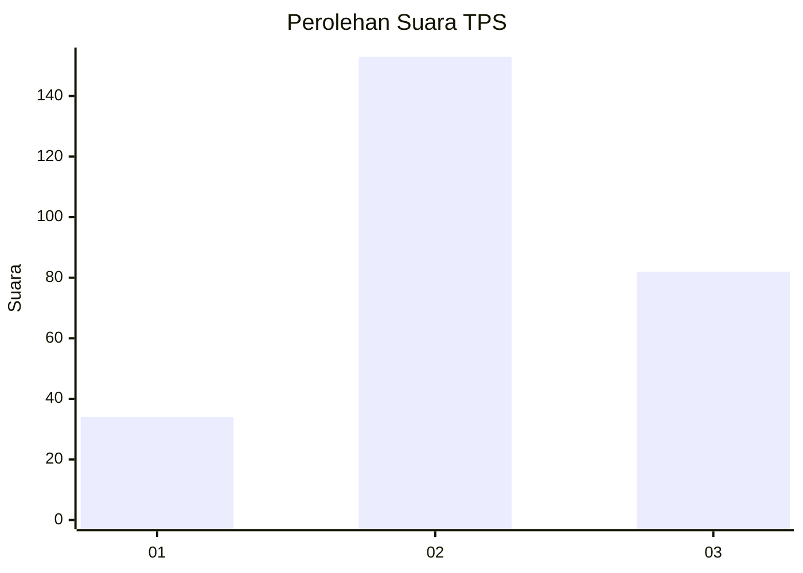
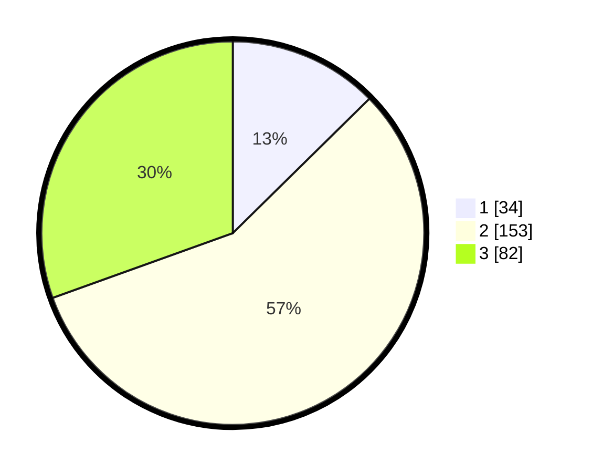

# Hasil

## Grafik

## Tabel

| No. | Nama Paslon    | Suara | Suara (raw) | Persentase |
|:--- |:-------------- | -----:| -----------:| ----------:|
| 1   | ANIES MUHAIMIN | 34    | [34][p-1]   | 12,64      |
| 2   | PRABOWO GIBRAN | 153   | [153][p-2]  | 56,88      |
| 3   | GANJAR MAHFUD  | 82    | [82][p-3]   | 30,48      |

[p-1]: https://github.com/gigit-pemilu/pemilu-2024-35-jawa-timur/blob/main/pilpres/hitung-suara/sub/35-jawa-timur/sub/26-bangkalan/sub/12-labang/sub/2003-jukong/sub/004-tps/sub/paslon-1.txt
[p-2]: https://github.com/gigit-pemilu/pemilu-2024-35-jawa-timur/blob/main/pilpres/hitung-suara/sub/35-jawa-timur/sub/26-bangkalan/sub/12-labang/sub/2003-jukong/sub/004-tps/sub/paslon-2.txt
[p-3]: https://github.com/gigit-pemilu/pemilu-2024-35-jawa-timur/blob/main/pilpres/hitung-suara/sub/35-jawa-timur/sub/26-bangkalan/sub/12-labang/sub/2003-jukong/sub/004-tps/sub/paslon-3.txt

## Foto C Plano

https://sirekap-obj-formc.kpu.go.id/ffb8/pemilu/ppwp/35/26/12/20/03/3526122003004-20240215-061744--2210608c-9d1a-46b1-aee9-a16e5d81f89d.jpg

https://sirekap-obj-formc.kpu.go.id/ffb8/pemilu/ppwp/35/26/12/20/03/3526122003004-20240215-061910--569aac0f-5dae-45ce-a0f0-b02d9d9eb1c5.jpg

https://sirekap-obj-formc.kpu.go.id/ffb8/pemilu/ppwp/35/26/12/20/03/3526122003004-20240215-062026--e3ac5afe-451b-4422-98fa-ae15c846c9bc.jpg

## Metadata

| Key        | Value               |
| ---------- | ------------------- |
| Time Stamp | 2024-02-19 06:16:00 |

