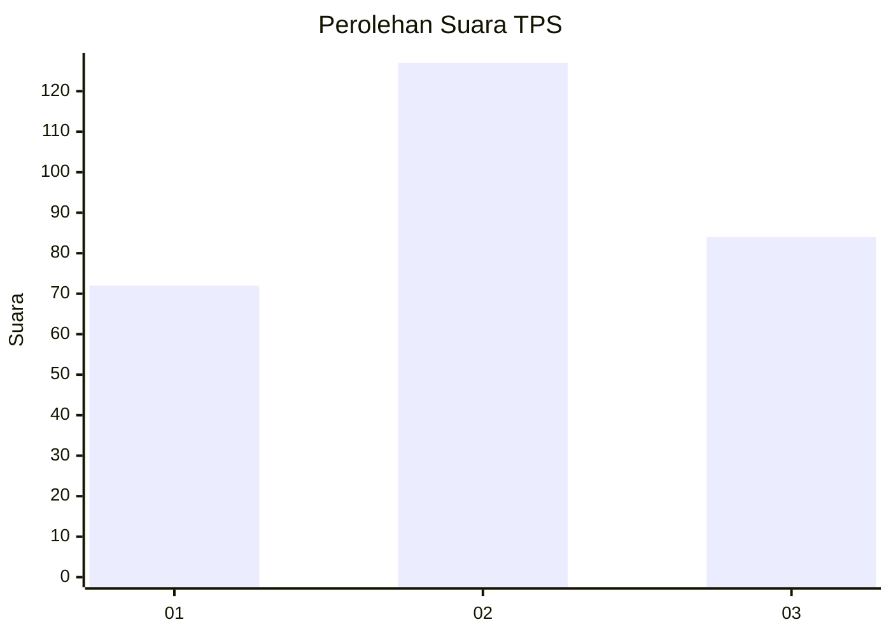
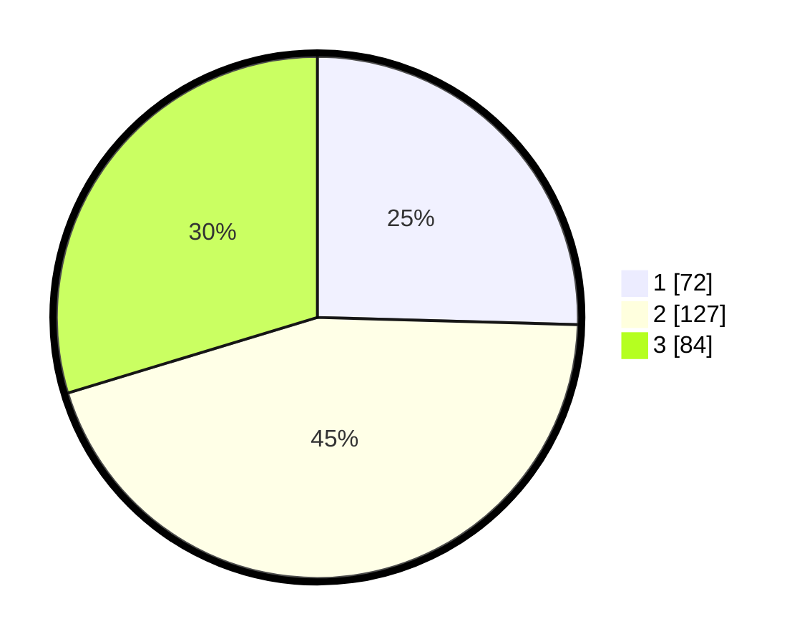

# Hasil

## Grafik

## Tabel

| No. | Nama Paslon    | Suara | Suara (raw) | Persentase |
|:--- |:-------------- | -----:| -----------:| ----------:|
| 1   | ANIES MUHAIMIN | 72    | [72][p-1]   | 25,44      |
| 2   | PRABOWO GIBRAN | 127   | [127][p-2]  | 44,88      |
| 3   | GANJAR MAHFUD  | 84    | [84][p-3]   | 29,68      |

[p-1]: https://github.com/gigit-pemilu/pemilu-2024/blob/main/pilpres/hitung-suara/sub/35-jawa-timur/sub/26-bangkalan/sub/12-labang/sub/2003-jukong/sub/005-tps/sub/paslon-1.txt
[p-2]: https://github.com/gigit-pemilu/pemilu-2024/blob/main/pilpres/hitung-suara/sub/35-jawa-timur/sub/26-bangkalan/sub/12-labang/sub/2003-jukong/sub/005-tps/sub/paslon-2.txt
[p-3]: https://github.com/gigit-pemilu/pemilu-2024/blob/main/pilpres/hitung-suara/sub/35-jawa-timur/sub/26-bangkalan/sub/12-labang/sub/2003-jukong/sub/005-tps/sub/paslon-3.txt

## Foto C Plano

https://sirekap-obj-formc.kpu.go.id/a012/pemilu/ppwp/35/26/12/20/03/3526122003005-20240215-072235--9e3e50c3-88f5-49f5-b033-924934ffe47a.jpg

https://sirekap-obj-formc.kpu.go.id/a012/pemilu/ppwp/35/26/12/20/03/3526122003005-20240215-023814--6c5b0a1b-a99a-4098-9d0c-e0230049a59f.jpg

https://sirekap-obj-formc.kpu.go.id/a012/pemilu/ppwp/35/26/12/20/03/3526122003005-20240215-072518--45437246-5536-4430-a629-b7089460d856.jpg

## Metadata

| Key        | Value               |
| ---------- | ------------------- |
| Time Stamp | 2024-02-15 15:00:29 |

