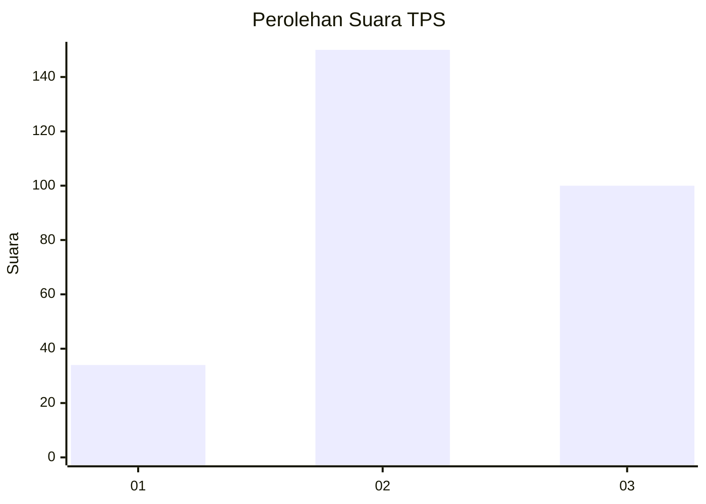
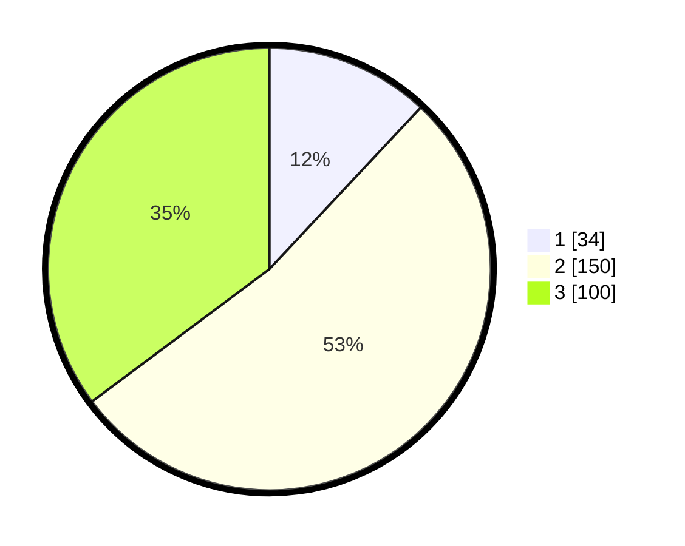

# Hasil

## Grafik

## Tabel

| No. | Nama Paslon    | Suara | Suara (raw) | Persentase |
|:--- |:-------------- | -----:| -----------:| ----------:|
| 1   | ANIES MUHAIMIN | 34    | [34][p-1]   | 11,97      |
| 2   | PRABOWO GIBRAN | 150   | [150][p-2]  | 52,82      |
| 3   | GANJAR MAHFUD  | 100   | [100][p-3]  | 35,21      |

[p-1]: https://github.com/gigit-pemilu/pemilu-2024/blob/main/pilpres/hitung-suara/sub/35-jawa-timur/sub/26-bangkalan/sub/12-labang/sub/2003-jukong/sub/006-tps/sub/paslon-1.txt
[p-2]: https://github.com/gigit-pemilu/pemilu-2024/blob/main/pilpres/hitung-suara/sub/35-jawa-timur/sub/26-bangkalan/sub/12-labang/sub/2003-jukong/sub/006-tps/sub/paslon-2.txt
[p-3]: https://github.com/gigit-pemilu/pemilu-2024/blob/main/pilpres/hitung-suara/sub/35-jawa-timur/sub/26-bangkalan/sub/12-labang/sub/2003-jukong/sub/006-tps/sub/paslon-3.txt

## Foto C Plano

https://sirekap-obj-formc.kpu.go.id/3c94/pemilu/ppwp/35/26/12/20/03/3526122003006-20240215-012416--1d0990e5-35c5-484f-b3f8-0218e03c7e3f.jpg

https://sirekap-obj-formc.kpu.go.id/3c94/pemilu/ppwp/35/26/12/20/03/3526122003006-20240215-012702--0d022cc2-01ab-467e-98ed-2e0262525ee0.jpg

https://sirekap-obj-formc.kpu.go.id/3c94/pemilu/ppwp/35/26/12/20/03/3526122003006-20240215-013325--458f9eaa-f0ff-49f1-b6e2-09deeefd2226.jpg

## Metadata

| Key        | Value               |
| ---------- | ------------------- |
| Time Stamp | 2024-02-15 12:00:28 |

