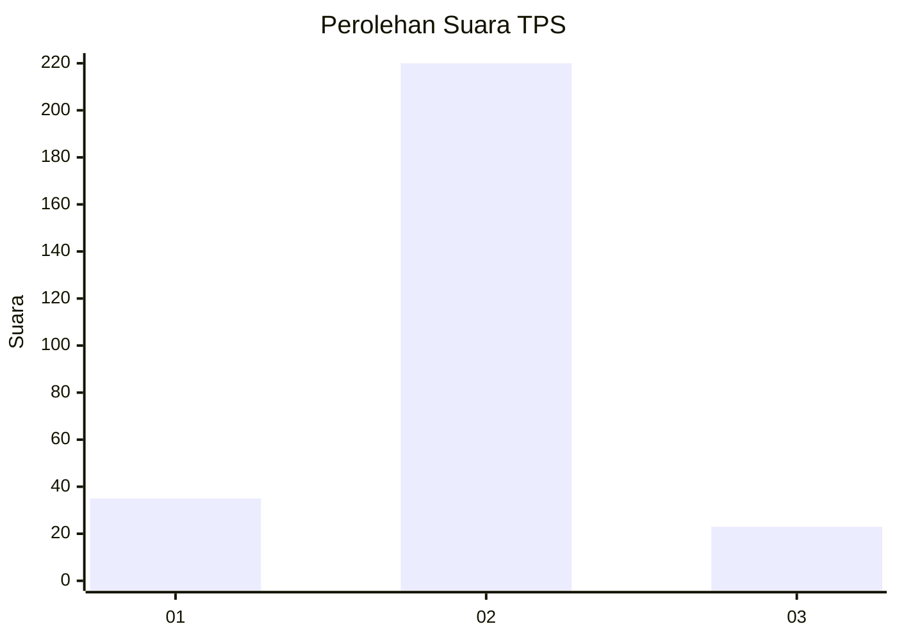
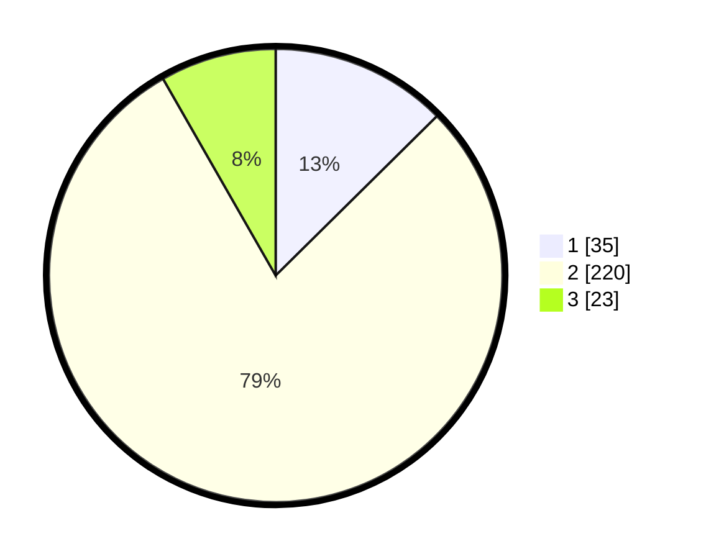

# Hasil

## Grafik

## Tabel

| No. | Nama Paslon    | Suara | Suara (raw) | Persentase |
|:--- |:-------------- | -----:| -----------:| ----------:|
| 1   | ANIES MUHAIMIN | 35    | [35][p-1]   | 12,59      |
| 2   | PRABOWO GIBRAN | 220   | [220][p-2]  | 79,14      |
| 3   | GANJAR MAHFUD  | 23    | [23][p-3]   | 8,27       |

[p-1]: https://github.com/gigit-pemilu/pemilu-2024-35-jawa-timur/blob/main/pilpres/hitung-suara/sub/35-jawa-timur/sub/26-bangkalan/sub/12-labang/sub/2003-jukong/sub/007-tps/sub/paslon-1.txt
[p-2]: https://github.com/gigit-pemilu/pemilu-2024-35-jawa-timur/blob/main/pilpres/hitung-suara/sub/35-jawa-timur/sub/26-bangkalan/sub/12-labang/sub/2003-jukong/sub/007-tps/sub/paslon-2.txt
[p-3]: https://github.com/gigit-pemilu/pemilu-2024-35-jawa-timur/blob/main/pilpres/hitung-suara/sub/35-jawa-timur/sub/26-bangkalan/sub/12-labang/sub/2003-jukong/sub/007-tps/sub/paslon-3.txt

## Foto C Plano

https://sirekap-obj-formc.kpu.go.id/65df/pemilu/ppwp/35/26/12/20/03/3526122003007-20240214-220514--4c0c27d3-2abd-41d1-ab7b-23b9ff9f02dc.jpg

https://sirekap-obj-formc.kpu.go.id/65df/pemilu/ppwp/35/26/12/20/03/3526122003007-20240214-220752--1ffd225d-2535-40f6-bd8f-1eb1c9971278.jpg

https://sirekap-obj-formc.kpu.go.id/65df/pemilu/ppwp/35/26/12/20/03/3526122003007-20240214-220846--dd4fc18f-5713-4e54-ae1e-a3df0d9b847f.jpg

## Metadata

| Key        | Value               |
| ---------- | ------------------- |
| Time Stamp | 2024-02-15 15:00:29 |

