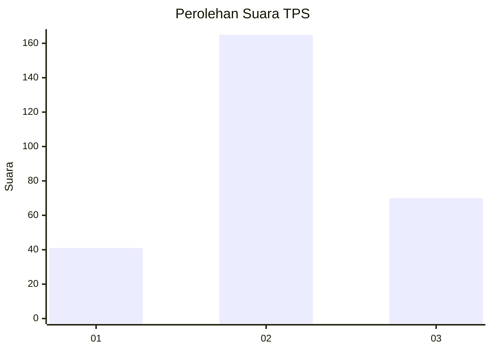
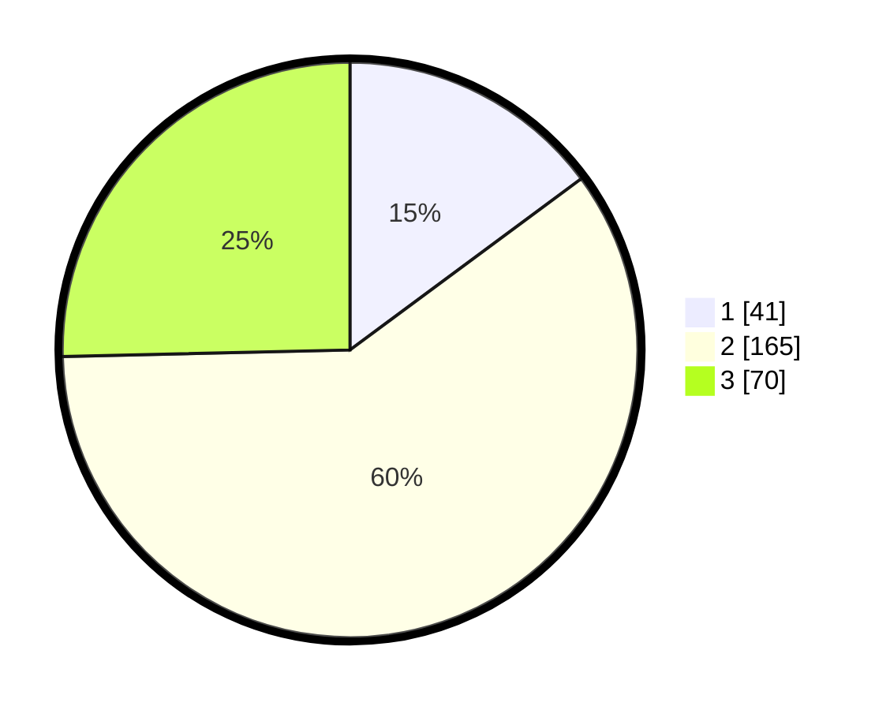

# Hasil

## Grafik

## Tabel

| No. | Nama Paslon    | Suara | Suara (raw) | Persentase |
|:--- |:-------------- | -----:| -----------:| ----------:|
| 1   | ANIES MUHAIMIN | 41    | [41][p-1]   | 14,86      |
| 2   | PRABOWO GIBRAN | 165   | [165][p-2]  | 59,78      |
| 3   | GANJAR MAHFUD  | 70    | [70][p-3]   | 25,36      |

[p-1]: https://github.com/gigit-pemilu/pemilu-2024/blob/main/pilpres/hitung-suara/sub/35-jawa-timur/sub/26-bangkalan/sub/12-labang/sub/2003-jukong/sub/009-tps/sub/paslon-1.txt
[p-2]: https://github.com/gigit-pemilu/pemilu-2024/blob/main/pilpres/hitung-suara/sub/35-jawa-timur/sub/26-bangkalan/sub/12-labang/sub/2003-jukong/sub/009-tps/sub/paslon-2.txt
[p-3]: https://github.com/gigit-pemilu/pemilu-2024/blob/main/pilpres/hitung-suara/sub/35-jawa-timur/sub/26-bangkalan/sub/12-labang/sub/2003-jukong/sub/009-tps/sub/paslon-3.txt

## Foto C Plano

https://sirekap-obj-formc.kpu.go.id/b9f0/pemilu/ppwp/35/26/12/20/03/3526122003009-20240215-081319--dcd0bce7-78a2-4710-a69e-a7847795b599.jpg

https://sirekap-obj-formc.kpu.go.id/b9f0/pemilu/ppwp/35/26/12/20/03/3526122003009-20240215-081354--02f4032f-1f33-465a-9ae4-26c9013c4065.jpg

https://sirekap-obj-formc.kpu.go.id/b9f0/pemilu/ppwp/35/26/12/20/03/3526122003009-20240215-081447--10e92666-0f4d-47eb-8655-1ec2706d746c.jpg

## Metadata

| Key        | Value               |
| ---------- | ------------------- |
| Time Stamp | 2024-02-24 22:31:28 |

