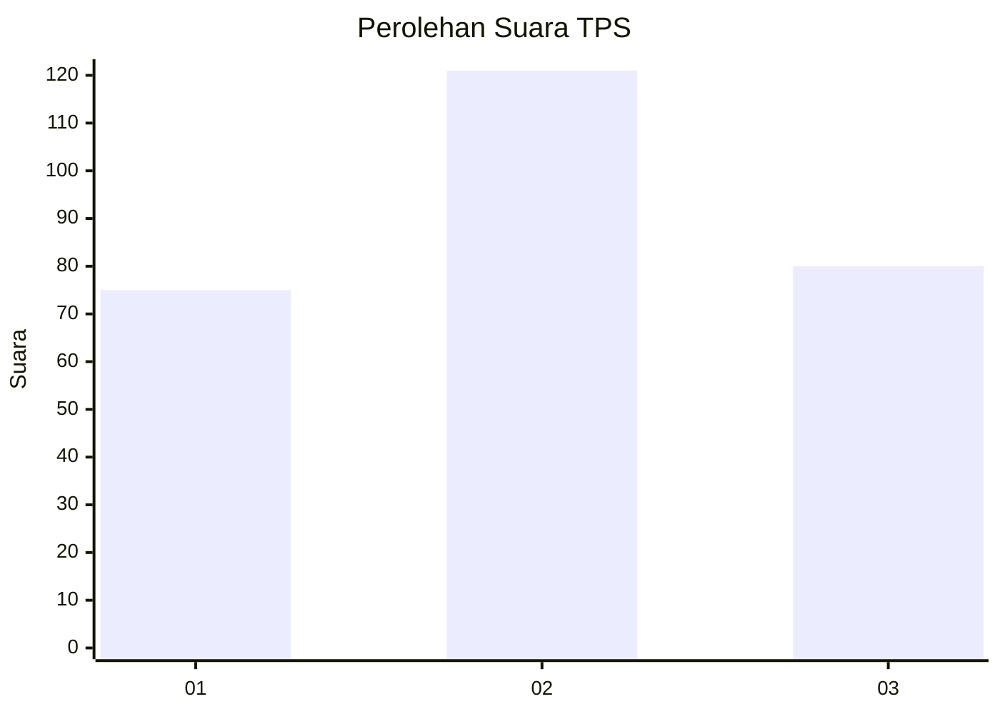
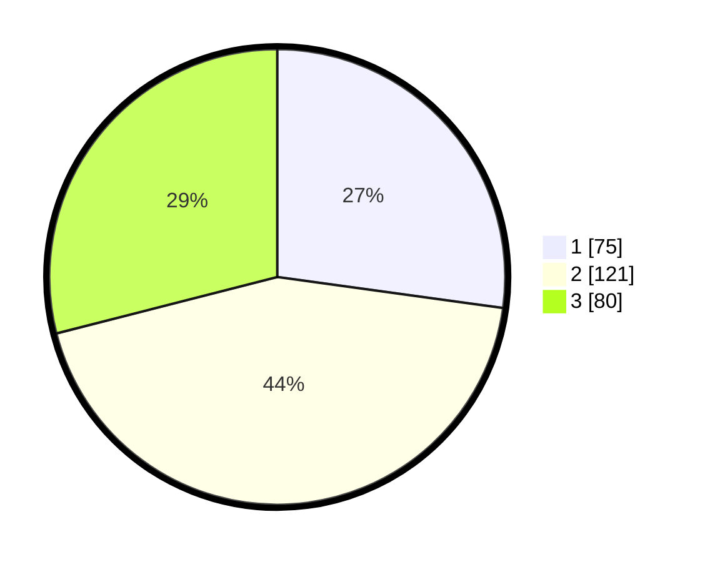

# Hasil

## Grafik

## Tabel

| No. | Nama Paslon    | Suara | Suara (raw) | Persentase |
|:--- |:-------------- | -----:| -----------:| ----------:|
| 1   | ANIES MUHAIMIN | 75    | [75][p-1]   | 27,17      |
| 2   | PRABOWO GIBRAN | 121   | [121][p-2]  | 43,84      |
| 3   | GANJAR MAHFUD  | 80    | [80][p-3]   | 28,99      |

[p-1]: https://github.com/gigit-pemilu/pemilu-2024/blob/main/pilpres/hitung-suara/sub/35-jawa-timur/sub/26-bangkalan/sub/12-labang/sub/2003-jukong/sub/010-tps/sub/paslon-1.txt
[p-2]: https://github.com/gigit-pemilu/pemilu-2024/blob/main/pilpres/hitung-suara/sub/35-jawa-timur/sub/26-bangkalan/sub/12-labang/sub/2003-jukong/sub/010-tps/sub/paslon-2.txt
[p-3]: https://github.com/gigit-pemilu/pemilu-2024/blob/main/pilpres/hitung-suara/sub/35-jawa-timur/sub/26-bangkalan/sub/12-labang/sub/2003-jukong/sub/010-tps/sub/paslon-3.txt

## Foto C Plano

https://sirekap-obj-formc.kpu.go.id/7bed/pemilu/ppwp/35/26/12/20/03/3526122003010-20240215-075604--3bfb7c8f-8384-4c31-878c-d8133d4c5e3f.jpg

https://sirekap-obj-formc.kpu.go.id/7bed/pemilu/ppwp/35/26/12/20/03/3526122003010-20240215-075819--184bd42b-6454-4e44-ae06-58bee93a9543.jpg

https://sirekap-obj-formc.kpu.go.id/7bed/pemilu/ppwp/35/26/12/20/03/3526122003010-20240215-080017--a87c8b34-3a63-4d7c-96f7-f4f30450e64a.jpg

## Metadata

| Key        | Value               |
| ---------- | ------------------- |
| Time Stamp | 2024-02-17 14:45:18 |

