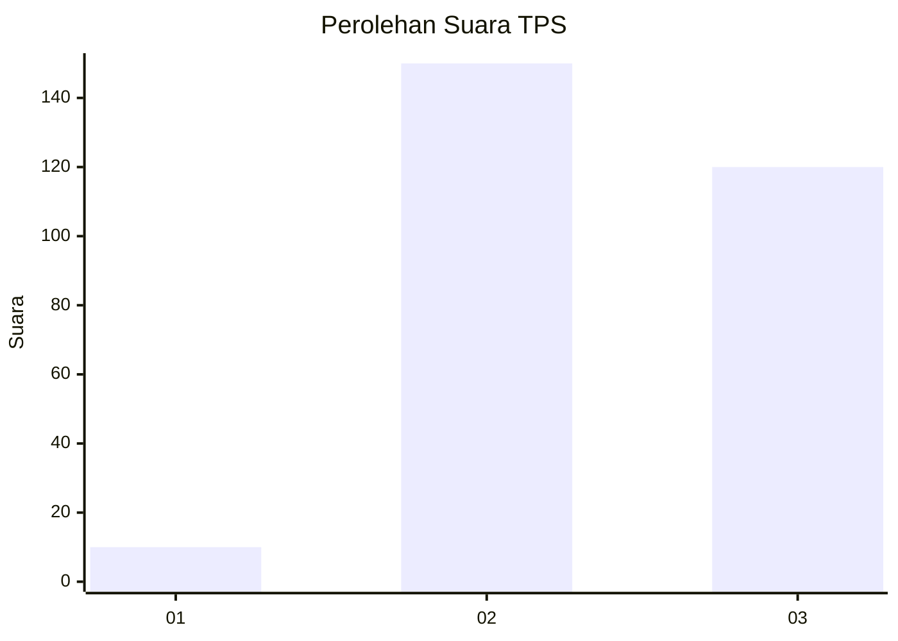
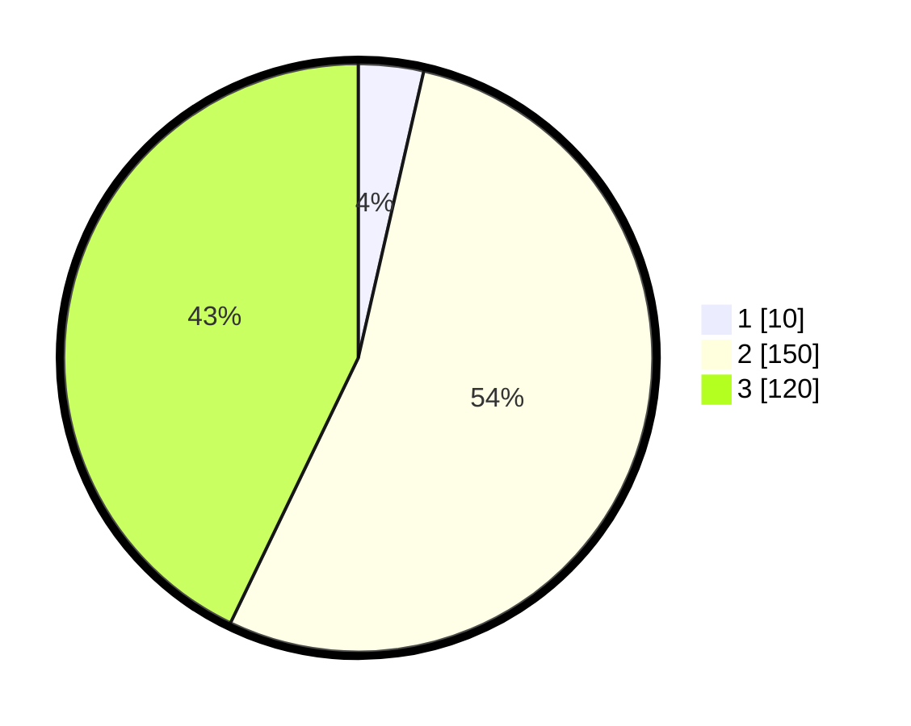

# Hasil

## Grafik

## Tabel

| No. | Nama Paslon    | Suara | Suara (raw) | Persentase |
|:--- |:-------------- | -----:| -----------:| ----------:|
| 1   | ANIES MUHAIMIN | 10    | [10][p-1]   | 3,57       |
| 2   | PRABOWO GIBRAN | 150   | [150][p-2]  | 53,57      |
| 3   | GANJAR MAHFUD  | 120   | [120][p-3]  | 42,86      |

[p-1]: https://github.com/gigit-pemilu/pemilu-2024/blob/main/pilpres/hitung-suara/sub/35-jawa-timur/sub/26-bangkalan/sub/12-labang/sub/2005-sukolilo-timur/sub/009-tps/sub/paslon-1.txt
[p-2]: https://github.com/gigit-pemilu/pemilu-2024/blob/main/pilpres/hitung-suara/sub/35-jawa-timur/sub/26-bangkalan/sub/12-labang/sub/2005-sukolilo-timur/sub/009-tps/sub/paslon-2.txt
[p-3]: https://github.com/gigit-pemilu/pemilu-2024/blob/main/pilpres/hitung-suara/sub/35-jawa-timur/sub/26-bangkalan/sub/12-labang/sub/2005-sukolilo-timur/sub/009-tps/sub/paslon-3.txt

## Foto C Plano

https://sirekap-obj-formc.kpu.go.id/9d86/pemilu/ppwp/35/26/12/20/05/3526122005009-20240214-200551--1438a32e-e7b4-4e65-acb2-974489aff1dc.jpg

https://sirekap-obj-formc.kpu.go.id/9d86/pemilu/ppwp/35/26/12/20/05/3526122005009-20240214-200821--931732d0-2adf-4a4d-be2f-0ac19ad21585.jpg

https://sirekap-obj-formc.kpu.go.id/9d86/pemilu/ppwp/35/26/12/20/05/3526122005009-20240214-201034--63d18c79-8453-4785-8920-56d4268d6e1c.jpg

## Metadata

| Key        | Value               |
| ---------- | ------------------- |
| Time Stamp | 2024-02-15 12:00:28 |

