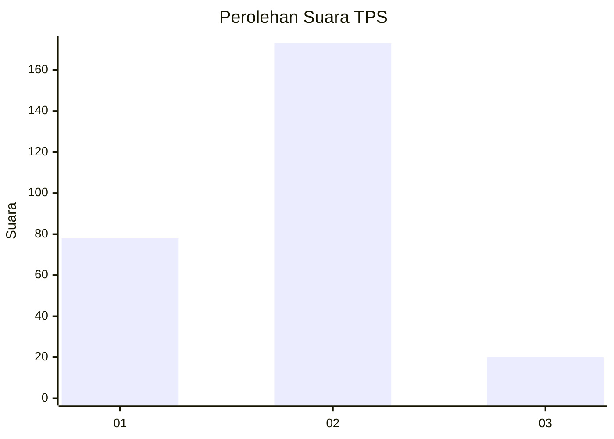
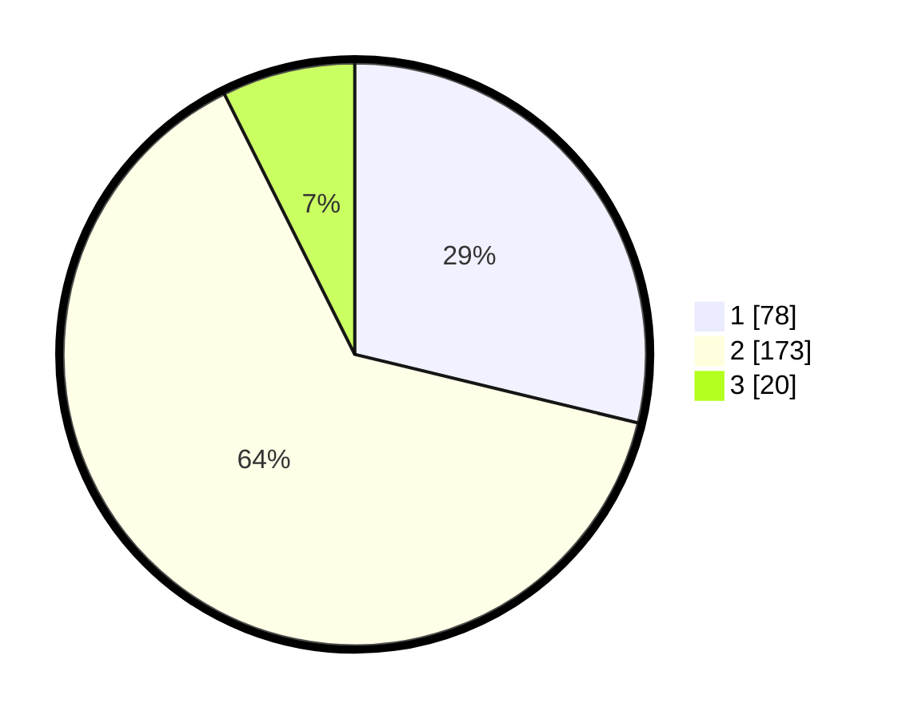

# Hasil

## Grafik

## Tabel

| No. | Nama Paslon    | Suara | Suara (raw) | Persentase |
|:--- |:-------------- | -----:| -----------:| ----------:|
| 1   | ANIES MUHAIMIN | 78    | [78][p-1]   | 28,78      |
| 2   | PRABOWO GIBRAN | 173   | [173][p-2]  | 63,84      |
| 3   | GANJAR MAHFUD  | 20    | [20][p-3]   | 7,38       |

[p-1]: https://github.com/gigit-pemilu/pemilu-2024/blob/main/pilpres/hitung-suara/sub/35-jawa-timur/sub/26-bangkalan/sub/12-labang/sub/2006-sukolilo-barat/sub/008-tps/sub/paslon-1.txt
[p-2]: https://github.com/gigit-pemilu/pemilu-2024/blob/main/pilpres/hitung-suara/sub/35-jawa-timur/sub/26-bangkalan/sub/12-labang/sub/2006-sukolilo-barat/sub/008-tps/sub/paslon-2.txt
[p-3]: https://github.com/gigit-pemilu/pemilu-2024/blob/main/pilpres/hitung-suara/sub/35-jawa-timur/sub/26-bangkalan/sub/12-labang/sub/2006-sukolilo-barat/sub/008-tps/sub/paslon-3.txt

## Foto C Plano

https://sirekap-obj-formc.kpu.go.id/de8d/pemilu/ppwp/35/26/12/20/06/3526122006008-20240214-224123--7220c006-3129-44ff-ae76-26b683042045.jpg

https://sirekap-obj-formc.kpu.go.id/de8d/pemilu/ppwp/35/26/12/20/06/3526122006008-20240214-211635--07e1b1df-5f9c-4c86-9609-47ce34c5f1fe.jpg

https://sirekap-obj-formc.kpu.go.id/de8d/pemilu/ppwp/35/26/12/20/06/3526122006008-20240214-224246--545b5afa-457c-47d0-8a3f-71059e0a655d.jpg

## Metadata

| Key        | Value               |
| ---------- | ------------------- |
| Time Stamp | 2024-02-15 18:00:26 |

