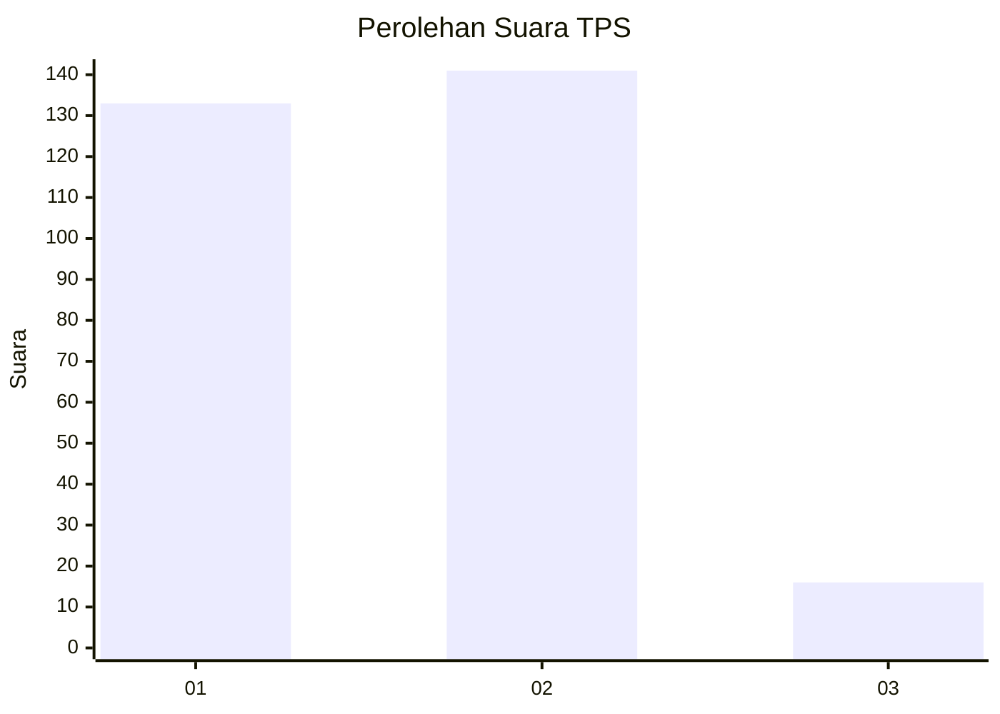
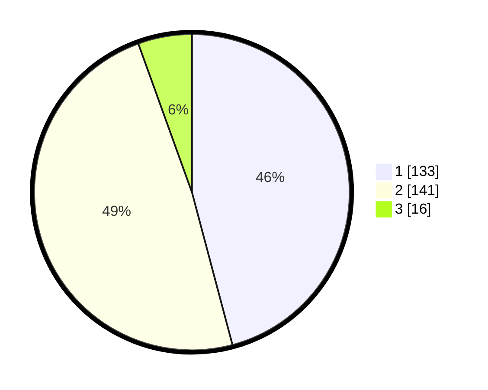

# Hasil

## Grafik

## Tabel

| No. | Nama Paslon    | Suara | Suara (raw) | Persentase |
|:--- |:-------------- | -----:| -----------:| ----------:|
| 1   | ANIES MUHAIMIN | 133   | [133][p-1]  | 45,86      |
| 2   | PRABOWO GIBRAN | 141   | [141][p-2]  | 48,62      |
| 3   | GANJAR MAHFUD  | 16    | [16][p-3]   | 5,52       |

[p-1]: https://github.com/gigit-pemilu/pemilu-2024-35-jawa-timur/blob/main/pilpres/hitung-suara/sub/35-jawa-timur/sub/26-bangkalan/sub/12-labang/sub/2006-sukolilo-barat/sub/014-tps/sub/paslon-1.txt
[p-2]: https://github.com/gigit-pemilu/pemilu-2024-35-jawa-timur/blob/main/pilpres/hitung-suara/sub/35-jawa-timur/sub/26-bangkalan/sub/12-labang/sub/2006-sukolilo-barat/sub/014-tps/sub/paslon-2.txt
[p-3]: https://github.com/gigit-pemilu/pemilu-2024-35-jawa-timur/blob/main/pilpres/hitung-suara/sub/35-jawa-timur/sub/26-bangkalan/sub/12-labang/sub/2006-sukolilo-barat/sub/014-tps/sub/paslon-3.txt

## Foto C Plano

https://sirekap-obj-formc.kpu.go.id/7531/pemilu/ppwp/35/26/12/20/06/3526122006014-20240215-014849--46aa6100-5316-4e58-a63d-f8566609b054.jpg

https://sirekap-obj-formc.kpu.go.id/7531/pemilu/ppwp/35/26/12/20/06/3526122006014-20240215-013959--50499479-b1f5-446e-b6dd-f3bd019937e7.jpg

https://sirekap-obj-formc.kpu.go.id/7531/pemilu/ppwp/35/26/12/20/06/3526122006014-20240215-014055--2d1efa1c-af27-4e1b-91f8-dc230f06d46a.jpg

## Metadata

| Key        | Value               |
| ---------- | ------------------- |
| Time Stamp | 2024-02-19 06:16:00 |

