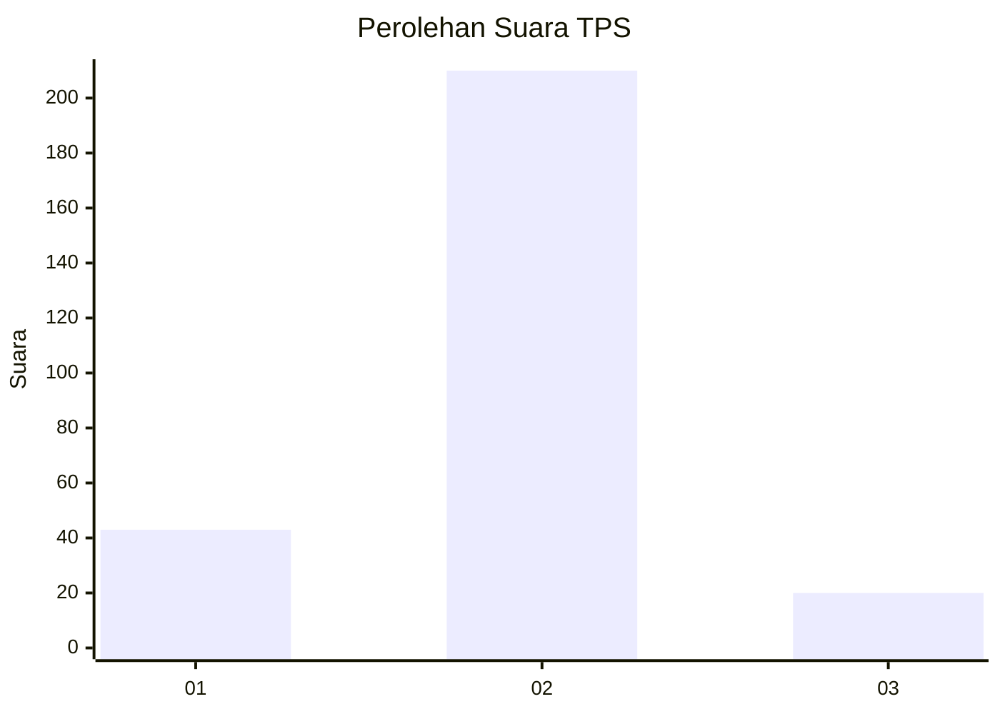
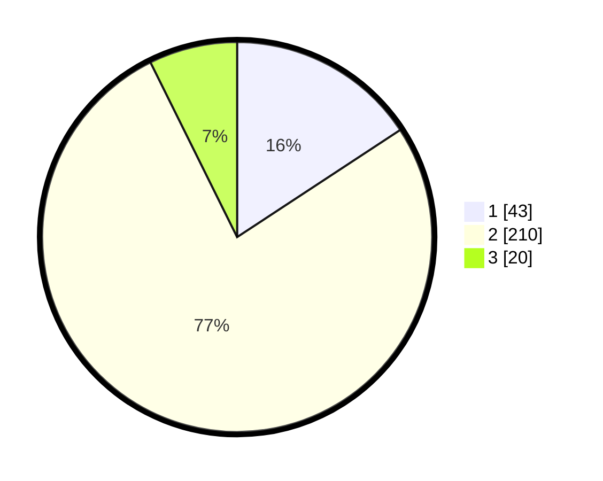

# Hasil

## Grafik

## Tabel

| No. | Nama Paslon    | Suara | Suara (raw) | Persentase |
|:--- |:-------------- | -----:| -----------:| ----------:|
| 1   | ANIES MUHAIMIN | 43    | [43][p-1]   | 15,75      |
| 2   | PRABOWO GIBRAN | 210   | [210][p-2]  | 76,92      |
| 3   | GANJAR MAHFUD  | 20    | [20][p-3]   | 7,33       |

[p-1]: https://github.com/gigit-pemilu/pemilu-2024/blob/main/pilpres/hitung-suara/sub/35-jawa-timur/sub/26-bangkalan/sub/12-labang/sub/2008-ba'engas/sub/011-tps/sub/paslon-1.txt
[p-2]: https://github.com/gigit-pemilu/pemilu-2024/blob/main/pilpres/hitung-suara/sub/35-jawa-timur/sub/26-bangkalan/sub/12-labang/sub/2008-ba'engas/sub/011-tps/sub/paslon-2.txt
[p-3]: https://github.com/gigit-pemilu/pemilu-2024/blob/main/pilpres/hitung-suara/sub/35-jawa-timur/sub/26-bangkalan/sub/12-labang/sub/2008-ba'engas/sub/011-tps/sub/paslon-3.txt

## Foto C Plano

https://sirekap-obj-formc.kpu.go.id/8fe4/pemilu/ppwp/35/26/12/20/08/3526122008011-20240214-232640--3c0e68de-3522-42c1-ada3-3808e92844b6.jpg

https://sirekap-obj-formc.kpu.go.id/8fe4/pemilu/ppwp/35/26/12/20/08/3526122008011-20240214-232756--05012551-2fdf-49d7-9d8a-bacbb9d8c1b7.jpg

https://sirekap-obj-formc.kpu.go.id/8fe4/pemilu/ppwp/35/26/12/20/08/3526122008011-20240214-233430--65cf0fb4-117e-48be-a189-9c02774d5563.jpg

## Metadata

| Key        | Value               |
| ---------- | ------------------- |
| Time Stamp | 2024-02-19 06:16:00 |

