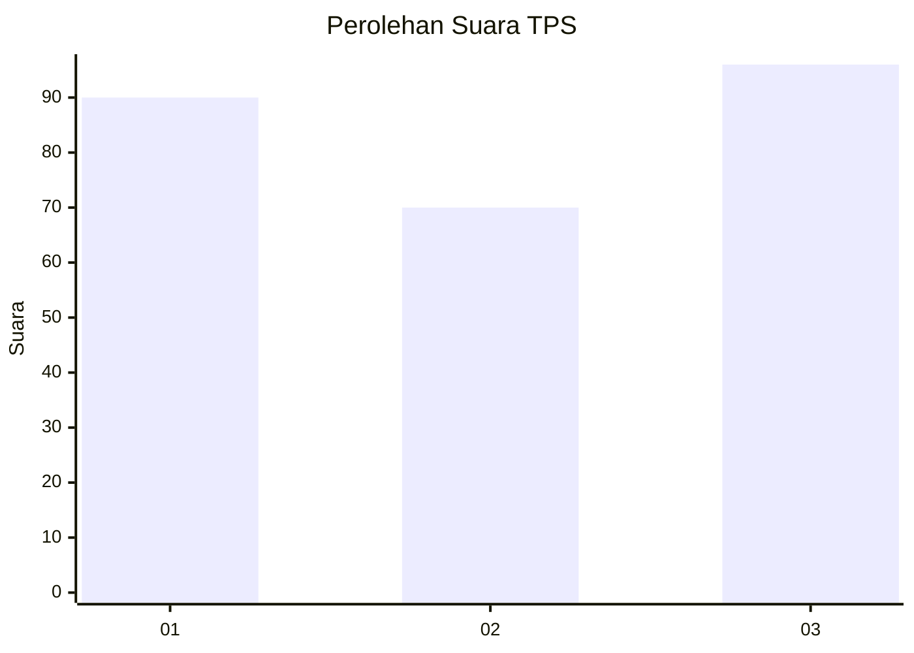
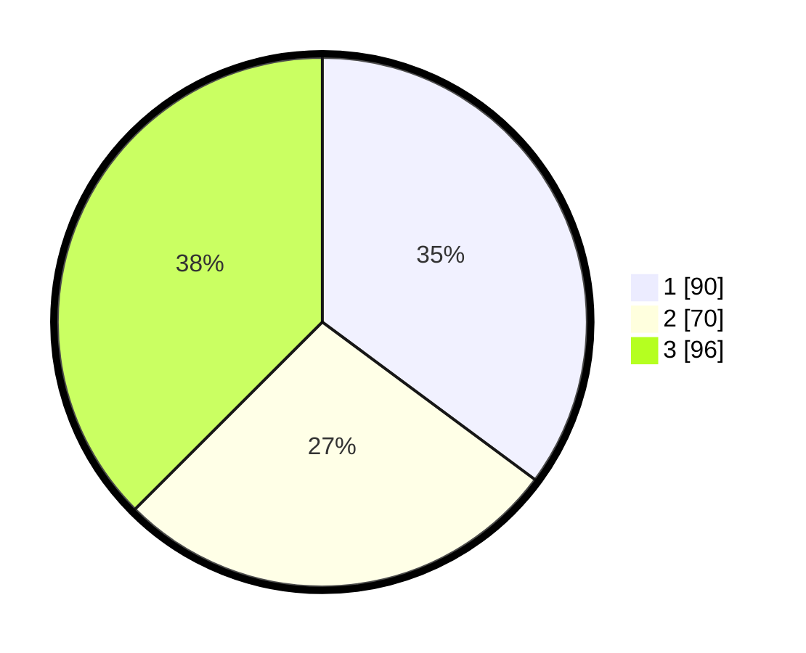

# Hasil

## Grafik

## Tabel

| No. | Nama Paslon    | Suara | Suara (raw) | Persentase |
|:--- |:-------------- | -----:| -----------:| ----------:|
| 1   | ANIES MUHAIMIN | 90    | [90][p-1]   | 35,16      |
| 2   | PRABOWO GIBRAN | 70    | [70][p-2]   | 27,34      |
| 3   | GANJAR MAHFUD  | 96    | [96][p-3]   | 37,50      |

[p-1]: https://github.com/gigit-pemilu/pemilu-2024-35-jawa-timur/blob/main/pilpres/hitung-suara/sub/35-jawa-timur/sub/26-bangkalan/sub/12-labang/sub/2011-sendang-dajah/sub/002-tps/sub/paslon-1.txt
[p-2]: https://github.com/gigit-pemilu/pemilu-2024-35-jawa-timur/blob/main/pilpres/hitung-suara/sub/35-jawa-timur/sub/26-bangkalan/sub/12-labang/sub/2011-sendang-dajah/sub/002-tps/sub/paslon-2.txt
[p-3]: https://github.com/gigit-pemilu/pemilu-2024-35-jawa-timur/blob/main/pilpres/hitung-suara/sub/35-jawa-timur/sub/26-bangkalan/sub/12-labang/sub/2011-sendang-dajah/sub/002-tps/sub/paslon-3.txt

## Foto C Plano

https://sirekap-obj-formc.kpu.go.id/c373/pemilu/ppwp/35/26/12/20/11/3526122011002-20240214-220405--41a082da-8567-4f35-8ca1-eb780df5d55e.jpg

https://sirekap-obj-formc.kpu.go.id/c373/pemilu/ppwp/35/26/12/20/11/3526122011002-20240214-220550--00cead74-ffac-4f3d-80f8-979b73449ecc.jpg

https://sirekap-obj-formc.kpu.go.id/c373/pemilu/ppwp/35/26/12/20/11/3526122011002-20240214-220701--7fb9f50a-1c0e-4e35-bb43-e0c0bfa1449f.jpg

## Metadata

| Key        | Value               |
| ---------- | ------------------- |
| Time Stamp | 2024-02-15 12:00:28 |

