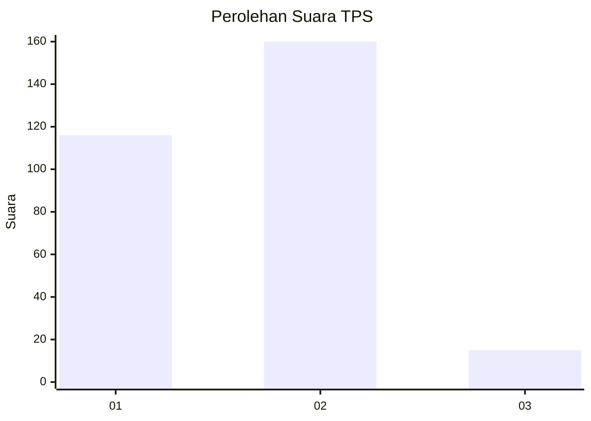
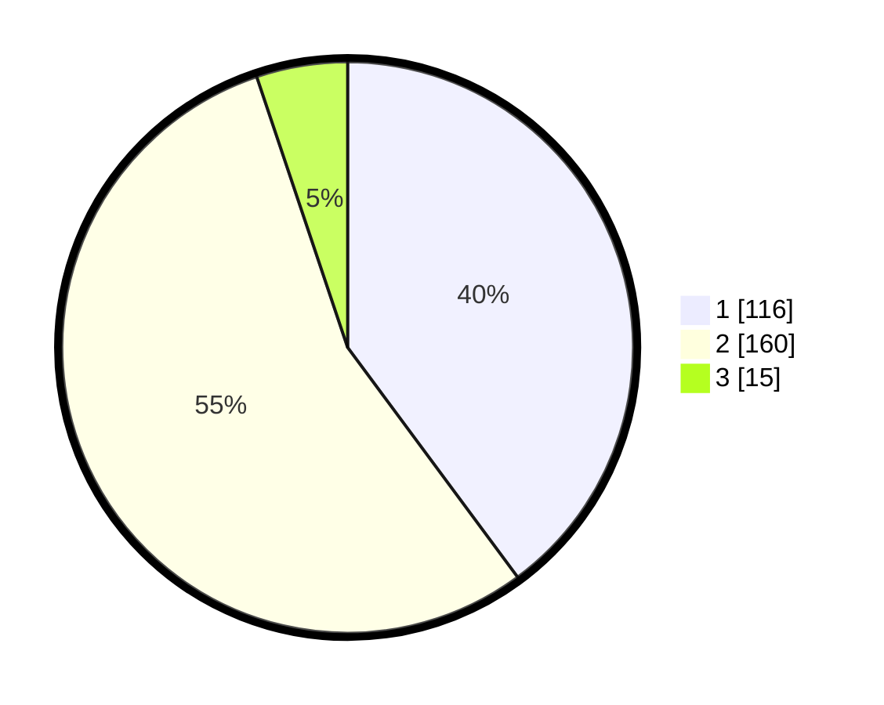

# Hasil

## Grafik

## Tabel

| No. | Nama Paslon    | Suara | Suara (raw) | Persentase |
|:--- |:-------------- | -----:| -----------:| ----------:|
| 1   | ANIES MUHAIMIN | 116   | [116][p-1]  | 39,86      |
| 2   | PRABOWO GIBRAN | 160   | [160][p-2]  | 54,98      |
| 3   | GANJAR MAHFUD  | 15    | [15][p-3]   | 5,15       |

[p-1]: https://github.com/gigit-pemilu/pemilu-2024/blob/main/pilpres/hitung-suara/sub/35-jawa-timur/sub/26-bangkalan/sub/13-tanah-merah/sub/2002-tanah-merah-laok/sub/001-tps/sub/paslon-1.txt
[p-2]: https://github.com/gigit-pemilu/pemilu-2024/blob/main/pilpres/hitung-suara/sub/35-jawa-timur/sub/26-bangkalan/sub/13-tanah-merah/sub/2002-tanah-merah-laok/sub/001-tps/sub/paslon-2.txt
[p-3]: https://github.com/gigit-pemilu/pemilu-2024/blob/main/pilpres/hitung-suara/sub/35-jawa-timur/sub/26-bangkalan/sub/13-tanah-merah/sub/2002-tanah-merah-laok/sub/001-tps/sub/paslon-3.txt

## Foto C Plano

https://sirekap-obj-formc.kpu.go.id/f271/pemilu/ppwp/35/26/13/20/02/3526132002001-20240214-190119--b47c1e3e-9d81-4d7b-b6e0-f5ec01aeb652.jpg

https://sirekap-obj-formc.kpu.go.id/f271/pemilu/ppwp/35/26/13/20/02/3526132002001-20240214-193827--6cd18d3e-33e6-4940-a616-ddbf636db6f5.jpg

https://sirekap-obj-formc.kpu.go.id/f271/pemilu/ppwp/35/26/13/20/02/3526132002001-20240214-190452--5c935e64-1d9b-48b9-bbaa-1c8944d83edc.jpg

## Metadata

| Key        | Value               |
| ---------- | ------------------- |
| Time Stamp | 2024-02-19 06:16:00 |

## DATA PEMILIH TETAP

Jumlah pemilih dalam DPT: **293**.
 * L: **121**.
 * P: **172**.

## DATA PENGGUNA HAK PILIH

Jumlah pengguna hak pilih dalam DPT: **291**.
 * L: **120**.
 * P: **171**.

Jumlah pengguna hak pilih dalam DPTb: **291**.
 * L: **120**.
 * P: **171**.

Jumlah pengguna hak pilih dalam DPK: **0**.
 * L: **0**.
 * P: **0**.

Jumlah pengguna hak pilih: **291**.
 * L: **120**.
 * P: **171**.

## JUMLAH SUARA SAH DAN TIDAK SAH

JUMLAH SELURUH SUARA SAH: **291**.

JUMLAH SUARA TIDAK SAH: **0**.

JUMLAH SELURUH SUARA SAH DAN SUARA TIDAK SAH: **291**.

