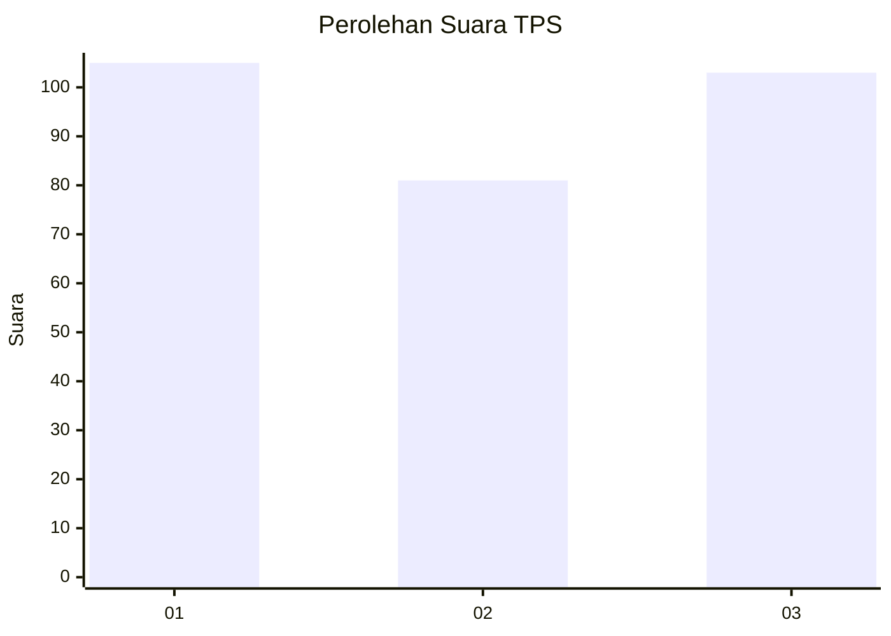
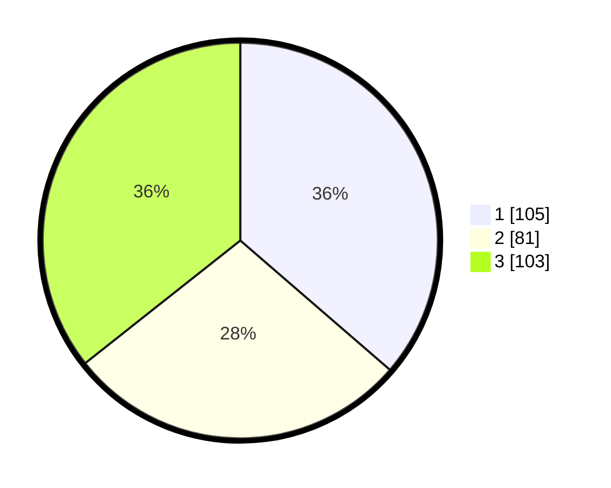

# Hasil

## Grafik

## Tabel

| No. | Nama Paslon    | Suara | Suara (raw) | Persentase |
|:--- |:-------------- | -----:| -----------:| ----------:|
| 1   | ANIES MUHAIMIN | 105   | [105][p-1]  | 36,33      |
| 2   | PRABOWO GIBRAN | 81    | [81][p-2]   | 28,03      |
| 3   | GANJAR MAHFUD  | 103   | [103][p-3]  | 35,64      |

[p-1]: https://github.com/gigit-pemilu/pemilu-2024/blob/main/pilpres/hitung-suara/sub/35-jawa-timur/sub/26-bangkalan/sub/13-tanah-merah/sub/2002-tanah-merah-laok/sub/004-tps/sub/paslon-1.txt
[p-2]: https://github.com/gigit-pemilu/pemilu-2024/blob/main/pilpres/hitung-suara/sub/35-jawa-timur/sub/26-bangkalan/sub/13-tanah-merah/sub/2002-tanah-merah-laok/sub/004-tps/sub/paslon-2.txt
[p-3]: https://github.com/gigit-pemilu/pemilu-2024/blob/main/pilpres/hitung-suara/sub/35-jawa-timur/sub/26-bangkalan/sub/13-tanah-merah/sub/2002-tanah-merah-laok/sub/004-tps/sub/paslon-3.txt

## Foto C Plano

https://sirekap-obj-formc.kpu.go.id/8c25/pemilu/ppwp/35/26/13/20/02/3526132002004-20240214-230510--0f688f57-89d6-486b-9df9-1b3c4602ad2d.jpg

https://sirekap-obj-formc.kpu.go.id/8c25/pemilu/ppwp/35/26/13/20/02/3526132002004-20240214-230632--ae2293c1-45a2-491b-9782-b48d0fa2f68e.jpg

https://sirekap-obj-formc.kpu.go.id/8c25/pemilu/ppwp/35/26/13/20/02/3526132002004-20240214-230938--d0338f83-163d-4b10-908f-946b53e34fd9.jpg

## Metadata

| Key        | Value               |
| ---------- | ------------------- |
| Time Stamp | 2024-02-19 06:16:00 |

