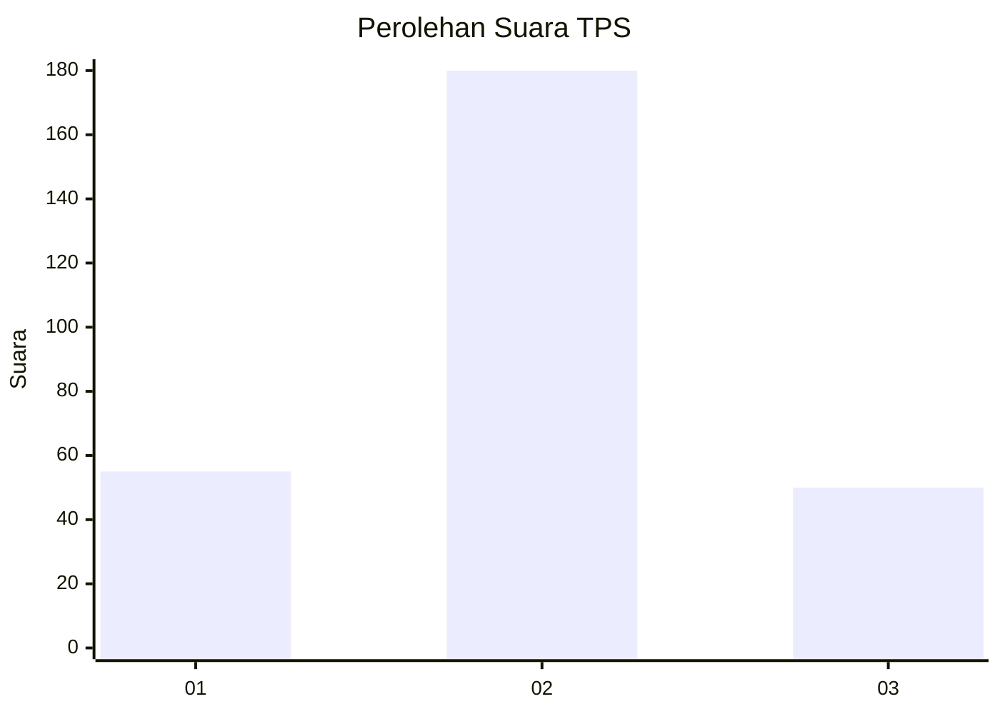
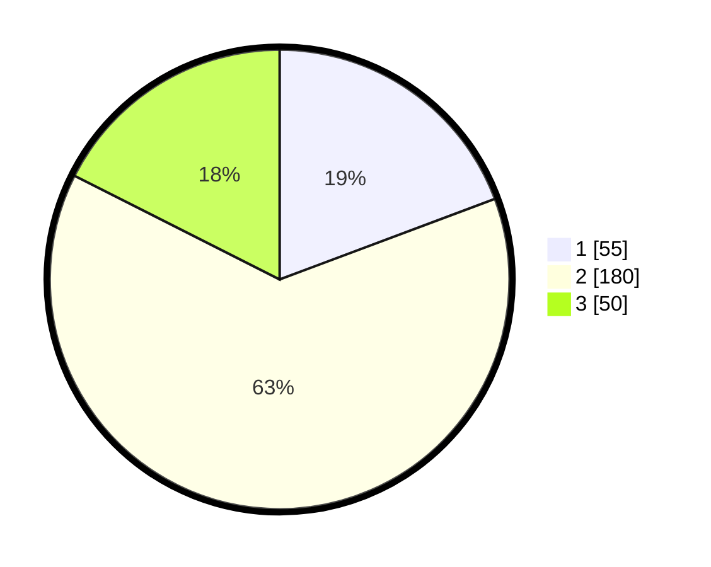

# Hasil

## Grafik

## Tabel

| No. | Nama Paslon    | Suara | Suara (raw) | Persentase |
|:--- |:-------------- | -----:| -----------:| ----------:|
| 1   | ANIES MUHAIMIN | 55    | [55][p-1]   | 19,30      |
| 2   | PRABOWO GIBRAN | 180   | [180][p-2]  | 63,16      |
| 3   | GANJAR MAHFUD  | 50    | [50][p-3]   | 17,54      |

[p-1]: https://github.com/gigit-pemilu/pemilu-2024/blob/main/pilpres/hitung-suara/sub/35-jawa-timur/sub/26-bangkalan/sub/13-tanah-merah/sub/2004-jangkar/sub/002-tps/sub/paslon-1.txt
[p-2]: https://github.com/gigit-pemilu/pemilu-2024/blob/main/pilpres/hitung-suara/sub/35-jawa-timur/sub/26-bangkalan/sub/13-tanah-merah/sub/2004-jangkar/sub/002-tps/sub/paslon-2.txt
[p-3]: https://github.com/gigit-pemilu/pemilu-2024/blob/main/pilpres/hitung-suara/sub/35-jawa-timur/sub/26-bangkalan/sub/13-tanah-merah/sub/2004-jangkar/sub/002-tps/sub/paslon-3.txt

## Foto C Plano

https://sirekap-obj-formc.kpu.go.id/80cf/pemilu/ppwp/35/26/13/20/04/3526132004002-20240214-223939--ab0efb88-bd2b-47a5-8db7-34eb50277c85.jpg

https://sirekap-obj-formc.kpu.go.id/80cf/pemilu/ppwp/35/26/13/20/04/3526132004002-20240214-224039--aed716c7-7945-4dc6-85d8-89bce9cd1e80.jpg

https://sirekap-obj-formc.kpu.go.id/80cf/pemilu/ppwp/35/26/13/20/04/3526132004002-20240214-224417--602b6119-04c9-45f6-a251-e5a7c13c3585.jpg

## Metadata

| Key        | Value               |
| ---------- | ------------------- |
| Time Stamp | 2024-02-21 20:00:00 |

