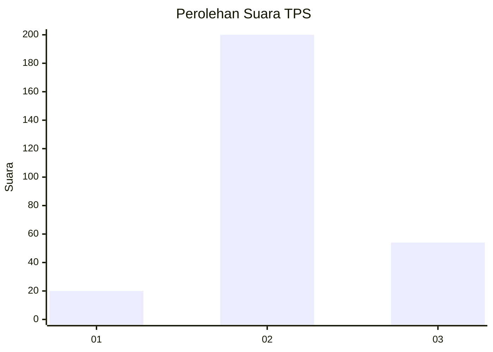
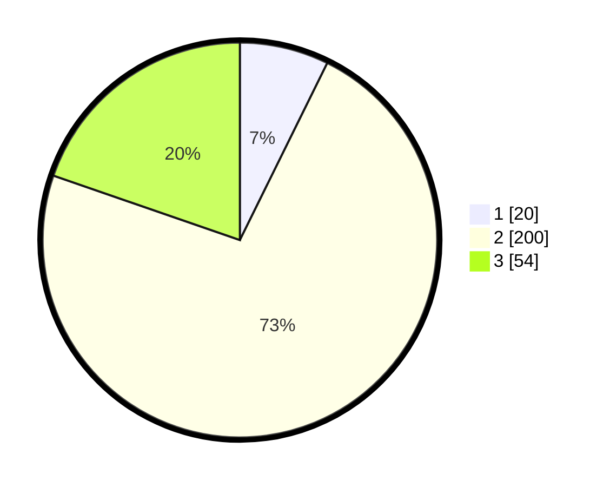

# Hasil

## Grafik

## Tabel

| No. | Nama Paslon    | Suara | Suara (raw) | Persentase |
|:--- |:-------------- | -----:| -----------:| ----------:|
| 1   | ANIES MUHAIMIN | 20    | [20][p-1]   | 7,30       |
| 2   | PRABOWO GIBRAN | 200   | [200][p-2]  | 72,99      |
| 3   | GANJAR MAHFUD  | 54    | [54][p-3]   | 19,71      |

[p-1]: https://github.com/gigit-pemilu/pemilu-2024/blob/main/pilpres/hitung-suara/sub/35-jawa-timur/sub/26-bangkalan/sub/13-tanah-merah/sub/2004-jangkar/sub/006-tps/sub/paslon-1.txt
[p-2]: https://github.com/gigit-pemilu/pemilu-2024/blob/main/pilpres/hitung-suara/sub/35-jawa-timur/sub/26-bangkalan/sub/13-tanah-merah/sub/2004-jangkar/sub/006-tps/sub/paslon-2.txt
[p-3]: https://github.com/gigit-pemilu/pemilu-2024/blob/main/pilpres/hitung-suara/sub/35-jawa-timur/sub/26-bangkalan/sub/13-tanah-merah/sub/2004-jangkar/sub/006-tps/sub/paslon-3.txt

## Foto C Plano

https://sirekap-obj-formc.kpu.go.id/07f8/pemilu/ppwp/35/26/13/20/04/3526132004006-20240214-220849--c76cc649-0ccd-4da6-8679-1cf719cad13e.jpg

https://sirekap-obj-formc.kpu.go.id/07f8/pemilu/ppwp/35/26/13/20/04/3526132004006-20240214-220952--b5c1ad9a-8b72-45e8-bab7-62e8a83bab4b.jpg

https://sirekap-obj-formc.kpu.go.id/07f8/pemilu/ppwp/35/26/13/20/04/3526132004006-20240214-221030--0573b852-cf6b-4167-96a3-f6b202697b89.jpg

## Metadata

| Key        | Value               |
| ---------- | ------------------- |
| Time Stamp | 2024-02-19 06:16:00 |

