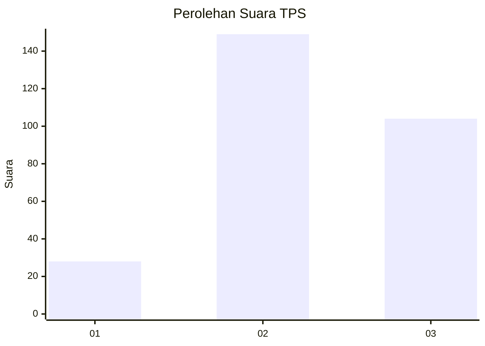
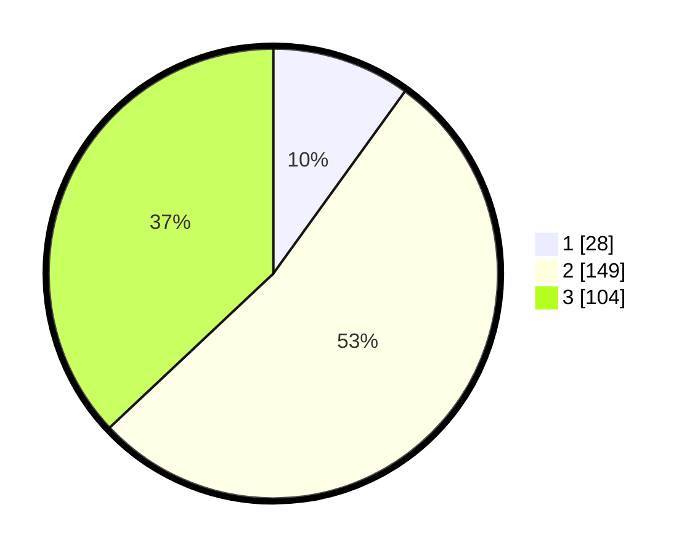

# Hasil

## Grafik

## Tabel

| No. | Nama Paslon    | Suara | Suara (raw) | Persentase |
|:--- |:-------------- | -----:| -----------:| ----------:|
| 1   | ANIES MUHAIMIN | 28    | [28][p-1]   | 9,96       |
| 2   | PRABOWO GIBRAN | 149   | [149][p-2]  | 53,02      |
| 3   | GANJAR MAHFUD  | 104   | [104][p-3]  | 37,01      |

[p-1]: https://github.com/gigit-pemilu/pemilu-2024-35-jawa-timur/blob/main/pilpres/hitung-suara/sub/35-jawa-timur/sub/26-bangkalan/sub/13-tanah-merah/sub/2004-jangkar/sub/007-tps/sub/paslon-1.txt
[p-2]: https://github.com/gigit-pemilu/pemilu-2024-35-jawa-timur/blob/main/pilpres/hitung-suara/sub/35-jawa-timur/sub/26-bangkalan/sub/13-tanah-merah/sub/2004-jangkar/sub/007-tps/sub/paslon-2.txt
[p-3]: https://github.com/gigit-pemilu/pemilu-2024-35-jawa-timur/blob/main/pilpres/hitung-suara/sub/35-jawa-timur/sub/26-bangkalan/sub/13-tanah-merah/sub/2004-jangkar/sub/007-tps/sub/paslon-3.txt

## Foto C Plano

https://sirekap-obj-formc.kpu.go.id/aa14/pemilu/ppwp/35/26/13/20/04/3526132004007-20240214-223806--f078cb2f-ac95-4277-85f1-d8a0e913192a.jpg

https://sirekap-obj-formc.kpu.go.id/aa14/pemilu/ppwp/35/26/13/20/04/3526132004007-20240214-223914--77f2400e-8422-431e-b7bd-91e07beac512.jpg

https://sirekap-obj-formc.kpu.go.id/aa14/pemilu/ppwp/35/26/13/20/04/3526132004007-20240214-224113--2b24b9a6-2360-49b9-bf53-b8f1ec186b5f.jpg

## Metadata

| Key        | Value               |
| ---------- | ------------------- |
| Time Stamp | 2024-02-24 22:31:28 |

