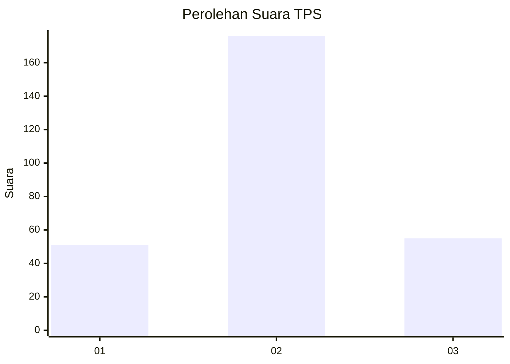
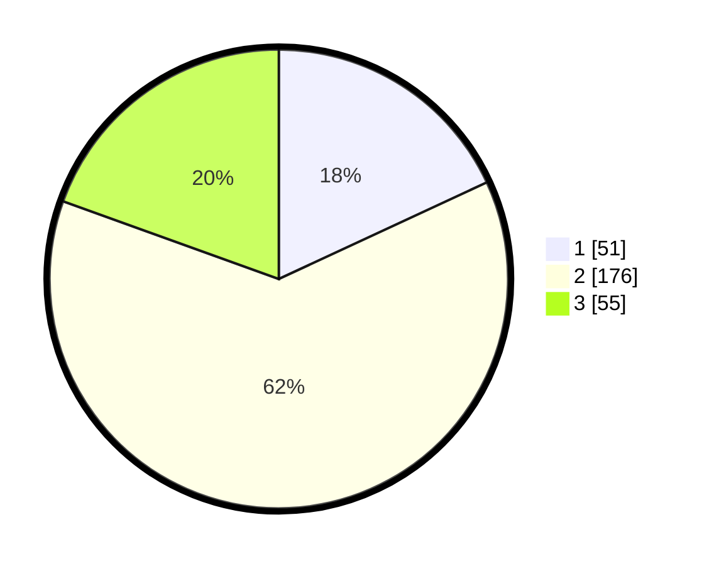

# Hasil

## Grafik

## Tabel

| No. | Nama Paslon    | Suara | Suara (raw) | Persentase |
|:--- |:-------------- | -----:| -----------:| ----------:|
| 1   | ANIES MUHAIMIN | 51    | [51][p-1]   | 18,09      |
| 2   | PRABOWO GIBRAN | 176   | [176][p-2]  | 62,41      |
| 3   | GANJAR MAHFUD  | 55    | [55][p-3]   | 19,50      |

[p-1]: https://github.com/gigit-pemilu/pemilu-2024-35-jawa-timur/blob/main/pilpres/hitung-suara/sub/35-jawa-timur/sub/26-bangkalan/sub/13-tanah-merah/sub/2004-jangkar/sub/012-tps/sub/paslon-1.txt
[p-2]: https://github.com/gigit-pemilu/pemilu-2024-35-jawa-timur/blob/main/pilpres/hitung-suara/sub/35-jawa-timur/sub/26-bangkalan/sub/13-tanah-merah/sub/2004-jangkar/sub/012-tps/sub/paslon-2.txt
[p-3]: https://github.com/gigit-pemilu/pemilu-2024-35-jawa-timur/blob/main/pilpres/hitung-suara/sub/35-jawa-timur/sub/26-bangkalan/sub/13-tanah-merah/sub/2004-jangkar/sub/012-tps/sub/paslon-3.txt

## Foto C Plano

https://sirekap-obj-formc.kpu.go.id/d031/pemilu/ppwp/35/26/13/20/04/3526132004012-20240214-224938--cabcc450-7ebd-404e-bdb8-91e938cb5b09.jpg

https://sirekap-obj-formc.kpu.go.id/d031/pemilu/ppwp/35/26/13/20/04/3526132004012-20240214-225117--64522000-eca4-4e3f-bc54-3d2636357274.jpg

https://sirekap-obj-formc.kpu.go.id/d031/pemilu/ppwp/35/26/13/20/04/3526132004012-20240214-225301--99a2feee-6a10-43ab-bce7-4a50d9d19ef2.jpg

## Metadata

| Key        | Value               |
| ---------- | ------------------- |
| Time Stamp | 2024-02-24 22:31:28 |

