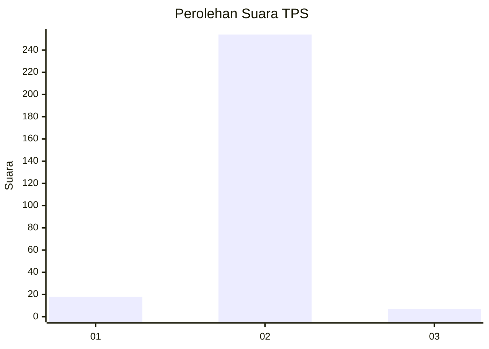
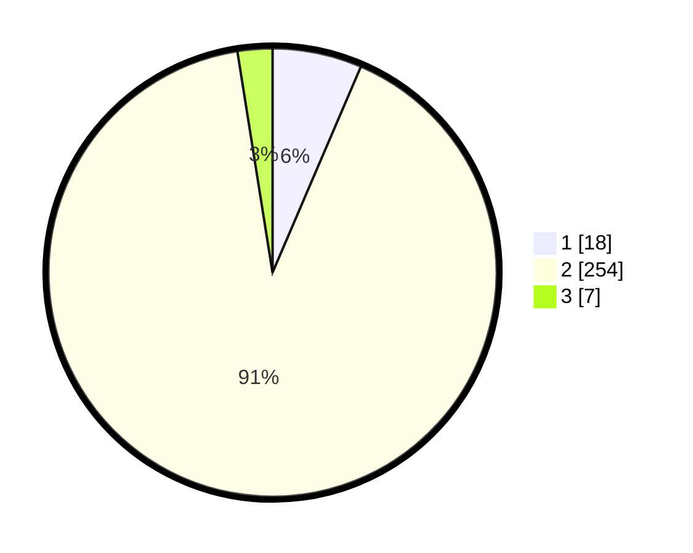

# Hasil

## Grafik

## Tabel

| No. | Nama Paslon    | Suara | Suara (raw) | Persentase |
|:--- |:-------------- | -----:| -----------:| ----------:|
| 1   | ANIES MUHAIMIN | 18    | [18][p-1]   | 6,45       |
| 2   | PRABOWO GIBRAN | 254   | [254][p-2]  | 91,04      |
| 3   | GANJAR MAHFUD  | 7     | [7][p-3]    | 2,51       |

[p-1]: https://github.com/gigit-pemilu/pemilu-2024/blob/main/pilpres/hitung-suara/sub/35-jawa-timur/sub/26-bangkalan/sub/13-tanah-merah/sub/2004-jangkar/sub/014-tps/sub/paslon-1.txt
[p-2]: https://github.com/gigit-pemilu/pemilu-2024/blob/main/pilpres/hitung-suara/sub/35-jawa-timur/sub/26-bangkalan/sub/13-tanah-merah/sub/2004-jangkar/sub/014-tps/sub/paslon-2.txt
[p-3]: https://github.com/gigit-pemilu/pemilu-2024/blob/main/pilpres/hitung-suara/sub/35-jawa-timur/sub/26-bangkalan/sub/13-tanah-merah/sub/2004-jangkar/sub/014-tps/sub/paslon-3.txt

## Foto C Plano

https://sirekap-obj-formc.kpu.go.id/912a/pemilu/ppwp/35/26/13/20/04/3526132004014-20240214-220954--712b9570-f0b1-4a20-be8d-3f8e1aa0f2a7.jpg

https://sirekap-obj-formc.kpu.go.id/912a/pemilu/ppwp/35/26/13/20/04/3526132004014-20240214-221119--58858e7e-fc02-4e84-9d02-0f0ee674a016.jpg

https://sirekap-obj-formc.kpu.go.id/912a/pemilu/ppwp/35/26/13/20/04/3526132004014-20240214-221238--c5b46eea-314e-47e3-8b9b-cf3a0cbe6dfd.jpg

## Metadata

| Key        | Value               |
| ---------- | ------------------- |
| Time Stamp | 2024-02-19 06:16:00 |

