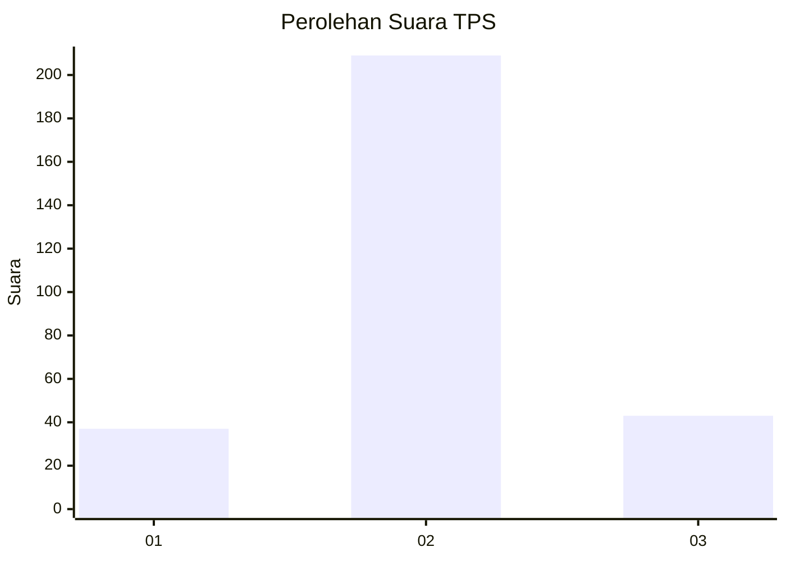
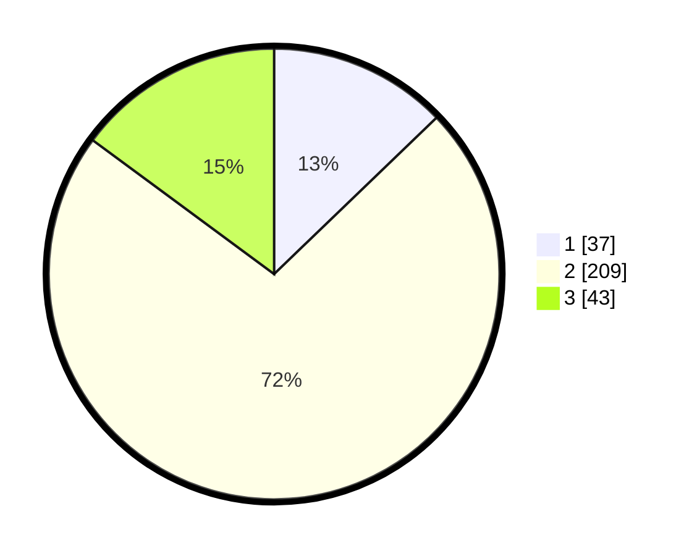

# Hasil

## Grafik

## Tabel

| No. | Nama Paslon    | Suara | Suara (raw) | Persentase |
|:--- |:-------------- | -----:| -----------:| ----------:|
| 1   | ANIES MUHAIMIN | 37    | [37][p-1]   | 12,80      |
| 2   | PRABOWO GIBRAN | 209   | [209][p-2]  | 72,32      |
| 3   | GANJAR MAHFUD  | 43    | [43][p-3]   | 14,88      |

[p-1]: https://github.com/gigit-pemilu/pemilu-2024/blob/main/pilpres/hitung-suara/sub/35-jawa-timur/sub/26-bangkalan/sub/13-tanah-merah/sub/2004-jangkar/sub/015-tps/sub/paslon-1.txt
[p-2]: https://github.com/gigit-pemilu/pemilu-2024/blob/main/pilpres/hitung-suara/sub/35-jawa-timur/sub/26-bangkalan/sub/13-tanah-merah/sub/2004-jangkar/sub/015-tps/sub/paslon-2.txt
[p-3]: https://github.com/gigit-pemilu/pemilu-2024/blob/main/pilpres/hitung-suara/sub/35-jawa-timur/sub/26-bangkalan/sub/13-tanah-merah/sub/2004-jangkar/sub/015-tps/sub/paslon-3.txt

## Foto C Plano

https://sirekap-obj-formc.kpu.go.id/a66e/pemilu/ppwp/35/26/13/20/04/3526132004015-20240214-230159--b56ea6e4-8428-4c3d-b107-d9c21b8590af.jpg

https://sirekap-obj-formc.kpu.go.id/a66e/pemilu/ppwp/35/26/13/20/04/3526132004015-20240214-230430--7015d9c6-0beb-4187-82e0-1c2707432e55.jpg

https://sirekap-obj-formc.kpu.go.id/a66e/pemilu/ppwp/35/26/13/20/04/3526132004015-20240214-230601--0458cf3f-9892-4713-a82d-a14b5c455bc1.jpg

## Metadata

| Key        | Value               |
| ---------- | ------------------- |
| Time Stamp | 2024-02-24 22:31:28 |

