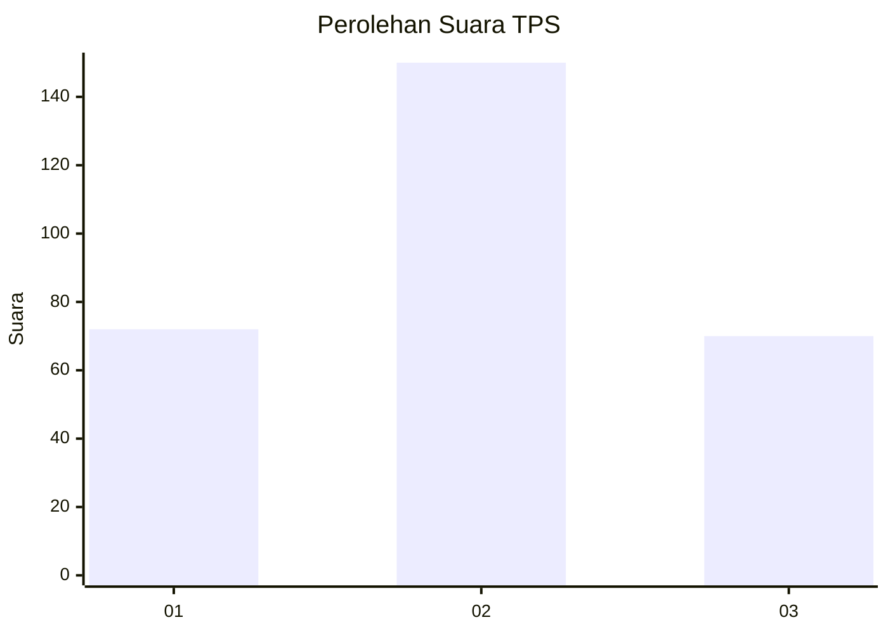
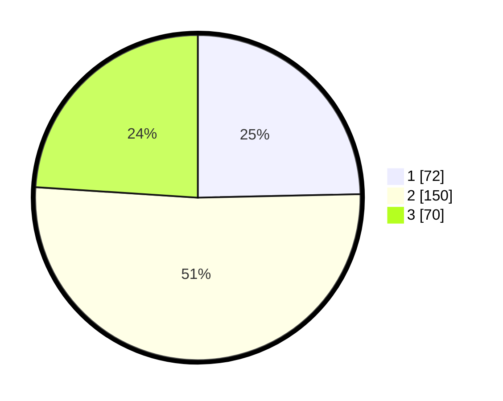

# Hasil

## Grafik

## Tabel

| No. | Nama Paslon    | Suara | Suara (raw) | Persentase |
|:--- |:-------------- | -----:| -----------:| ----------:|
| 1   | ANIES MUHAIMIN | 72    | [72][p-1]   | 24,66      |
| 2   | PRABOWO GIBRAN | 150   | [150][p-2]  | 51,37      |
| 3   | GANJAR MAHFUD  | 70    | [70][p-3]   | 23,97      |

[p-1]: https://github.com/gigit-pemilu/pemilu-2024/blob/main/pilpres/hitung-suara/sub/35-jawa-timur/sub/26-bangkalan/sub/13-tanah-merah/sub/2004-jangkar/sub/016-tps/sub/paslon-1.txt
[p-2]: https://github.com/gigit-pemilu/pemilu-2024/blob/main/pilpres/hitung-suara/sub/35-jawa-timur/sub/26-bangkalan/sub/13-tanah-merah/sub/2004-jangkar/sub/016-tps/sub/paslon-2.txt
[p-3]: https://github.com/gigit-pemilu/pemilu-2024/blob/main/pilpres/hitung-suara/sub/35-jawa-timur/sub/26-bangkalan/sub/13-tanah-merah/sub/2004-jangkar/sub/016-tps/sub/paslon-3.txt

## Foto C Plano

https://sirekap-obj-formc.kpu.go.id/d532/pemilu/ppwp/35/26/13/20/04/3526132004016-20240214-224708--2ffb0138-96f6-4e1d-80f5-f7b55f1e07a0.jpg

https://sirekap-obj-formc.kpu.go.id/d532/pemilu/ppwp/35/26/13/20/04/3526132004016-20240214-225301--67a49360-51ae-4d5a-ab35-09ebab14ff2e.jpg

https://sirekap-obj-formc.kpu.go.id/d532/pemilu/ppwp/35/26/13/20/04/3526132004016-20240214-225726--0f6fac4c-eb11-4587-bb3d-c233dfa5cd65.jpg

## Metadata

| Key        | Value               |
| ---------- | ------------------- |
| Time Stamp | 2024-02-24 22:31:28 |

