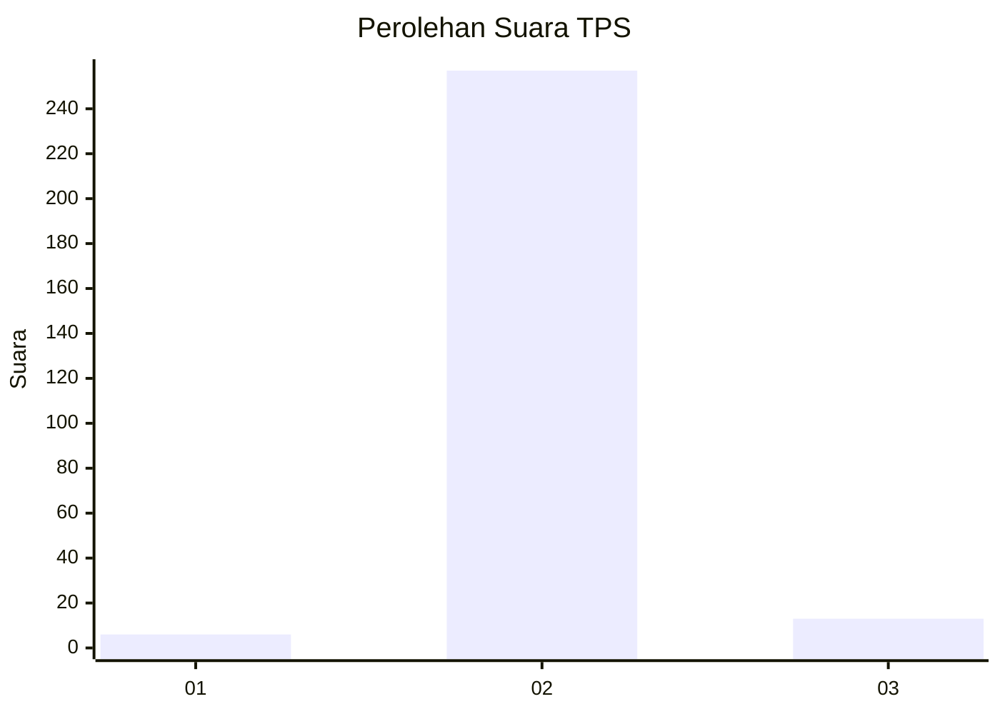
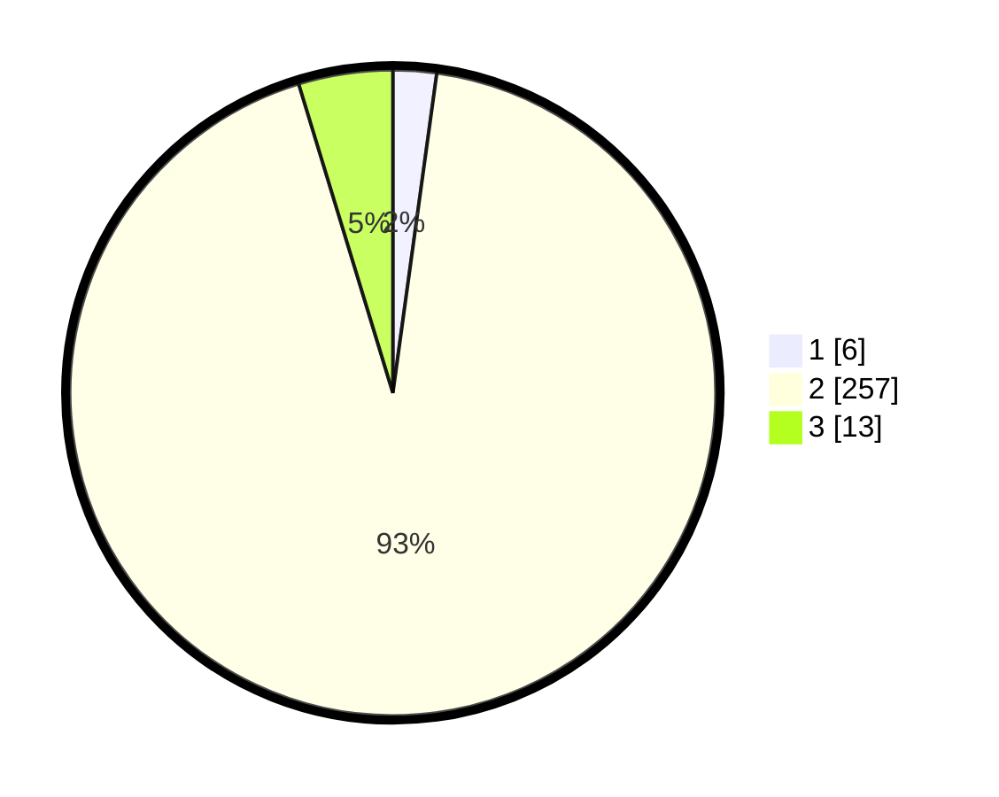

# Hasil

## Grafik

## Tabel

| No. | Nama Paslon    | Suara | Suara (raw) | Persentase |
|:--- |:-------------- | -----:| -----------:| ----------:|
| 1   | ANIES MUHAIMIN | 6     | [6][p-1]    | 2,17       |
| 2   | PRABOWO GIBRAN | 257   | [257][p-2]  | 93,12      |
| 3   | GANJAR MAHFUD  | 13    | [13][p-3]   | 4,71       |

[p-1]: https://github.com/gigit-pemilu/pemilu-2024/blob/main/pilpres/hitung-suara/sub/35-jawa-timur/sub/26-bangkalan/sub/13-tanah-merah/sub/2006-kendaban/sub/001-tps/sub/paslon-1.txt
[p-2]: https://github.com/gigit-pemilu/pemilu-2024/blob/main/pilpres/hitung-suara/sub/35-jawa-timur/sub/26-bangkalan/sub/13-tanah-merah/sub/2006-kendaban/sub/001-tps/sub/paslon-2.txt
[p-3]: https://github.com/gigit-pemilu/pemilu-2024/blob/main/pilpres/hitung-suara/sub/35-jawa-timur/sub/26-bangkalan/sub/13-tanah-merah/sub/2006-kendaban/sub/001-tps/sub/paslon-3.txt

## Foto C Plano

https://sirekap-obj-formc.kpu.go.id/1371/pemilu/ppwp/35/26/13/20/06/3526132006001-20240214-215941--6d3794af-2f9e-4f38-a5c0-941debeeda43.jpg

https://sirekap-obj-formc.kpu.go.id/1371/pemilu/ppwp/35/26/13/20/06/3526132006001-20240214-220019--ba1ee29f-54e8-4df3-a4db-5dbd31526762.jpg

https://sirekap-obj-formc.kpu.go.id/1371/pemilu/ppwp/35/26/13/20/06/3526132006001-20240214-220057--aaaae70a-2082-4bb5-aed1-5b6d687adce5.jpg

## Metadata

| Key        | Value               |
| ---------- | ------------------- |
| Time Stamp | 2024-02-24 22:31:28 |

